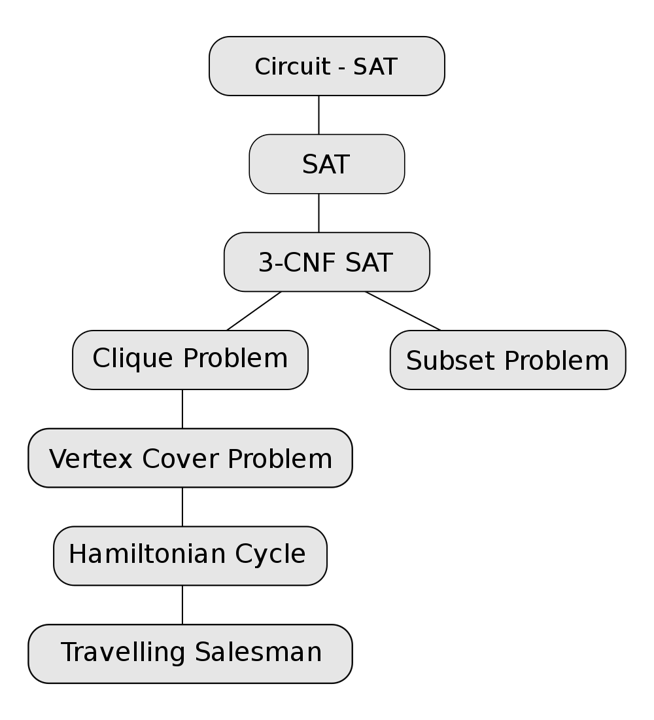

接下来我们将接触一些非常困难的问题，以至于目前仍然没有多项式时间内的解法。首先我们先介绍图灵机的定义，这一部分在离散数学中应当有所提及。

## Turing Mechine

图灵机被定义成无限大的内存纸条和一个程序探针。每一时刻它会读取纸条上的信息，可能是左移探针、右移探针或者是覆写数据。在这个过程中，如果我们知道整张纸条上的信息，理论上我们应当能判断图灵机的最终状态。但是我们提出一个问题，这个图灵机最终会停下吗？还是说会陷入某个死循环？这就是著名的**停机问题(Halting problem)**。

停机问题本质上就是找一个函数，读取一段程序后判断程序是否会最终停下。但是我们发现这样的函数是不存在的。可以利用反证法，假设存在这样的函数 `g()` 能判定一段程序是否会停止，则我们能实现这样一个函数：

```cpp
void h()
{
    if(g(h)==STOP)
        while(true);
    else
        return;
}
```

也就是进行自指，我们会发现总是会出现矛盾，因此停机问题不可解。

因此我们得到了一个经典的非常困难的问题。除此以外，我们能够将图灵机分成两类：

- **确定性图灵机(Deterministic Turing Machine)**：每一步都按照程序设定的，探针总是指向唯一的结果；
- **非确定性图灵机(Nondeterministic Turing Machine)**：每一步都朝着能求出解的方向走，每一步都有很多可选的结果。

## NP problem

我们定义 NP 问题就是能利用 NTM 来求解的问题。换句话说，对于 NP 问题，我们能够在多项式时间内验证某个解是否正确。比如说哈密顿回路问题，虽然无法主动得到一个解，但是给我一个解之后我能够很方便地判断这个解是否合法。

## NP-Completeness

在理解了 NP 问题的分类后，我们先指出，P 问题指的是那些我们能够在多项式时间内求解的问题。当然，对于 P 或者 NP 而言，其内部的问题也不是一样困难的。

很显然，我们有 $P\subseteq NP$，因为我们如果可以多项式时间求解，一定能够验证一个解是否正确。那么我们的问题是，在 NP 中是否有一些问题，是不存在多项式时间解的？也就是 P 是否等于 NP？这个问题目前没有定论，因为我们无法确定我们没有多项式算法的原因是我们不够聪明还是确实就不存在这样的算法。

为了简化这个问题，我们从 NP 问题中抽离出一部分，这部分问题是 NP 中最难的问题，NP 中所有的问题都能被**归约**到这类问题上，也就是说，只要我们解决了这个部分的问题（找到了多项式复杂度的算法），我们实际上就解决了 NP 中所有的问题，也就是证明了 P=NP。这类问题我们称之为 NP-Completeness 问题。

!!! note "归约(reduction)"
    我们说问题 $A$ 可以被归约到问题 $B$，感性上说明问题 $B$ 更困难，因为 $B$ 解决之后 $A$ 就能够通过 $B$ 的解决方案来解决。形式化地，我们有如下表述：

    问题 $A$ 可以被归约到 $B$，说明对于 $A$ 中的任意一个实例（也就是具体的例子） $\alpha$，我们可以通过多项式时间 $O(N^{k_1})$ 将其转化为问题 $B$ 中的一个实例 $\beta$，同时，想在问题 $B$ 中解出 $\beta$，也只需要多项式时间 $O(N^{k_2})$。那么我们就在多项式时间内把 $A$ 归约到了 $B$，因为此时求解 $\beta$ 等价于求解了 $\alpha$。

    我们把“多项式时间内归约”简记为 $\leq_p$。

同时我们需要指出，当然是存在比 NP-C 更难的问题的，有些问题甚至无法在多项式时间内验证。因此我们定义所有 NP 问题都可以被归约到的问题类型，称之为 NP-hard。换言之，NP-C 应当是 NP-hard 的子集，NP-hard 中有相当一部分不再是 NP 问题。我们可以通过下面这张图来理解问题的分类：

!!! info
    

## Samples

接下来，我们会通过几个例子来说明 NP-C 问题，同时运用归约的思想来证明一些问题是困难的。

### Traveling salesman problem

!!! question "旅行商问题"
    给定一张带权的完全图，求一条访问所有点的简单回路，使得路径上权值之和小于等于 $K$。

现在我们在已知哈密顿回路是 NP-C 问题的前提下，想证明该问题是 NP-C 的。这就需要用到归约。

!!! note "proof"
    首先，TSP 问题是**可以多项式时间内验证**的，因此是 NP 问题（重要！需要规避 NP-hard 的可能）。

    然后我们进行归约。我们希望 $HC\leq_p TSP$，所以我们取哈密顿回路的一个实例 $G$，然后构造另一个完全图 $G'$，若在 $G$ 中 $u,v$ 之间有边，则边权为 $1$，否则为 $2$，然后取 $K=N$。此时 $(G',K)$ 是 TSP 问题的一个实例，如果 TSP 问题有解，则其选取的回路上权值一定都是 $1$，该解就对应了哈密顿回路的解。所以 $HC\leq_p TSP$，我们证明了 TSP 问题更难。

### Circuit-SAT

该问题是第一个被证明的 NP-C 问题，此后的所有 NP-C 问题都可以由它为依据被证得。

!!! question "问题描述"
    给定一个布尔表达式，问是否存在一种赋值方式使得表达式为真。

这个问题最初是通过证明它在 NTM 上可以多项式时间内解决证明出它是 NP-C 问题。如下图所示是 NP-C 问题的归约路线：

!!! info
    

### Clique problem & Vertex cover problem

!!! question "最大团问题(Clique problem)"
    给定一张无向图和 $K$，问是否存在完全子图大小为 $K$。

!!! question "最小点覆盖问题(Vertex cover problem)"
    给定一张无向图，问是否能从中挑选至多 $K$ 个点，使得每条边至少有一端被挑选。

这两个问题都是 NP-C 问题，请互相证明：

!!! note "proof"
    二者都能在多项式时间内验证，因此都是 NP 问题。

    - $Clique\leq_p Vertex\_Cover$：对于团问题，我们取它的实例 $(G,K)$，取补图 $G'$，并得到实例 $(G',|V|-K)$ 作为最小点覆盖的实例。该过程至多是 $O(n^2)$ 的。然后考虑最小点覆盖的解 $V'$，首先有 $|V|-K\geq |V'|$，其次考虑 $V-V'$ 中的点两两之间在 $G'$ 上都没有边，否则 $V'$ 是不合法的。这样一来，$V-V'$ 中的点在 $G$ 中是两两右边，构成完全图的，且有 $|V-V'|\geq K$，得到了最大团问题的一个解。
    - $Vertex\_Cover\leq_p Clique$：同样的，对于实例 $(G,K)$，取补图 $G'$，在最大团问题中能求得实例 $(G',|V|-K)$ 的一个解 $V'$，那么有 $V-V'$ 中的点被选择之后，原图中每一条边都至少有一端被选择了，除非有一条边两端都在 $V'$ 中，但是这在补图中说明 $V'$ 内部两点不存在边，与完全图矛盾。
    - 因此我们能够得出结论，最大团 + 最小点覆盖 = n。