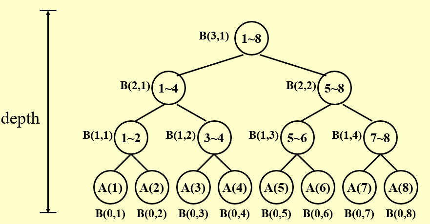
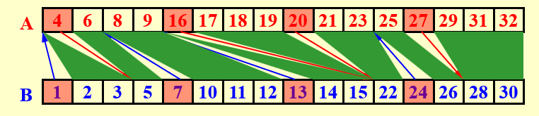

在实际情况中，处理器应当不止有一个核，因此我们会考虑并行算法。我们会提出一个并行算法的模型：

## PRAM model

**Parallel Random Access Machine(PRAM) 模型**是一种基本的并行算法模型，它的想法是所有的处理器每时每刻都在工作，即使没有具体的指令需要它干，也会给一条空的指令让它空跑。在这个过程中，会出现读写冲突的问题，那么具体的解决方案有如下几种：

!!! abstract "冲突解决"
    1. Exclusive-Read Exclusive-Write (EREW) 不同时读写
    2. Concurrent-Read Exclusive-Write (CREW) 同时读不同时写
    3. Concurrent-Read Concurrent-Write (CRCW) 同时读写，此时需要写规则
          - Arbitrary rule 任意一个先写
          - Priority rule 最值等优先写
          - Common rule 所有处理器想写同一个值时才写
    
但是该模型在体现处理器数量的作用上并不优秀，而且空跑处理器也算入效率计算范围令人难以接受，所以我们提出一个优化的模型：

## WD model

**Work-Depth(WD) 模型**在 PRAM 的基础上，去除了空跑的处理器，从而我们可以更好地来衡量一个并行算法。

现在我们来定义两个衡量并行算法的参数：

1. **work-load(W)**: 可以理解成总的工作量，定义是在只有一个处理器的时候算法的时间复杂度；
2. **work-depth(D)**: 可以理解成并行树的深度，定义是在有无穷多处理器的时候算法的时间复杂度。

这么讲述可能比较抽象，接下来将用四个例子来说明上述内容。

## Examples

### Summation

!!! question "问题描述"
    输入给定 $A(1)\sim A(n)$，求 $\sum_{i=1}^nA(i)$。

在并行的视角下，我们可以采用每次两两相邻求和的方式，会得到如下求和树图。其中我们定义了 $B(h,i)$ 代表着自下而上第 $h$ 层的第 $i$ 个节点子树内的和。则很轻易可以得到：

$$
B(h,i)=B(h-1,2i-1)+B(h-1,2i)
$$

!!! info "求和树"
    

我们可以用伪代码来描述这个过程，新定义 pardo 语句为并行执行：

```cpp
for P_i, 1 <= i <= n pardo
    B(0, i) := A(i)
for h = 1 to log(n) do
    for P_i, i <= n / 2^h pardo
        B(h, i) := B(h - 1, 2 * i - 1) + B(h - 1, 2 * i)
for i = 1 pardo
    output B(log(n), 1)
```

此时，我们可以开始考虑 $W$ 与 $D$。若只有一个处理器，则求和显然是 $O(n)$ 的，所以 $W=O(n)$；如果有无限多的处理器，则每一层只需要 $O(1)$，总的是 $D=O(\log n)$ 的。

#### bounds for p processors

那么对于有 $p$ 个处理器的情况，我们如何计算它的用时 $T_p$ 呢？考虑用上下界去逼近它。显然的是 $\frac{W}{p}$ 是一个下界，从 PRAM 的观点来看，就是没有任何一个处理器在某一时刻空闲，也需要那么久的时间。那么下面我们可以证明它的上界是 $\frac{W}{p}+D$。

??? note "证明"
    我们假设第 $i$ 层的工作量为 $w_i$，则有 $W=\sum w_i$，则用 $p$ 个处理器的花销为：

    $$
    T_p=\sum_{i=1}^D\lceil\dfrac{w_i}{p}\rceil\leq \sum_{i=1}^D\dfrac{w_i}{p}+1 = \dfrac{W}{p}+D
    $$

这也强调了 $W$ 和 $D$ 在评估并行算法时的重要作用。接下来三个问题中，我们都会围绕减少 $W$ 和 $D$ 去展开。

### Prefix-Sums

!!! question "问题描述"
    输入给定 $A(1)\sim A(n)$，求 $\forall i:1\leq i\leq n, \sum_{j=1}^iA(j)$。

考虑如何并行地解决这个问题。在求和的基础上，我们需要并行地求出所有的前缀和。我们在上题定义的基础上，新增一个 $C(h,i)$，代表着自下而上第 $h$ 层的第 $i$ 个节点子树内最右节点的前缀和。这样我们就能自上而下地解决该问题。

!!! abstract "递推求解"
    - 当 $i=1$ 时，$C(h,i)=B(h,i)$；
    - 当 $i=2k$ 时，$C(h,i)=C(h+1,i/2)$；
    - 当 $i=2k+1$ 时，$C(h,i)=B(h,i)+C(h+1,(i-1)/2)$。

可以将上述过程写成伪代码如下：

```cpp
// Same as summation problem
for P_i, 1 <= i <= n pardo
    B(0, i) := A(i)
for h = 1 to log(n)
    for i, 1 <= i <= n / 2^h pardo
        B(h, i) := B(h - 1, 2 * i - 1) + B(h - 1, 2 * i)

// Now calculate the prefix sum problem
for h = log(n) to 0
    for i even, 1 <= i <= n / 2^h pardo
        C(h, i) := C(h + 1, i / 2)
    for i = 1 pardo
        C(h, 1) := B(h, 1)
    for i odd, 3 <= i <= n / 2^h pardo
        C(h, i) := C(h + 1, (i - 1) / 2) + B(h, i)
for P_i, 1 <= i <= n pardo
    Output C(0, i)
```

简言之，我们采取了再次由上而下的递推求得了所有的前缀和，整个算法的 $W=O(n),D=O(\log n)$。

### Merging

!!! question "问题描述"
    给定两个升序数组 $A(n),B(m)$，将它们合并成一个升序数组 $C(n+m)$。

对于朴素的线性合并做法，不难发现该做法是 $W=O(n),D=O(n)$。假设 $n,m$ 同阶。

接下来我们提出一种想法——通过**排名**来合并，定义 $RANK(j,A)$ 代表着 $B(j)$ 在 $A$ 数组中排在第几个元素之后，也就是若 $i=RANK(j,A)$，则有 $A(i)<B(j)<A(i+1)$。同定义了 $RANK(j,B)$。现假设已经求得 $RANK$，那么以下方法实现了 $W=O(n),D=O(1)$ 的并行合并过程：

```cpp
for i , 1 <= i <= n  pardo
    C(i + RANK(i, B)) := A(i)
for i , 1 <= i <= n  pardo
    C(i + RANK(i, A)) := B(i)
```

于是我们考虑如何求得这个 $RANK$，事实上，朴素的想法就是对每个数并行地做二分，那么它的复杂度为 $W=O(n\log n),D=O(\log n)$。或者我们可以用线性扫描过去的做法，但是这个做法的总工作量以及工作深度与朴素的线性合并完全一样。

接下来我们提出一个重要的思想：**分组(partition)**。在并行算法中，找到一种合适的分组方法，在组间采用并行，组内采用不同的并行算法，有可能可以同时降低工作量和深度的开销。下面介绍一种能够做到 $W=O(n),D=O(\log n)$ 的优秀做法：

令 $p=\dfrac{n}{\log n}$，在 $A,B$ 中均匀地取出 $p$ 个数作为 pivot。然后对这些 pivot 做二分查找，就能得到它们的排名，一个平凡的结论是，它们的排名不会相交，可以参考下图来理解这一点：

!!! info
    

这样，我们就将整个数组分成了 $2p$ 组，在每个组内单独线性归并，最后合并是能够保证正确性的。那么每一组的大小约为 $\log n$，于是这个并行的组内合并过程有 $W=O(\log n),D=O(\log n)$，然后考察分组过程，并行地对 $p$ 个数做二分，有 $W=O(p\log n)=O(n),D=O(\log n)$。因此最终的复杂度为 $W=O(n),D=O(\log n)$。

### Maximum Finding

!!! question "问题描述"
    在 $A(n)$ 中找到最大值。

在并行算法中，找一个数组的最大值是一件非常值得研究的事情。我们可以借鉴求和部分的思路，用二叉树的形式，那么最终的工作量和深度和求和是相同的。但是我们有一些更好的思路。

#### Compare all pairs

这个做法非常的粗暴。初始化一个全为 $1$ 的数组 $B$，随后并行地取所有 $i,j$ 对，若 $A(i)<A(j)$，则 $B(i)=1$，否则 $B(i)=0$。此时会出现写冲突，于是我们采取 CRCW 中的 Common rule，也就是同一个位置写入值都相同时才写，那么所有的 $i$ 中只有最大值对应的下标会全写入 $0$，因此最终并行读取 $B$，其中唯一的那个 $0$ 就是最大值对应的位置。

!!! warning
    此处的做法和 cy 课件不完全相同，因为笔者思考发现 cy 写的做法使用 CRCW 的 common rule 是不对的。

```cpp
for P_i, 1 <= i <= n pardo
    B(i) := 1
for i and j, 1 <= i, j <= n pardo
    if (A(i) < A(j) || A(i) == A(j) && i < j)
        B(i) = 1
    else
        B(i) = 0
for P_i, 1 <= i <= n pardo
    if B(i) == 0
        A(i) is a maximum in A
```

有 $W=O(n^2),D=O(1)$。

#### Doubly-logarithmic Paradigm

接下来我们应用之前提出的重要思想 partition 来进一步优化。看到上方的 $O(n^2)$，我们就希望能够通过按 $\sqrt{n}$ 分组，若每组内能求出最大值，我们就能在 $W=O(n),D=O(1)$ 内解决该问题。那么每一组的开销是多少呢？我们有如下递推式：

$$
W(n)=\sqrt{n}W(\sqrt{n})+n
$$

$$
D(n)=D(\sqrt{n})+1
$$

这两个递推式可以通过取对数的方式求解：

!!! note "递推求解"
    令 $f(\log n)=\dfrac{W(n)}{n}$，则 $f(\log n)=f(\dfrac{1}{2}\log n)+1$，故 $f(\log n)=O(\log\log n)$，也就是 $W(n)=O(n\log\log n)$。

    同理 $D(n)=O(\log\log n)$。

该做法已经非常接近我们希望的 $W=O(n),D=O(1)$ 了，但是还是不够。

我们尝试改变第一次划分的大小，令 $h=\log\log n$，然后我们按每 $h$ 个一组划分。这样总共就有 $\dfrac{n}{h}$ 组，此时对组内，我们采用线性的方式，在 $W=O(n),D=O(h)$ 的时间内得到了 $\dfrac{n}{h}$ 个值，我们只需要在这之中找到最大值就行。

此时我们再次运用前面说的根号的方式分组，就会得到 $W=O(\dfrac{n}{h}\log\log\dfrac{n}{h}),D=O(\log\log\dfrac{n}{h})$，与前面得到的相加，得到：

$$
W=O(n+\dfrac{n}{h}\log\log\dfrac{n}{h})=O(n),D=O(h+\log\log\dfrac{n}{h})=O(\log\log n)
$$

这样一来，我们成功减小了总的工作量，但是深度仍没能达到 $O(1)$。

#### Random Sampling

事实证明，想要深度达到 $O(1)$ 非常困难，于是我们退而求其次，希望在随机过程下，它正确的概率达到非常大，这就是**随机采样(Random Sampling)**的做法。

1. 从 $n$ 个元素中随机挑选 $n^{\frac{7}{8}}$ 个元素，该过程 $W=O(n^{\frac{7}{8}}),D=O(1)$；
2. 将选出的按 $n^{\frac{1}{8}}$ 个一组分组，组内按全配对方式求最值，得到 $n^{\frac{3}{4}}$，该过程 $W=O(n^{\frac{1}{4}}),D=O(1)$；
3. 依次类推，最终会得到 $n^{\frac{1}{2}}$ 个元素，此时直接使用全配对，有 $W=O(n),D=O(1)$。

所以整个过程都是 $W=O(n),D=O(1)$ 的。最后，我们不停地重复上述过程，直到找到最大值，这部分是随机算法的内容。事实上，我们不一定要取 $n^{\frac{7}{8}}$，取任何 $n^{1-2^{-k}}$ 都能进行上述过程，不过在 $k$ 过大时，会退化成 Doubly-logarithmic Paradigm，因此我们通常只取 $k=3$。此时无法在可接受时间内找到最大值的概率应该不超过 $O(\dfrac{1}{n^c})$，其中 $c$ 为常数。