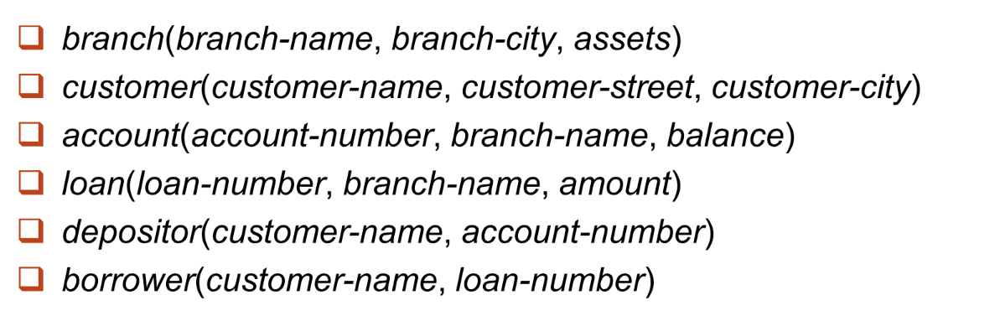
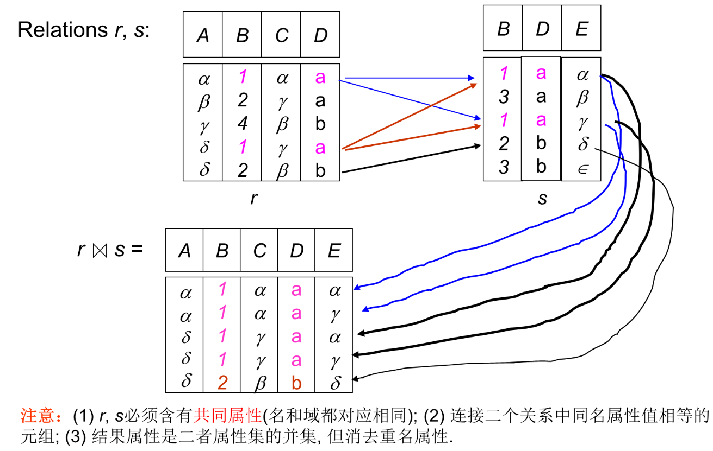
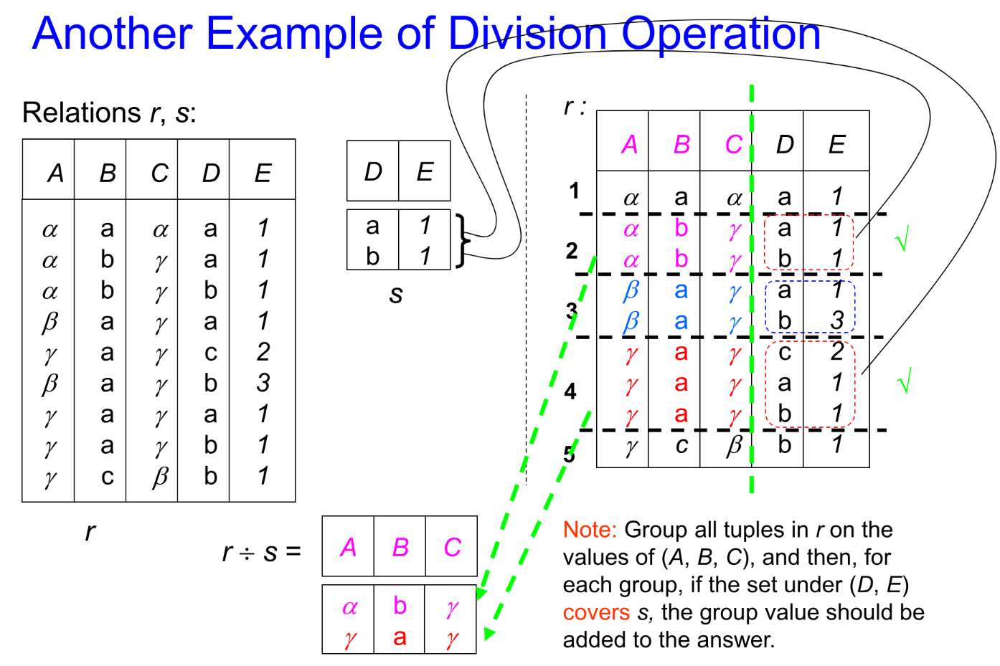
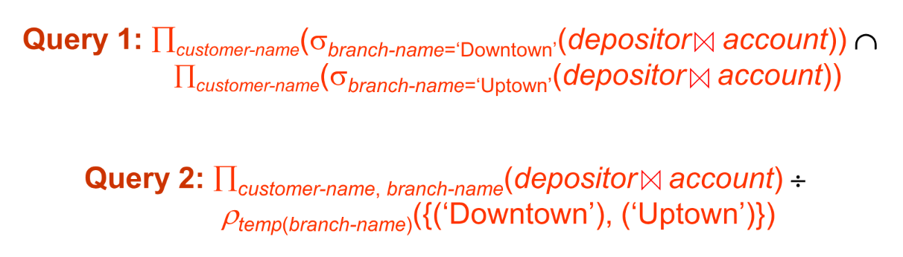
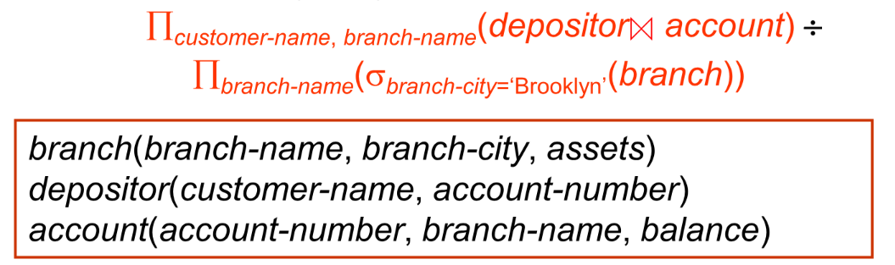
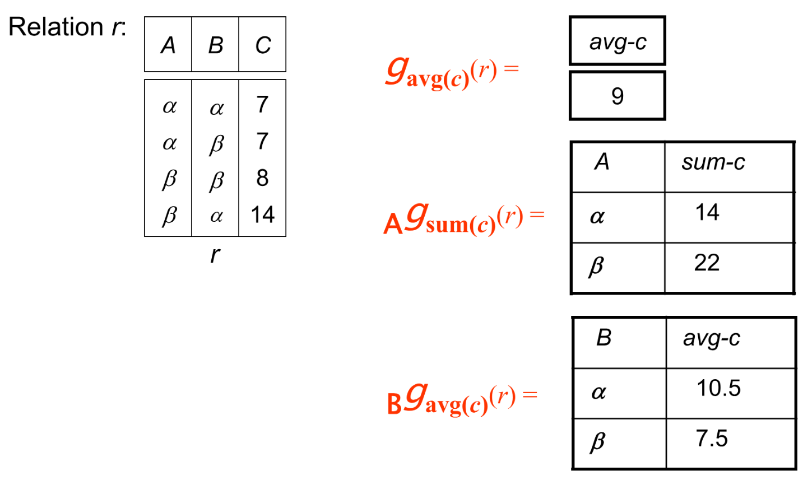

关系型数据库是由多种关系组成，具体表现是各种各样的不同的表格，以此体现数据实例之间的关系。

## Structure of Relational Databases

### Basic Structure

关系（relation）的正式定义：对于集合 $D_1,D_2,D_3,\cdots,D_n$，关系 $r$ 被定义为 $D_1\times D_2\times \cdots \times D_n$ 的一个子集。

也就是在所有组合情况中取一种子集的组合。

!!! example "示例"
    

之前说我们用表格的形式来描述关系，那么关系有一些相关的概念来表述表格的一些内容。

- 我们把表格的每一行称为**元组（Tuple）**；
- 把表格的一列称为**属性（Attribute）**，其中每种属性都有其名字（name）；
    - 对于每一种属性，其所有可能的取值称为该属性的**域（domain）**；
    - 对于每一种属性，都要有**原子性（atomic）**，也就是不可分的。

在关系中会出现一些无法填入或者未知的情况，我们会称之为**空（null）**。显然，null 会属于所有的属性的域，而且 null 参与的关系逻辑运算会显得比较复杂，因此我们下面暂时忽略 null 对运算的影响，在最后才引入 null 的影响。

### Concepts about Relation

关系首先关心两个概念：**关系模型（schema）和关系实例（instance）**。二者就像是变量的类型名称和实际值之间的关系。关系模型描述关系的大致结构，而关系实例就是关系中的具体的数据。

关系的性质：

- 元组之间的**顺序**是无关于关系的；
- 同一个关系中不能存在冗余的元组（要**去重**）；
- 属性值拥有**原子性**。

因此一个好的关系型数据库设计，应当能够满足各种范式，从而尽可能减少数据的冗余。

### Key

我们令 $K\subset R$，其中 $R$ 为关系模型。有如下几种情况：

- 如果凭借 $K$ 足以区分所有元组，那么称 $K$ 为 $R$ 的**超码（superkey）**；
- 取所有超码中最小的，称之为**候选码（candidate key）**；
- **主码（primary key）**是一种候选码，是显式的由下划线标出，一般不作修改；
- **外码（foreign key）**是对于两种关系来说的，如果参照关系中的某些属性是被参照关系的主码，那么这些属性就是这一对关系的外码。

## Fundamental Relational-Algebra Operations

### Select

记号：$\sigma_p(r)$

其中，$p$ 是逻辑或算术命题。可以用与或非来连接多个分句。其意义是从关系中选取出满足 $p$ 约束的元组。

??? example "示例"
    

### Porject

记号：$\Pi_{A_1,A_2,\dots,A_k}(r)$

其中 $A_i$ 为属性的子集。其意义是仅保留关系中对应属性的列，然后**进行去重**。这一过程与多维向量在广义平面上进行投影的过程十分相似，所以应该不难理解为什么称该操作为投影。

??? example "示例"
    

### Union

记号：$r\cup s$

简单来说就是两个关系的并集。但是要进行并的操作，需要两个关系具有相同的属性数量和兼容的属性内容，简称为**等目相容**。

一般而言，当描述中有 or 等关键字时考虑用 Union。

??? example "示例"
    

### Difference

记号：$r-s$

与集合的差相似，条件运用与并集相似。

??? example "示例"
    

### Cartesian-Product

记号：$r\times s$

笛卡尔积，如果两个关系有相同的属性，则需要对属性分别命名而不能直接合二为一。

??? example "示例"
    

### Rename

记号：$\rho_X(E)$ 或 $\rho_{X(A_1,A_2,\dots,A_n)}(E)$

可以把关系 $E$（以及其所有的属性）更名为 $X$（所有属性 $A_1,A_2,\dots,A_n$）。

### Banking for example

下面我们用银行存储账户的数据库来举例，如下为银行数据库中的关系模型。

> E1: Find all loans of over $1200.

使用 Select 进行选取即可：
$$
\sigma_{amount>1200}(loan)
$$

> E2: Find the loan number for each loan of an amount greater than $1200.

由于只需要 loan number，所以作投影即可：

$$
\Pi_{loan-number}(\sigma_{amount>1200}(loan))
$$

> E3: Find the names of all customers who have a loan, or an account, or both, from the bank.

我们看到了关键字 or，那么显然就是并操作。同时它只需要保留 name，因此：

$$
\Pi_{customer-name}(borrower)\cup \Pi_{customer-name}(depositor)
$$

> E4: Find the names of all customers who at least have a loan and an account at bank.

or 变成 and 了，所以直接用交。交前面没讲，是因为交操作可以用并和差来实现。

$$
\Pi_{customer-name}(borrower)\cap \Pi_{customer-name}(depositor)
$$

> E5: Find the names of all customers who have a loan at the Perryridge branch.

由于这二者的信息存储在不同的表里，所以想到用笛卡尔积来合并两表的信息。合并之后我们用外码筛选出合法的信息，然后再筛选银行的名字，最后投影到账户名上。

$$
\Pi_{customer-name}(\sigma_{branch-name='Perryridge'}(\sigma_{borrower.loan-number=loan.loan-number}(borrower\times loan)))
$$

当然我们可以先筛选再做笛卡尔积。此时作积时的表格变得更小了，在这种情况下，复杂度更低。因此我们更倾向于这种写法：

$$
\Pi_{customer-name}(\sigma_{borrower.loan-number=loan.loan-number}(borrower\times (\sigma_{branch-name='Perryridge'}(loan))))
$$

> E6: Find the largest account balance.

找最大值，我们会想到这需要跨元组进行比较，因此仍然笛卡尔积起手。如何找到最大值呢？我们将所有不是最大值的剔除掉，就剩下最大值了。所以我们对自己的余额
作笛卡尔积，然后筛选出所有前者小于后者的元组，这样前者对应的账户一定不是最大的。而且这个并集是充分的，所以去除这些账户剩下的，就是最大值了。

$$
\Pi_{balance}(account)-\Pi_{account.balance}(\sigma_{account.balance<d.balance}(account\times \rho_d(account)))
$$

## Additional Relational-Algebra Operations

### Set-Intersection

记号：$r\cap s$

交的操作与并、差相似，也需要两个关系等目相容。

我们之前说交可以用前面基础的运算得到，即：$r\cap s=r-(r-s)$。

### Natural Join

记号：$r\bowtie s$

前面我们在合并两个关系的时候用笛卡尔积的方式，我们说过，如果两个关系有相同属性，则需要把相同的属性分别命名后列出。但是在多数情况下，两种关系只会有一个属性相同，并且该属性是主码或者外码，此时更符合直观的做法是将相同属性相同的元组取出来作为结果。

这么说有点抽象，可以想象一下两个学生名单，一个是个人信息，一个是成绩表。两个名单都有学生学号这一属性，但是其它属性都各不相同。因此如果我们想知道某人（名字）对应的成绩是多少，我们会希望把两表合并。如果用笛卡尔积，则我们需要再筛选出两个关系学号相同的元组。但是自然合并允许我们略去这一步直接得到自然的合并结果。

同时，根据以上表述，如果我们有关系 $r(A,B,C,D),s(B,D,E)$，那么：

$$
r\bowtie s=\Pi_{r.A,r.B,r.C,r.D,s.E}(\sigma_{r.B=s.B\land r.D=s.D}(r\times s))
$$

??? example "示例"
    

### Theta Join

记号：$r\bowtie_{\theta} s$

有的时候自然合并无法满足我们的需求，所以我们定义条件合并，可以在笛卡尔积后跟上一个筛选条件，让式子简化一些。本质上是一个补丁。即：$r\bowtie_{\theta} s=\sigma_{\theta}(r\times s)$

### Division

记号：$r\div s$

在一些语境下，我们希望在一个关系中找满足所有的条件的元组。也就是 for all 这样一个关键字。我们可以用除法。如果 $r$ 关系中有属性 $A_1,A_2,\dots,A_n,B_1,B_2,\dots,B_m$，而 $s$ 关系中有 $B_1,B_2,\dots,B_m$，则除法就是在 $r$ 中对于 $A$ 属性相同的元组，如果其 $B$ 属性覆盖了 $s$ 中所有情况，则其成为商的一个元组。

根据如上描述，有：

$$
r(R)\div s(S)=\Pi_{R-S}(r)-\Pi_{R-S}((\Pi_{R-S}(r)\times s)-\Pi_{R-S,S}(r))
$$

??? example "示例"
    

### Assignment

记号：$\leftarrow$

用来简化逻辑表达。表现上就是将一个语句赋值为一个变量。如果此后的逻辑语句中需要用到该语句，则可以直接使用该变量代替。有点类似于 C 语言中的 `#define`。

### Example Queries

我们仍然以上面的银行数据库为例。

> E1: Find all customers who have an account from at least the “Downtown” and the “Uptown” branches. 

想要找到所有有 Downtown 和 Uptown 账户的客户。本来我们会需要对 depositor 和 account 作笛卡尔积，然后筛选出满足条件的账户的名字，最后再对二者求交，因为我们需要两个分支都有。那么我们现在可以直接使用自然合并，然后直接选，可以使式子简便不少。或者呢，我们可以直接创建一个包含两个支行名字的关系，然后用除法的方式代替作一次交。

??? answer "答案"
    

> E2: Find all customers who have an account at all branches located in Brooklyn city.

看到了 all，可以想到把 Brooklyn 城里的支行筛出来，然后做除法就可以了。

??? answer "答案"
    

## Extended Relational-Algebra Operations

除了上述基本的关系代数运算之外，我们还提供了一些简化表达式的扩展运算。

### Generalized Projection

记号：$\Pi_{F_1,F_2,\dots,F_n}(E)$

广义投影是指对关系的某些属性进行运算的过程。你可以将它类比 excel 表格中的按列操作的数学公式。通过上述记号，广义投影就是将 $F_1$ 运算的结果作为第一属性，$F_2$ 为第二等等。

### Aggregate Functions and Operations

记号：$_{G_1,G_2,\dots,G_n}g_{F_1(A_1),\dots,F_n(A_n)}(E)$

记号中 $G_i$ 为属性，可以为空。$F_i$ 为聚集函数，聚集函数就是输入若干数，得到一个数的函数，常见的有求平均（avg），求最大（max）最小（min）值，求和（sum），求数量（count）等。其含义为对所有不同的属性组合，求关系中有相同属性的聚集函数计算结果。

??? example "示例"
    

### Outer Join

外合并是考虑到自然合并过程中可能会丢失信息，我们希望能够留下某一个或者两个关系中的所有信息，对于无法填入的部分，则用空 null 填入。其记号在自然合并基础上，在希望留下的关系的方向加两条横线。

### Null Values

我们需要考虑 null 对运算的影响了。首先我们有任何有 null 参与的数学运算结果都是 null，对于聚集函数而言，直接忽略 null。而对于其它关系代数，我们把 null 看成一个元素，null 与 null 相等。

同时，我们可能需要对 null 进行逻辑运算。在逻辑表达式值不确定（and false or true）时，运算结果均为 unknown。在之后的运算中，可以把 unknown 看成一个特定的值，也就是 (unknown==unknown)=true。

## Modification of the Database

对数据库进行修改的过程是用赋值过程来完成的，其原理非常显然，因此下面只作列举：

1. 删除：$r\leftarrow r-E$
2. 插入：$r\leftarrow r\cup E$
3. 修改：$r\leftarrow \Pi_{F_1,\dots,F_n}(r)$

其中 $r$ 为关系，$E$ 为关系代数表达式，$F_i$ 为关系属性的表达式。