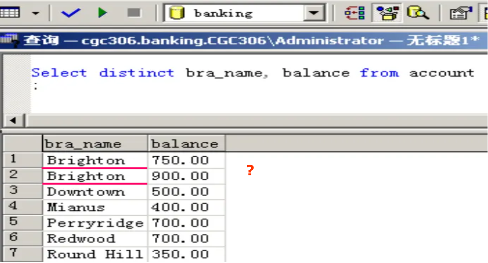

SQL 语句包括以下类型：

- Data-Definition Language(DDL)
    - Create table
    - Create index
    - Create view
    - Create trigger(监视器)
- Data-Manipulation Language(DML)
    - Select from
    - Insert delete update
- Data-Control Language(DCL)
    - Grant revoke(权限管理)

## Data-Definition Language

!!! example
    ```SQL
    CREATE TABLE branch
                ( branch_name char(15) not null, 
                branch_city varchar(30), 
                assets numeric(8, 2), 
                primary key (branch_name))
    ```

### Domain Types in SQL

在数据库中创建表格，表格中每一个属性都会有对应的类型或者域（domain）。

- **char(n)**: 定长的字符串，具体长度由用户决定；
- **varchar(n)**: 变长的字符串，最大长度由用户指定；
- **int**: 整型数，具体范围由具体机器决定（32 位）；
- **smallint**: 小整型数，同样由具体机器决定；
- **numeric(p, d)**: 定长的小数，总位数是 $p$ 位，在小数点后有 $d$ 位；
- **real, double precision**: 单、双精度，具体精度由机器决定；
- **float(n)**: 浮点数，其精度至少为 $n$ 位；

如上就是一些基本类型，特别地，我们申明 **Null** 值可以被写在任何类型中。除此以外，我们还有一些关于时间的类型：

- date: 日期，包括年月日；
    - E.g., date ‘2007-2-27’ 
- Time: 时间，表示一天内时间，包括时分秒；
    - E.g., time ‘11:18:16’, time ‘11:18:16.28’ 
- timestamp: 即将上述二者组合。 
    - E.g., timestamp ‘2011-3-17 11:18:16.28’ 

### Create Table

```SQL
CREATE TABLE r (A1 D1, A2 D2, ..., An Dn, 
                (integrity constraint1), 
                ..., 
                (integrity constraintk)) 
```

其意义为创建表格 r，各属性为 $A_1\sim A_n$，对应类型为 $D_1\sim D_n$。

同时会对表格进行完整性约束（integrity constraint），完整性约束有如下三种形式：

- not null，约定了某属性不可填入 null 作为值；
- primary key，指定该表格的主键/主码；
- check(p)，要求某些属性要满足表达式 p。

!!! example
    ```SQL
    CREATE TABLE branch
        (branch_name char(20) not null, 
        branch_city char(30), 
        assets integer, 
        primary key (branch_name), 
        check (assets >= 0)); 
    ```
    主键也可以直接写在上方，同时在高版本的 SQL 中，约定主键默认了 not null。
    ```SQL
    CREATE TABLE branch2
        (branch_name char(20) primary key,
        branch_city char(30), 
        assets integer, 
        check (assets >= 0)); 
    ```

### Drop and Alter Table

在创建完表格之后，我们可以对表格进行删改。

Drop 是删除表格的命令，其格式为 `DROP TABLE r`。该命令会在物理层面删除表格，是不可逆的操作，因此要谨慎使用该命令！

Alter 可以对表格进行增改。如果要在表格中增加属性，可以用如下格式实现：

```SQL
ALTER TABLE r ADD A D; 
ALTER TABLE r ADD (A1 D1, ..., An Dn); 
```

当然也可以直接删除一个属性：

```SQL
ALTER TABLE r DROP A 
```

同时 Alter 也可以使用 modify 关键字来直接修改属性。

### Create Index

创建索引的意义是提升此后检索的速度。其原理是为某一属性建立索引之后，就可以用数据结构来维护该属性，从而在检索的时候可以用二分等方式加速。其格式为：

```SQL
CREATE INDEX <i-name> ON <table-name> (<attribute-list>); 
CREATE UNIQUE INDEX <i-name> ON <table-name> (<attribute-list>); //不允许有重复的元组
```

## Basic Structure

SQL 筛选语句基本格式如下：

```SQL
SELECT A1, A2, ...,An FROM r1, r2, ...,rm WHERE P
```

表示从 $r_1\sim r_m$ 中选出满足 P 的元组并保留 $A_1\sim A_n$ 属性。如果写成关系代数表达式，则是如下形式：

$$
\Pi_{A_1,A_2,\dots,A_n}\sigma_{P}(r_1\times r_2\times \dots\times r_m)
$$

注意，此处为笛卡尔积而不是自然连接，这是因为我们需要契合其它特殊连接。

### Select Clause

我们需要对选择分句作出一些说明。在选择的属性中，属性名称不能用 `-` 来连接，而应该用下划线来连接。其次，SQL 语句对大小写是不敏感的，因此写成 `SELECT` 和 `select` 都是没有区别的。

同时，非常重要的区别是，SQL 语句选择结果是**允许冗余**的，因此我们可以加上关键字 `distinct` 来去重。该关键字是加在整个属性集合上的，而不是某个特定属性上的。当然对应的，我们有 `all` 关键字，表示允许冗余的选取，是默认的。

!!! example
    如下图，虽然两个分支的名字相同，但是余额不同，所以并不会被 `distinct` 去重。
    

同时，`*` 在选择分句中表示选择所有属性。当然，`+-*/` 等运算也可以用在属性运算上。

!!! example
    ```SQL
    SELECT loan_number, branch_name, amount * 100 FROM loan 
    ```

### Where Clause

条件分句约定了该次筛选的条件。条件语句用 `AND,OR,NOT` 来连接。特别地，在 SQL 中可以使用 `BETWEEN` 作为比较运算符，其等价于 `>=lower_bound AND <=upper_bound`。

### From Clause

来源分句约定了筛选的对象，可以包含多个关系，此时这些关系是用笛卡尔积结合。那么我们知道，如果两个关系中有相同的属性，做完笛卡尔积之后需要保留二者的属性，再加上前缀加以区分。那么在 SQL 中，我们也需要注意这一点。

!!! example
    ```SQL
    SELECT customer_name, borrower.loan_number, amount 
    FROM borrower, loan 
    WHERE borrower.loan_number = loan.loan_number and branch_name = ‘Perryridge’ 
    ```

### The Rename Operation

我们还可以在 SQL 中对行列进行重命名。

对列进行命名可以用关键字 `AS`，其范式如下：

```SQL
old_name AS new_name
```

关键字 `AS` 在大多数情况下**可以省略**，或者也可以用等号 `=` 代替。

对列重命名一般写在选择分句（Select Clause）里，旧名字可以是属性的表达式而不一定要是单一的属性名。

!!! example
    ```SQL
    SELECT customer_name, borrower.loan_number as loan_id, amount 
    FROM borrower, loan 
    WHERE borrower.loan_number = loan.loan_number 
    ```

同时，我们也可以对关系进行重命名，从而简化表达或者实现自积。

!!! example
    简化表达可以缩短关系的名称：
    ```SQL
    SELECT customer_name, T.loan_number, S.amount 
    FROM borrower as T, loan as S 
    WHERE T.loan_number = S.loan_number 
    ```
    如果需要自己对自己作笛卡尔积，也可以使用重命名来实现：
    ```SQL
    SELECT distinct T.branch_name 
    FROM branch as T, branch as S 
    WHERE T.assets > S.assets and S.branch_city = ‘Brooklyn’ 
    ```

### String Operations

SQL 的字符串是支持**模糊匹配**的，其匹配格式和文件系统相似：

- `%` 代表任意的字符串；
- `_` 代表任意的字符。

要在 SQL 中实现模糊匹配，可以用关键字 `LIKE` 来实现。当然，如果匹配模式中就含有上述两个关键字，可以使用 `\` 来反转义。

!!! example
    ```SQL
    SELECT customer_name 
    FROM customer 
    WHERE customer_name LIKE ‘%泽%’
    ```
    如果要匹配 "Main%"，可以用反转义：`LIKE ‘Main\%’ escape ‘\’`。

也可以实现**字符串拼接**，用 `||` 来实现，如：`SELECT ‘客户名=’ || customer_name `。

当然，SQL 还支持很多其它字符串操作，包括转大小写，提取子串等等。

### Ordering the Display of Tuples 

在查询之后，我们可以加上 `order by` 关键字，来实现对元组（Tuple）的排序。

!!! example
    ```SQL
    SELECT distinct customer_name 
    FROM borrower A, loan B 
    WHERE A.loan_number = B.loan_number and branch_name = ‘Perryridge’ 
    order by customer_name
    ```

排序的时候，我们会默认按升序排序，如果想要降序则可以在属性后注记 `desc`。在多关键字场景下，可以将多个属性都放在 `order by` 关键字后。

!!! example
    ```SQL
    SELECT * FROM customer
    ORDER BY customer_city, customer_street desc, customer_name
    ```

## Set Operations

SQL 支持很多集合操作。集合操作无非就是交（Intersect），并（Union），差（Except）。在 SQL 中我们可以用对应的关键字，对集合作这些操作。

```SQL
(SELECT customer_name FROM depositor) UNION (SELECT customer_name FROM borrower) 
(SELECT customer_name FROM depositor) INTERSECT (SELECT customer_name FROM borrower) 
(SELECT customer_name FROM depositor) EXCEPT (SELECT customer_name FROM borrower) 
```

## Aggregate Functions 

SQL 也支持聚集函数。但是想要在查询语句中使用聚集函数，有几个需要注意的问题。

> 如果 `SELECT` 语句后有聚集函数出现，则不在聚集函数内部的属性必须出现在 `Group by` 语句后面。

举个例子，如下语句是错的：

```SQL
SELECT branch_name, avg(balance) avg_bal 
FROM account 
WHERE branch_name = ‘Perryridge’ 
```

原因是我们 SQL 语句需要有普适性，肯定会有某种情况下我们会需要删去上面语句中的 `WHERE`，此时我们就不知道对余额求平均的范围了，导致了比较严重的混淆。因此我们令 branch_name 必须出现在某个 `Group by` 语句后，如：

```SQL
SELECT branch_name, avg(balance) avg_bal
FROM account 
GROUP BY brach_name 
```

> 在聚集函数 count 中，如果需要考虑不同的个数是多少，则可以加上关键字 `distinct`。

如下所示：

```SQL
SELECT branch_name, count(distinct customer_name) as tot_num 
FROM depositor D, account A
WHERE D.account_number = A.account_number 
GROUP BY branch_name
```

就能统计每个支行里不同名字的个数了。

> 如果要进一步对聚合函数的结果进行筛选，则可以使用 `HAVING` 分句。

比如说我要找到城市 Brooklyn 中账户平均余额多于 $1,200 的账户，可以这样写：

```SQL
SELECT A.branch_name, avg(balance) 
FROM account A, branch B 
WHERE A.branch_name = B.branch_name and branch_city =‘Brooklyn’ 
GROUP BY A.branch_name 
HAVING avg(balance) > 1200 
```

同样的，如果在 `HAVING` 分句中，有不作用聚集函数的属性，则该属性必须出现在 `Group by` 分句中。

## Summary

我们现在可以对查询语句进行总结了。它基本的范式如下：

```SQL
SELECT <[DISTINCT] c1, c2, ...> FROM <r1, ...> 
[WHERE <condition>] 
[GROUP BY <c1, c2, ...> [HAVING <cond2>]] 
[ORDER BY <c1 [DESC] [, c2 [DESC|ASC], ...]>] 
```

其中 `[]` 为可选项，`<>` 为不定长。

那么整个语句的**执行顺序**如下：

$$
from\to where\to group(aggregate)\to having\to select\to distinct\to order by
$$

在该顺序中需要特别注意，`HAVING` 语句的谓词是在分组之后的，而 `WHERE` 语句的谓词是在分组之前的。**严格遵照该顺序**可以避免很多错误。

同时我们需要注意，聚集函数**不能**用在 `WHERE` 语句中，正是因为此时还未分组，如果可以作用，那么会使得整个关系降维聚集。

## Null Values

正如我们在之前关系代数中所言，null 值是一种特殊的值，在 SQL 语句中，我们也允许 null 相关值的出现，因此现在需要来讨论 null 值的运算和一些注意事项。

1. null 值与任何值作算术运算结果都是 null；
2. null 值与任何值作逻辑比较运算结果都是 unknown。

我们遇到了一个新的名词 unknown，它是与 true/false 一同作为逻辑结果的。在作逻辑运算时，如果结果不能够被确定，那么就等于 unknown，否则就直接等于那个能够确定的结果（确定指与上 false 或者或上 true）。

那么对于运算结果是 unknown 的表达式，如果是在 `WHERE` 分句中，则**视为 false**。

在实际使用中，我们可能会遇到需要判断是否为 null 的场景，此时我们可以使用谓词 `is null` 和 `is not null` 来应对。相应的，`P is unknown` 可以用来判断谓词 `P` 是否为 unknown。

??? example "一个错误的例子"
    ```SQL
    SELECT loan_number 
    FROM loan 
    WHERE amount = null 
    ```
    该操作无法筛选出总金额是 null 的账户，因为我们说 null 值对所有的逻辑比较运算结果都是 unknown，而 unknown 在 `WHERE` 分句中视为 false。

最后需要注意的是，除了 count 以外的所有聚集函数都会**忽略** null 值，也就是完全不考虑，也不计数。如果聚集函数的目标中没有非 null 的值，那么其结果就是 null。

## Nested Queries 

当然，询问是可以嵌套的。我们可以在一次 `SELECT_FROM_WHERE` 语句之后，再套上一次。这种做法就叫嵌套查询。通常，我们用它来做一些集合的从属问题。

首先我们要先接受一个想法，就是询问语句从数据库中得到的，应该是一个集合。如果我们用关键字 `in` 和 `not in` 来连接一个属性和一个集合，那么就组成了判断从属关系。

**在下面的例子中，要时刻注意上面提到的语句执行顺序。**

!!! example "e.g.1"
    > Find all customers who have both an account and a loan at the bank. 

    ```SQL
    SELECT distinct customer_name
    FROM borrower 
    WHERE customer_name in 
    (SELECT customer_name FROM depositor) 
    ```

上面这个例子展示了嵌套查询的基本用法。事实上，这个问题是可以不使用嵌套来实现的，如下：

```SQL
SELECT distinct B.customer_name 
FROM borrower B, depositor D 
WHERE B.customer_name = D.customer_name
```

但是嵌套避免了重命名和笛卡尔积，使整个过程的逻辑更加清晰，在更为复杂的询问中占有优势。

!!! example "e.g.2"
    > Find all customers who have loans at a bank but do not have an account at the bank.

    ```SQL
    SELECT distinct customer_name
    FROM borrower 
    WHERE customer_name not in (SELECT customer_name FROM depositor) 
    ```

在这个例子中就能看出，如果想用重命名的方式来实现的话，可能需要集合差（EXCEPT），但是如果用嵌套实现，实际只需要改成 `not in` 即可。

!!! example "e.g.3"
    > Find all customers who have both an account and a loan at the Perryridge branch. 

    ```SQL
    // Query1
    SELECT distinct customer_name 
    FROM borrower B, loan L 
    WHERE B.loan_number = L.loan_number and branch_name = ‘Perryridge’ and 
        (branch_name, customer_name) in 
        (SELECT branch_name, customer_name
         FROM depositor D, account A 
         WHERE D.account_number = A.account_number) 

    // Query2
    SELECT distinct customer_name 
    FROM borrower B, loan L 
    WHERE B.loan_number = L.loan_number and 
        branch_name = ‘Perryridge’ and 
        customer_name in
        (SELECT customer_name
         FROM depositor D, account A 
         WHERE D.account_number = A.account_number and
            branch_name = ‘Perryridge’) 

    // Query3
    SELECT distinct customer_name 
    FROM borrower B, loan as t
    WHERE B.loan_number = t.loan_number and 
        branch_name = ‘Perryridge’ and 
        customer_name in
        (SELECT customer_name 
         FROM depositor D, account A
         WHERE D.account_number = A.account_number and 
         branch_name = t.branch_name) 
    ```

上面展示的三种询问，分别想要说明 SQL 嵌套的一些特性。

- Query1：可以看到，我们将 branch_name 和 customer_name 组合成一个元组，然后对这个元组去做集合从属判断。
- Query2: 是提醒我们，尽管内部的询问是嵌套的，但是如果有其它属性会产生影响的话，还是需要对这些属性进行约束的。同时它向我们展示了如何简化 Query1 的写法。
- Query3: 则是提醒我们重命名的用法。从执行顺序可以看到，`FROM` 的优先级是非常高的，所以如果在 `WHERE` 从句中有嵌套，那么嵌套询问中也可以使用 `FROM` 中写的重命名。

!!! example "e.g.4"
    > Find the account_number with the maximum balance for every branch. 

对于该查询，我们先来看几种典型**错误**写法：

??? warning "case1"

    ```SQL
    SELECT account_number, balance
    FROM account
    WHERE balance >= max(balance)
    GROUP BY branch_name
    ```

    我们前面提到过，在 `WHERE` 从句中是不能使用聚集函数的，因为此时还未分组。

??? warning "case2"

    ```SQL
    SELECT account_number, max(balance) 
    FROM account 
    GROUP BY branch_name
    ```

    我们之前说过，在 `SELECT` 从句中有聚集函数时，不作用聚集函数的属性必须要出现在 `Group by` 中。

??? warning "case3"

    ```SQL
    SELECT account_number, balance 
    FROM account 
    GROUP by branch_name 
    HAVING balance >= max(balance) 
    ORDER by balance
    ```

    同样地，和 case2 是同一个原理。在分组之后，`SELECT` 从句中只能出现被分组的列，和聚集函数。


你会发现，无论如何我们都**无法**用单个查询去完成这次询问。因此我们需要嵌套子查询来做到这件事：

```SQL
SELECT account_number, balance
FROM account a
WHERE balance = (
    SELECT MAX(balance)
    FROM account b
    WHERE a.branch_name = b.branch_name
);
```

那么到现在为止，我们应该已经熟悉了嵌套查询的应用了，下面将展示嵌套查询在集合比较中的应用。有的时候我们会需要描述“大于某些”或者“大于所有”这样的查询，此时用嵌套查询将会比较方便。

### Set Comparison

SQL 为我们提供了谓词 `SOME`，来表示集合中存在某个值。对应的，也有谓词 `ALL`，表示集合中所有的值。下面用几个例子来说明。

!!! example
    > Find all branches that have greater assets than some branch located in Brooklyn. 

    ```SQL
    SELECT distinct branch_name FROM branch 
    WHERE assets > SOME
        (SELECT assets 
        FROM branch 
        WHERE branch_city = ‘Brooklyn’) 
    ```

需要注意的是，=all 与 in 是不等价的，同时 ≠some 与 not in 是不等价的。

### Test for Empty Relations

子查询的结果可能为空，此时我们可以用谓词 `exist` 来测试子查询的结果是否为空，从而实现一些判断。当然也可以在前面加上 `not` 来判断结果不是空。该谓词可以用来实现除法。如下：

我们要将如图给关系代数表达式转化为 SQL 语言。


SQL 转化结果为：

```SQL
SELECT distinct S.customer_name 
FROM depositor as S
WHERE not exists ( 
(SELECT branch_name FROM branch 
WHERE branch_city = ‘Brooklyn’) 
EXCEPT 
(SELECT distinct R.branch_name FROM depositor as T, account as R 
WHERE T.account_number = R.account_number and S.customer_name = T.customer_name))
```

这是因为如果两集合差为空，说明二者是子集的关系。这样就能判断结果是否为被除关系的子集了。

### Test for Absence of Duplicate Tuples

SQL 还提供了一个用来判断是否有重复元组的谓词 `unique`。一般在处理至多一个或者至少两个的时候可以使用。

!!! example
    > Find all customers who have at most one account at the Perryridge branch. 

    ```SQL
    SELECT customer_name 
    FROM depositor as T 
    WHERE unique 
        (SELECT R.customer_name 
        FROM account, depositor as R 
        WHERE T.customer_name = R.customer_name and 
        R.account_number = account.account_number and 
        account.branch_name = ‘Perryridge’) 
    ```

