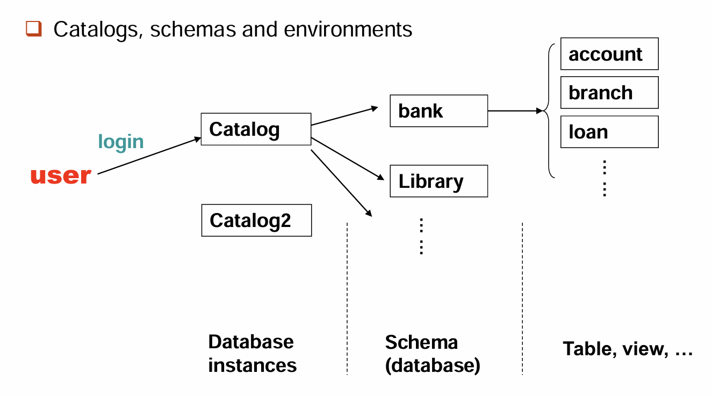
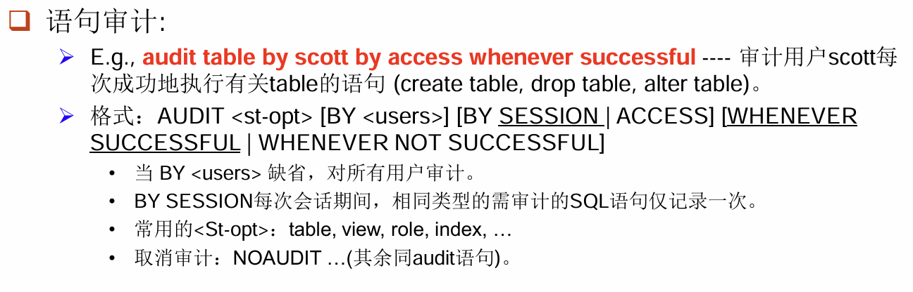
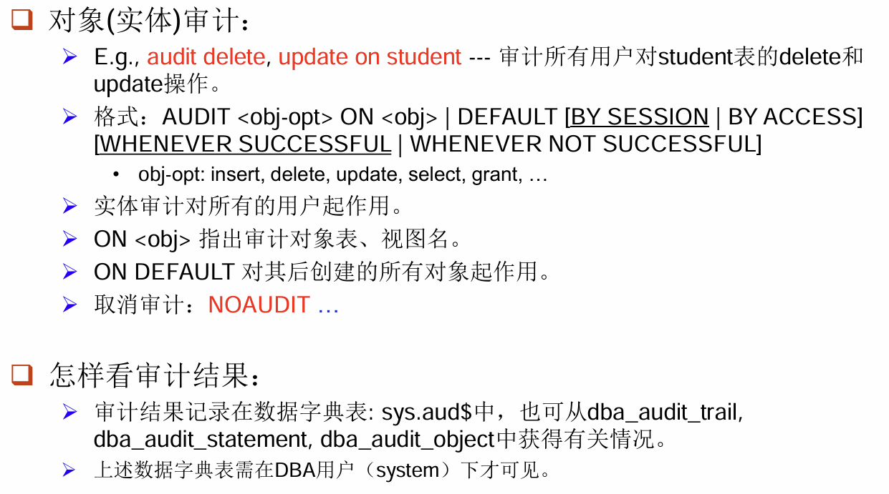

## SQL Data Types and Schemas

我们在 SQL 中会使用各种各样类型的数据，有的时候，我们还可以自己定义数据类型，比如：

```sql
Create type person_name as varchar (20)
```

这样在之后就可以：

```sql
Create table student
(sno char(10) primary key, sname person_name, ssex char(1), birthday date) 
```

那么在 type 之外，我们还可以自定义域（domain），域的意义是可以加上约束条件。如：

```sql
Create domain Dollars as numeric(12, 2) not null; 
Create domain Pounds as numeric(12,2); 
Create table employee 
        (eno char(10) primary key, 
        ename varchar(15), 
        job varchar(10), 
        salary Dollars, 
        commPounds); 
```

同时，我们也有可能需要向数据库里存储一些比较大的文件，比如说图片、视频等等。如果直接存储在数据库中会显得过于臃肿，因此我们定义一些特殊的类型来指向大型对象（Large Object），在我们做查询的时候，对于这些大型对象会返回**指针**而不是对象本身。

- **blob**(binary large object)：指向一些由二进制进行编码的文件。
- **clob**(character large object)：指向由字符进行编码的文件。

!!! example
    ```sql
    Create table students 
        (sid char(10) primary key, 
        name varchar(10), 
        gender char(1), 
        photo blob(20MB), 
        cv clob(10KB))
    ```

从上面我们可以看出，整个数据库的存储逻辑是**分层**的，具体的分层方法可以参考下图：

!!! note
    

## Integrity Constraints

在[上一章](./lec03.md)中我们就已经介绍了部分完整性约束的内容。完整性约束是为了避免数据库在使用过程中遭遇了意外的损毁而对数据造成过大的影响。任何实例都必须遵循完整性约束，而完整性约束由数据库自动维护。

先来回顾一下之前提到过的完整性约束：

- Not null: 约束一个属性不能为 null；
- Primary key: 指定一个属性为主键；
- Unique: 指定该属性不能重复；
- Check(P): 对 P 进行验真判断。

??? example
    ```sql
    Create table branch2 
        (branch_name varchar(30) primary key, 
        branch_city varchar(30), 
        assets integer not null, 
        check (assets >= 100))
    ```

### Domain Constraints

在前文中我们提到域的定义，在定义域的时候我们说可以加上完整性约束。那么在这里我们指出，这个约束是可以被定义并命名的。我们使用关键字 `Constraint`，就可以定义一个完整性约束。比如：

```sql
Create domain hourly-wage numeric(5, 2) 
Constraint value-test check(value > = 4.00)
```

就是定义了一个叫做 `value-test` 的完整性约束，并将其作用在 `hourly_wage` 字段。这样的好处是：如果报错，我们可以快速找到是与哪部分的完整性约束产生冲突；其次，如果我们想对约束进行更改也可以直接使用该名字来实现，而不用去查系统表；最后，这一操作还能提高可读性。

当然，这都是可选项，我们也可以不对其进行定义命名：

```sql
Create domain hourly-wage numeric(5, 2) 
check(value > = 4.00)
```

### Referential Integrity

参照完整性约束实际上就是我们之前讲过的外键约束。它的正式定义是这样的：

> 对于两个关系 $r_1$ 和 $r_2$，它们的主键分别是 $K_1$ 和 $K_2$。如果 $r_2$ 中存在属性子集 $\alpha$，满足对于 $r_2$ 中任何元组 $t_2$，都在 $r_1$ 中能找到一个 $t_1$，使得 $t_1[K_1]=t_2[\alpha]$。

这样的定义比较抽象，但是我们可以通俗地解释：参照关系（referencing relation）中的外键的值，如果不是 null，就必须在被参照关系（referenced relation）中实际存在。也就是说：

$$
\Pi_{\alpha}(r_2)\subseteq \Pi_{K_1}(r_1)
$$

本质来说，我们就是申明了这样一个约束：在参照关系中，我们提到另一个被参照关系的主键，不能超出主键的值域。这是显然的，比如说我在参照关系中需要提到课程编号，那么被参照关系课程集合的所有课程编号就成了参照关系的值域。

在该种约束下，对表格进行增删就需要一些前提条件。

- Insertion: 对于新插入的元组 $t_2$，必须满足 $t_2[\alpha]\in \Pi_K(r_1)$；如果是修改本质上和插入是一样的。
- Deletion: 对于要删除被参照关系中的元组 $t_1$，则需计算 $\sigma_{\alpha=t1[K]}(r_2)$，如果不为空，则要么拒绝此次删除，要么进行连锁删除（cascading deletions）。

那么在 SQL 语句中，我们如何描述申明这种约束呢？首先我们之前用 `primary key` 来约定主键，用 `unique` 来约定候选键。那么我们可以用关键字 `foreign key` 来约定外键。首先我们需要列出该表格中的外键，然后加上 `references` 和被参照关系的名字，表示整个外键约束关系。

在默认情况下，被参照关系中的主键会作为参照的属性。如果是其它的候选键，那么可以具体指定。

!!! example
    ```sql
    Create table customer 
        (customer-name     char(20), 
        customer-street    varchar(30), 
        customer-city      varchar(30), 
        primary key (customer-name));
    
    Create table branch 
        (branch-name       varchar(15), 
        branch-city        varchar(30), 
        assets             integer, 
        primary key (branch-name));

    Create table account 
        (account-number    char(10),
        branch-name        char(15), 
        balance            integer, 
        primary key (account-number), 
        foreign key (branch-name) references branch);

    Create table depositor 
        (customer-name        char(20), 
        account-number        char(10), 
        primary key (customer-name, account-number), 
        foreign key (account-number) references account, 
        foreign key (customer-name) references customer);
    ```

#### Cascading Actions

在前面我们提到过连锁操作，也就是说，如果两个表之间有参照关系，那么当对应的主键修改或删除后，为了保证完整性，我们可能拒绝该次操作，或者连锁地修改所有相关的值。那么当我们需要连锁修改的时候，可以用关键字 `Cascade` 来标注。我们将其称为级联操作（Cascading Actions），它的基本范式如下：

```sql
Create table account ( 
...
foreign key (branch-name) references branch
[ on delete cascade] 
[ on update cascade ] 
...);
```

具体地，如果我们删除了 branch 中的一个元组，其在 account 中有参照关系的元组也要同步删除。如果多个指定了删除级联的关系构成了一条链，那么在链的一端进行的删除会自动地传递下去。当然，这个过程中可能导致冲突，在冲突的时候，系统会丢出一个事务并终止，那么任何由此次删除引起的变化**都将复原**。

当然，除此以外，我们也可以设定在对应主键删除后改为什么。如下：

```sql
on delete set null 
on delete set default
```

分别表示外键设为 null 和默认值（一般为 0，可以设定）。因此我们会发现，如果外键被设定为 null 是不会触发完整性约束检查的。因此为了避免这样的问题出现，我们一般对外键会有 `not null` 的约束。

同时，我们会关心另外一件事情，就是**约束检查的时机**。在默认情况下，是立即检查（NOT DEFERRABLE），也就是执行一条 SQL 语句之后就会对其进行完整性检查。当然，我们也可以选择延迟检查（DEFERRABLE），在这种情况下，提交（COMMIT）一次事务之后才会检查一次。

??? note "为什么需要延迟检查"
    在配偶关系：
    ```sql
    marriedperson(name, address, spouse)
    ```
    中，我们考虑插入一对配偶，那么每个人的 spouse 都有着指向该关系的外键约束。

    如果我们选择立即提交，则在插入其中一个人的时候会发现另一个人并没有在关系中，从而触发完整性约束的报错。如果选择延迟，则可以在两个人都插入后，再对关系进行检查，完美解决了这个问题。

### Assertions

断言是一个谓词表达式，数据库中所有的关系都需要满足这个表达式。我们通常用它来处理一些复杂的约束条件。它有如下的形式：

```sql
CREATE ASSERTION <assertion-name>
    CHECK <predicate>;
```

每当作出一个断言，系统就会检查所有可能违反断言的操作，如果发现违反则会直接报错。这一过程会有大量的开销，因此使用断言需要谨慎。

!!! example
    > The sum of all loan amounts for each branch must be less than the sum of all account balances at the branch. 

    由于 SQL 没有提供 forall 的写法，因此我们可以对两侧进行否定，写成不存在使得否 P 的形式。

    ```sql
    CREATE ASSERTION sum-constraint CHECK 
    (not exists (select * from branch B 
        where (select sum(amount) from loan 
            where loan.branch-name = B.branch-name) 
            > (select sum(balance) from account 
            where account.branch-name = B.branch-name))) 
    ```

!!! example
    > Every loan has at least one borrower who maintains an account with a minimum balance of $1000.

    ```sql
    CREATE ASSERTION balance-constraint CHECK 
    (not exists (select * from loan L
        where not exists (select * 
                        For each loan-number, 
                        to see if exists 
                        from borrower B, depositor D, account A 
                        where L.loan-number = B.loan-number 
                        and B.customer-name = D.customer-name 
                        and D.account-number = A.account-number 
                        and A.balance >= 1000))) 
    ```

### Triggers

触发器就是在满足触发条件的时候，自动进行一些操作，作为本次操作的副效果。我们可以从以下这个例子开始。

> 在银行存贷款数据库中，如果一个人的存款减到负数，我们希望能够自动地将其设定为零，并在贷款加入一条对应的数据来记录。

那么在这种情况下，想要触发的条件，就是某一次修改会导致存款为负。所以：

```sql
CREATE TRIGGER overdraft-trigger after update on account 
referencing new row as nrow for each row 
when nrow.balance < 0
```

那么触发之后需要做什么呢？首先在贷款处保证插入了完整的数据内容，然后再将存款设定为 0。

```sql
begin atomic 
    insert into borrower
    (select customer-name, account-number from depositor 
    where nrow.account-number = depositor.account-number) 

    insert into loan values 
    (nrow.account-number, nrow.branch-name, – nrow.balance) 
    
    update account set balance = 0 
    where account.account-number = nrow.account-number 
end
```

OK，在这里我们需要对上述的一些语法作出一些解释。

- 触发器定义的第一行说明了触发的操作类型（update/delete/insert）、执行时间（before/after）、关注的表格（account）。在上方没有列出，我们可以只对某些属性进行监视，如 `after update of balance on account ...`。
- 第二行的 referencing 表示我们需要的数据是修改前还是修改后，分别用 `old row` 和 `new row` 来表示。当然，如果是删除操作就没有 `new row`，同样如果是插入操作就没有 `old row`。
- 我们还可以写 `referencing old/new table`，这样就是直接得到整个旧/新的表格，可以在 `when` 中使用 `select from where` 来进行更复杂的条件判断。
- 同一行还有一个 `for each row` 表示每一行受到修改就进行一次触发，我们还可以写 `for each statement`，这样一个语句就只会触发一次。

接下来我们从一个更实际的问题来看触发器的其他应用。假设我们在管理一家仓库，当库存低于警戒线时，需要增加订单来获取更多的库存。在这个问题中，我们希望触发器能够触发对外界的行为，但是数据库是不能直接进行外部行动的，所以我们需要定义一个内部的关系来记录订单，从而间接地影响外部。

最后我们考虑触发器的局限性。在以前数据库的性能弱的时候，我们在维护汇总数据和做内容复制的时候，如果不使用数据库就得每次手动来检查更新。但是现在的数据库可以用物化视图等方式来实现，触发器隐性执行、难调试的缺点就显现出来。

## Authorization

权限管理的目的就是为了保证数据的安全，在此之前，我们需要对数据库的层次，以及每个层次可能导致的危险作出分析。

1. 数据库系统层：对用户权限进行管理，让每一种用户只访问到需要的数据；
2. 操作系统层：系统管理的权限很大，可以直接访问数据内容，因此必须做好该层的安全；
3. 网络层：需要防止窃听、伪装等网络攻击，使用加密等方法来进行数据传输；
4. 物理层：需要能够应对现实场景中的意外，如破坏设备、洪水、火灾等。可以使用门禁、备份等方式来应对；
5. 人为层：最弱的一层，需要加强用户审核、安全培训等来应对。

那么在数据库中，我们可以通过视图来进行用户操作，而不是直接给用户提供原始的表。并且，我们还可以进一步地对视图进行权限管理，从而进一步提高数据库的安全性。

比如说，如果银行职员想要看每个支行的客户名字，但是没有查看贷款的权限。此时我们可以创建视图：

```sql
CREATE VIEW cust_loan as 
SELECT branchname, customer_name 
FROM borrower, loan 
WHERE borrower.loan_number = loan.loan_number
```

这样在需要查询的时候就可以：

```sql
SELECT * 
FROM cust_loan
```

后面我们会讨论授权相关的内容。DBA 是数据库系统中最高权限人，他可以将部分权限授予其它用户，这些用户也可以将自己的部分权限授予其它用户。当 DBA 或者某用户回收权限时，要确保下游的所有用户都不再拥有该权限。因此我们要保证权限授予的图不能有环。

在 SQL 中，可以用如下方式来授予权限：

```sql
GRANT<privilege list> ON <table | view> 
TO <user list> 
```

- 在这里，user list 可以是 user_id，可以是 public，也可以说明是一个 role（后面会解释）；
- 授予一个视图的权限，并不代表授予组成视图的下层表的任何权限；
- 权限授予者自身必须先拥有相关权限。

同时，我们需要说明一下权限的范围：如 select,delete 等都是顾名思义的。权限 references 表示允许在创建的时候申明外键约束。权限 all (privileges) 表示授予所有权限。

当然，能够继续向下授权本身也是一种权限，我们可以用 `with grant operation` 来描述这一权限。如：

```sql
grant select on branch to U1 with grant option;
```

如果我们需要对多个用户授予相同的权限（这在现实场景中非常常见），那么可以使用角色（role）来简化。

```sql
Create role teller;
Create role manager;
Grant select on branch to teller;
Grant update (balance) on account to teller;
Grant all privileges on account to manager;
Grant teller to manager;
Grant teller to alice, bob; 
Grant manager to avi;
```

对应的，我们也会有权限撤销，其范式如下：

```sql
REVOKE <privilege list> ON <table | view> 
FROM<user list> [restrict | cascade]
```

我们发现这里有级联的选项，这是因为你撤销一个权限可能导致后续的权限撤销，因此如果选择 cascade，那么将会级联的删除下去。那如果选择了 restrict，那么如果后续需要级联删除，就会拒绝本次撤销。

这里，`<privilege list>` 可以是 ALL，可以移除所有目标可能有的权限。`<user list>` 可以是 public，那么除了那些被显示地赋予权限的用户，所有用户都被撤销相应的权限。如果一个用户的一个权限被两个以上的用户授予，那么经过一次撤销后他仍然可能拥有该权限。

那么接下来我们将讲述一些 SQL 权限管理的**缺陷**。

1. **SQL 不支持行级管理**：比如说大学成绩记录表，每个同学应当只能查询他自己的成绩。但是在我们前面的权限管理中，我们只能限制某些用户查询某些列或者某些表，却无法限制他只查询某一行。
2. **用户共享问题**：在现在的 Web 服务器架构中，所有 app 用户都会共享同一个服务器用户，我们没法具体知道到底是谁在使用该用户。

那么为了解决这些缺陷，我们想到**落实到应用层**来进行管理。我们用 C++ 等语言来实现应用层，就可以实现更细粒度（fine-grained）控制。但是这样也会带来一些问题，比如调试变得复杂，语句变得分散不方便集中维护。

那么为了解决这个问题，我们又想到用审计日志（Audit Trails）的方式来记录谁在什么时候做了什么操作，日志可以用来查错、查违规等行为。如何实现日志呢？首先我们可以使用触发器（Trigger），在每次更新操作的时候写入日志。那么在现代的数据库中，Audit log 和 CDC 等内置可以直接完成。

??? note "Audit in Oracle"
    

    

## Embedded SQL 

事实上就是我们可以把 SQL 内嵌到高级语言中，下面以 C 语言为例解释。在 C 中，我们使用 `EXEC SQL<embedded SQL statement> END_EXEC` 来内嵌。宿主语言不同，格式完全不同。

### Query

在做单行查询的时候，我们可能会动态地需要从外部读入信息，这些变量需要在 `DECLARE SECTION` 中声明。如下：

```sql
EXEC SQLBEGIN DECLARE SECTION; 
char V_an[20], bn[20];
float  bal; 
EXEC SQLEND DECLARE SECTION; 
```

那么这些变量就可以用在后面的 SQL 内嵌语句中，用法是在变量名前面加上 `:`。

```sql
scanf(“%s”, V_an);   // 读入账号,然后据此在下面的语句获得bn, bal的值
EXEC SQL
SELECT branch_name, balance INTO :bn, :bal
FROM account WHERE account_number = :V_an; 
END_EXEC
printf(“%s, %s, %s”, V_an, bn, bal); 
```

意思是把查询的结果写入变量 `bn` 和 `bal`。

那么面对多行数据，我们会注意到我们无法直接写入到几个变量中，此时我们需要用到游标（cursor），可以类似地理解成 C 语言的指针，它可以一行一行地扫过去，并且每次将结果写入特定变量，从而实现了多行数据的读取。

首先我们需要定义查询和游标：

```sql
EXEC SQL
DECLARE c CURSOR FOR
SELECT customer_name, customer_city
FROM depositor D, customer B, account A
WHERE D.customer_name = B.customer_name
  AND D.account_number = A.account_number
  AND A.balance > :v_amount
END_EXEC
```

然后我们执行查询并将结果暂存，用游标指向第一条数据：

```sql
EXEC SQL OPEN c END_EXEC
```

然后每次取出数据写入宿主语言的变量中：

```sql
EXEC SQL FETCH c INTO :cn, :ccity END_EXEC
```

当一个在 SQLCA 的名叫 `SQLSTATE` 的变量为 `02000` 时表明读到结尾了。随后我们关闭数据库游标即可。

```sql
EXEC SQL CLOSE c END_EXEC
```

下面是个完整的例子：

```sql
Exec SQL include SQLCA;  // SQL 通讯区，是存放语句的执行状态的数据结构，其中有一个变量 sqlcode 指示每次执行 SQL 语句的返回代码（success, not_success）。
Exec SQL BEGIN DECLARE SECTION; 
char bn[20], bc[30]; 
Exec SQL END DECLARE SECTION; 
Exec SQL DECLARE branch_cur CURSOR FOR 
Select branch_name, branch_city From branch; 
...
Exec SQL OPEN branch_cur; 
While (1) {
    Exec SQL FETCH branch_cur INTO :bn, :bc; 
    if (sqlca.sqlcode <> SUCCESS) BREAK; 
    ...   // 由宿主语句对bn, bc中的数据进行相关处理
} 
Exec SQL CLOSE branch_cur; 
```

### Updates

修改大体上与查询一样，涉及多行修改时，就可以使用游标，对当前游标进行修改用 `where CURRENT OF csr`。

```sql
Exec SQL BEGIN DECLARE SECTION;  
char an[20]; 
float bal; 
Exec SQL END DECLARE SECTION; 
EXEC SQL DECLARE csr CURSOR FOR 
SELECT * 
FROM account 
WHERE branch_name = ‘Perryridge’ 
FOR UPDATE OF balance; 
EXEC  SQL OPEN csr; 
While (1) { 
    EXEC SQL FETCH csr INTO :an, :bn, :bal; 
    if (sqlca.sqlcode <> SUCCESS) BREAK; 
    ...   // 由宿主语句对 an, bn, bal 中的数据进行相关处理(如打印) 
    EXEC SQL update account 
    set balance = balance + 100 
    where CURRENT OF csr;
} 
... 
EXEC SQL CLOSE csr;
```

## Dynamic SQL

与嵌入式 SQL 类似，我们把 SQL 语句写成字符串，并用 `?` 进行占位。在要用到的时候使用 `using` 填入 `?` 处即可。

```sql
char *sqlprog = "update account
                set balance = balance * 1.05 
                where account_number = ?"
EXEC SQL PREPARE dynprog FROM :sqlprog; 
char v_account [10] = "A_101"; 
```

## ODBC and JDBC

To be completed...