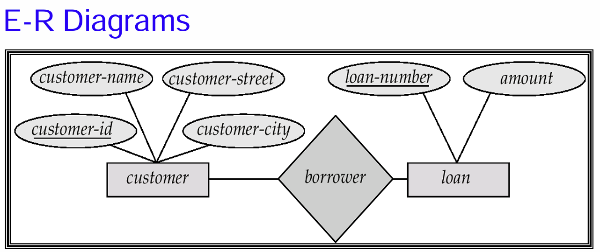
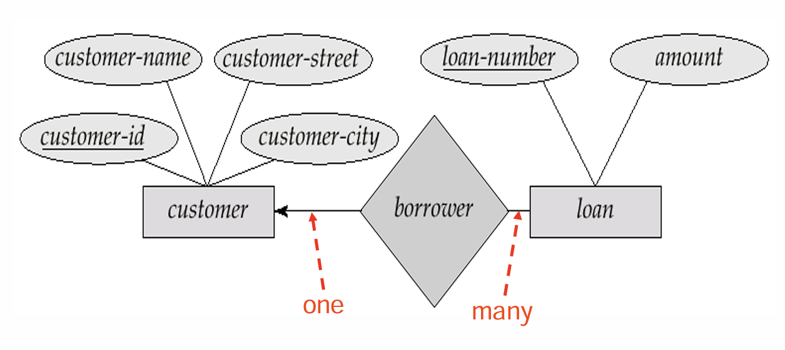
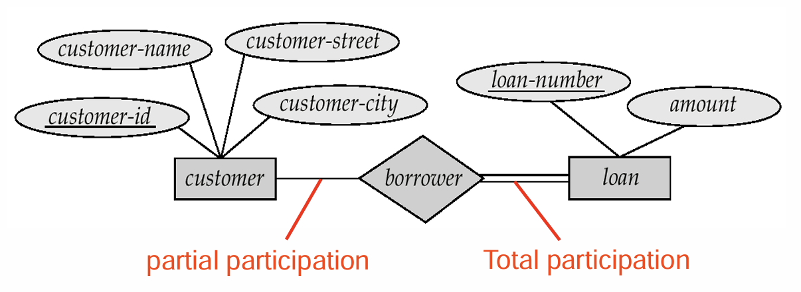
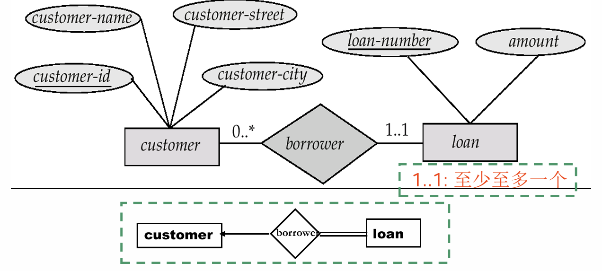
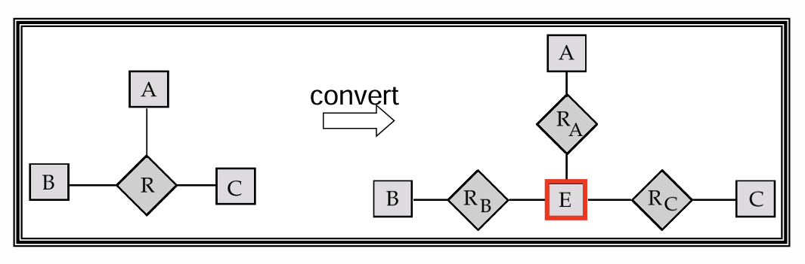
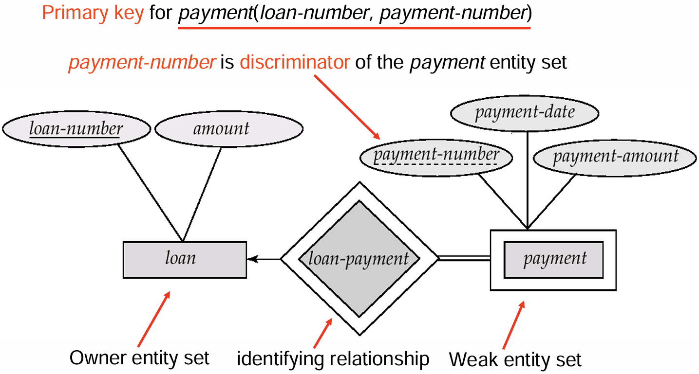
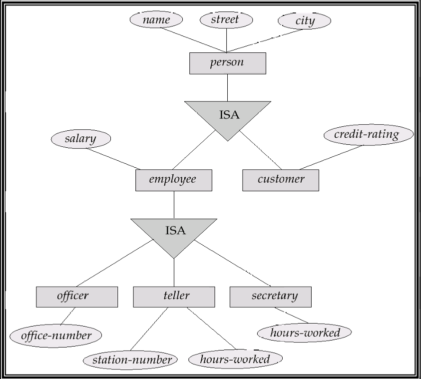
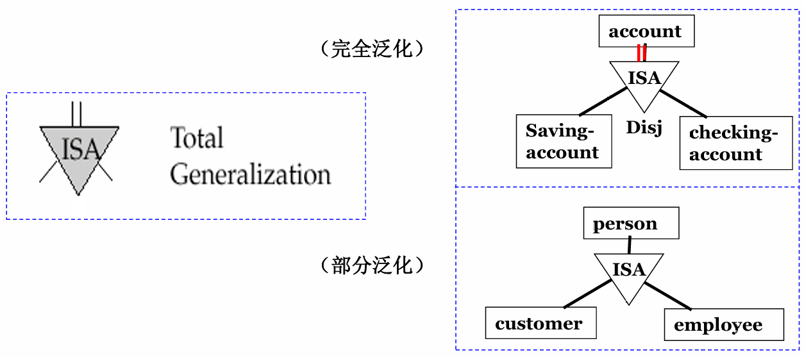
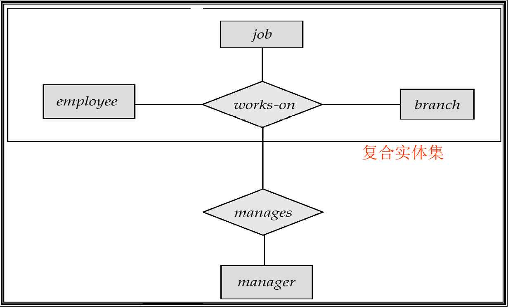
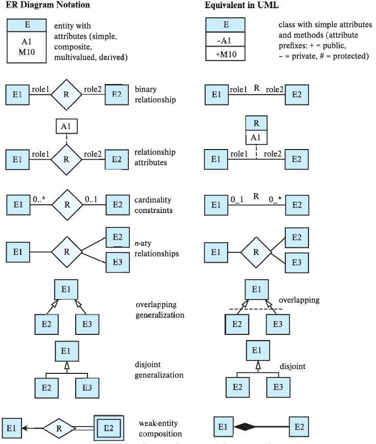

ER 模型的想法就是任何的数据库我们都可以通过实体-关系的方式来描述。因此我们会先介绍实体集和关系集，然后介绍如何构建一个 ER 图来表现一个 ER 模型。

## Entity Sets

**实体**（Entity）指实际存在的客观对象，可以与其它对象相区分。可以是具体的也可以是抽象的。每个实体都会有一些属性，比如人是一个实体，对于人来说，ta 的名字、身高等就是ta 的属性。实体集就是包含同一类实体的集合。

我们在之前关系中也讲到过属性。属性有几种分类方式：

- 简单和复合属性：比如性别是简单属性，而地址、名字等可以进一步拆分的就是复合属性；
- 单值和多值属性：比如所有电话号码就是多值属性；
- 派生属性与基属性：派生属性可以由其它属性组合得到，比如年龄，可以通过出生日期计算得到。

## Relationship Sets

关系描述的是两个或多个实体之间的关联。关系集是多个同一类型关系的集合。

关系集的**度**（degree）代表的是该关系集所联系的实体集的个数。大部分情况下，我们只考虑度为 2 的关系集，度大于 2 的关系集比较少见。

**映射基数**（Mapping Cardinalities）代表的是一个联系集中，一个实体可以与另一类实体相联系的实体数目。其中数目是指最多一个还是多个。

## Keys

关于键的概念我们在前几章已经提到过，包括超键、候选键以及主键，这些概念在这里同样使用。那么这些是实体集的键的概念。下面我们谈论的是关系集中键的概念：

1. 参与该关系集的各个实体集的主键的组合，就组成了该关系集的一个超码；
2. 在确定候选码的时候，必须要考虑到映射基数；
3. 在选择码的时候，要注意码的属性不能为空，值不应常变。

## E-R Diagram

矩形代表实体集，菱形代表关系集，用线来连接关系集和实体集。在以前的版本中，用椭圆连接实体集代表其属性，在现在我们可以直接把属性写在实体集的矩形内，后面会详细讲到。

!!! example "E-R 图"
    

当然，关系集联系的实体集不一定要是不同的，可以有**自环联系集**（Recursive relationship set）。

**Cardinality Constraints**：我们用是否带箭头的线来表示对单还是对多。如图，带有箭头一面的实体集是一，不带的是多，代表着一对多。



**Participation**：分为全参与和部分参与。全参与是说实体集中每个实体都在该关系中，部分参与则是存在一些实体不在关系中。对于全参与，我们可以用两条实线来描述。



**Alternative Notation**：除了上述两种方式以外，我们还有更普适的方法。直接用数字来标注实体集参与关系个数的上下限。`*` 表示没有限制。



**Ternary Relationship**：有的时候关系的度不一定为 2，用 ER 图也可以同理表示出来。但是在大部分情况下，我们其实可以把多元关系拆成二元的。



## Weak Entity Sets

在实际中，我们会遇到一种实体集，它本身没有主键，使得它没法通过某几个属性来区别几个实体，但是如果处在联系集中，则可以通过另一个实体集来区分。这种实体集我们称之为**弱实体集**（Weak Entity Sets）。由于它没有主键，我们一般将那些用于区分的属性叫做**分辨符**（discriminator）或**部分码**（partial key）。

弱实体集所依赖来区分各个实体的联系集称为其**标识性联系**（identifying relationship），对应的另一个实体集称为**标识实体集**（identifying entity）或**属主实体集**（owner entity set），那么该弱实体集的主键就由：标识实体集的主键加上自身的部分码构成。

!!! example
    

在这里我们还需要注意一个点，标识实体集中的主键并不需要显式地标注在弱实体集中，因为这已经隐含在标识性联系中了。

## Extended E-R Features

在前面的 ER 图中，我们讨论的大多是实体集和联系集之间比较直接的联系。但是在实际建模时，还会遇到实体集内部有层次、关系本身还要继续参与关系等情况。为了描述这些问题，我们需要引入一些扩展的 ER 特性。

### Specialization and Generalization

**特殊化**（Specialization）是一种自顶向下的设计过程。也就是说，我们先有一个比较泛的实体集，然后再根据其中某些实体的特殊属性或特殊联系，把它们划分成更低层的实体集。

比如 `person` 可以特殊化为 `customer` 和 `employee`。对于 `customer` 来说，我们可能关心信用评级；对于 `employee` 来说，我们可能关心工资。这些属性并不适用于所有 `person`，所以单独放在低层实体集中会更加自然。

!!! example
    

特殊化中一个很重要的概念是**属性继承**（Attribute Inheritance）。低层实体集会继承高层实体集的所有属性，也会继承高层实体集参与的联系。也就是说，如果 `employee ISA person`，那么 `employee` 不需要重新声明 `person-id, name, street, city` 等属性，它天然拥有这些属性。

**泛化**（Generalization）则是反过来的自底向上的设计过程。我们先发现多个实体集拥有共同的属性和联系，于是将这些共同部分抽象成一个更高层的实体集。比如 `customer` 和 `employee` 都可能有姓名、地址等属性，那么就可以把它们泛化成 `person`。

从 ER 图的表示上看，特殊化和泛化本质上是同一个结构，只是设计思路相反。因此很多时候二者可以混用。

### Constraints on Specialization

在特殊化/泛化结构中，我们还需要描述一些约束条件。首先是**低层实体集成员资格**的来源：

- 条件定义（Condition-defined）：某个实体是否属于低层实体集由条件决定。比如年龄超过 65 岁的 `person` 自动属于 `senior-citizen`；
- 用户定义（User-defined）：成员资格不是由属性条件自动推出，而是由用户或应用程序指定。比如把 `employee` 分到不同的 team。

其次是低层实体集之间是否可以重叠：

- **Disjoint**：不相交。一个高层实体至多属于一个低层实体集。比如一个 `account` 要么是 `saving-account`，要么是 `checking-account`；
- **Overlapping**：可重叠。一个高层实体可以同时属于多个低层实体集。比如一个 `person` 可以既是 `customer`，也是 `employee`。

最后是**完全性约束**（Completeness Constraint），它描述高层实体是否必须属于至少一个低层实体集：

- **Total**：完全泛化。每个高层实体都必须属于某个低层实体集；
- **Partial**：部分泛化。高层实体可以不属于任何低层实体集。

!!! example
    

### Aggregation

聚集（Aggregation）用于处理“关系之间的关系”。这是因为在普通 ER 模型中，联系集只能连接实体集，不能直接连接另一个联系集。但是实际建模时，我们可能确实需要把某个联系当成一个整体，再让它和其它实体发生联系。

比如我们有一个三元联系 `works-on(employee, job, branch)`，表示某个员工在某个支行承担某项工作。现在我们还想记录：对于某个具体的 `works-on` 工作安排，是否有一个经理负责管理它。此时如果直接再建一个联系，可能会重复描述 `employee, job, branch` 这组信息。

聚集的做法就是把 `works-on` 这个联系抽象成一个复合实体集，然后再让它和 `manager` 发生联系。这样既保留了原有的 `works-on`，又能描述“经理管理某个工作安排”这件事。

!!! example
    

## Design of an E-R Database Schema

数据库设计一般可以分成几个层次：

1. 需求分析：明确需要存储什么数据、支持什么应用、需要哪些操作；
2. 概念结构设计：用 ER 模型等高层数据模型描述数据和约束；
3. 逻辑结构设计：把概念模型转化成数据库模式，也就是后面会讲到的表结构；
4. 模式优化：通过规范化等方式检查冗余和异常；
5. 物理结构设计：考虑索引、聚簇、查询优化等物理存储问题；
6. 数据库实施和安全设计：加载初始数据，测试系统，并为不同用户设置权限。

在这里，ER 模型主要作用在概念结构设计阶段。它并不直接关心某个 DBMS 如何存储数据，而是先把现实世界中的对象、联系和约束表达清楚。

### E-R Design Decisions

ER 设计中最容易出问题的地方，并不是画图语法，而是同一个对象到底应该被建模成属性、实体集还是联系集。下面总结几个常见判断。

**1. 属性还是实体集？**

如果一个对象只是单值信息，并且我们只关心它的名字或取值，那么通常可以作为属性。比如性别一般可以作为 `student` 的属性。

但是如果这个对象本身还有需要描述的属性，或者可能有多个值，那么就应该考虑建成实体集。比如电话不一定只是一个号码，它还可能有位置、类型、颜色等属性，此时可以建模为：

```text
employee(emp-id, emp-name, ...)
phone(phone-num, location, type, color)
emp-phone(emp-id, phone-num)
```

这样做的好处是不会把电话的相关信息硬塞进 `employee` 中，也可以自然地处理多个电话号码。

**2. 实体集还是联系集？**

如果我们要描述的是两个对象之间发生的动作或关联，那么更自然的方式是联系集。比如 `borrower` 描述客户和贷款之间的借款关系，`depositor` 描述客户和账户之间的存款关系。

当然，这个判断还会受映射基数影响。比如贷款和支行之间如果是多对一关系，那么支行编号可能最终可以合并进 `loan` 表中。但在概念设计阶段，先把语义表达清楚通常更重要。

**3. 属性属于实体还是联系？**

有些属性不是单独属于某个实体，而是属于两个实体之间的联系。比如学生选课的成绩 `grade`，它既不是学生本身的属性，也不是课程本身的属性，而是学生和课程之间 `enrolled` 联系的属性。

类似地，客户开户的 `access-date` 也更适合作为 `depositor` 联系的属性，因为它描述的是客户和账户之间的关系。

**4. 多元联系还是多个二元联系？**

并不是所有多元联系都可以无损地拆成多个二元联系。如果一个事实必须由三个或更多实体共同确定，那么使用三元或 n 元联系会更准确。只有在语义上能够独立拆分时，才应该改成多个二元联系。

**5. 强实体集还是弱实体集？**

如果某个对象必须依赖另一个实体才能被唯一标识，并且离开属主实体后就没有独立意义，那么它适合建成弱实体集。比如还款 `payment` 需要依赖对应的 `loan` 来标识。

除此之外，特殊化/泛化可以提高设计的模块化；聚集可以把 ER 图的一部分包装成一个整体，使我们在更高层次上继续建模。

## Reduction of an E-R Schema to Tables

ER 图最终需要转化为关系数据库中的表。基本思想是：每个实体集和联系集都可以对应到一个表；表的属性来自实体集的属性、参与实体集的主键，以及联系集自身的描述性属性。

### Entity Sets to Tables

强实体集可以直接转化成同名的表，其属性就是实体集的属性。

```text
customer(customer-id, cust-name, cust-street, cust-city)
branch(branch-name, branch-city, assets)
account(account-number, balance)
loan(loan-number, amount)
employee(employee-id, employee-name, phone, start-date)
```

如果实体集中有复合属性，那么需要把复合属性展开成各个分量属性。比如 `name` 可以拆成 `first-name` 和 `last-name`：

```text
customer(customer-id, first-name, last-name, cust-street, cust-city)
```

如果实体集中有多值属性，则需要为该多值属性单独建立一个表。比如一个员工可能有多个 dependent name：

```text
employee(emp-id, ename, sex, age)
employee-dependent-names(emp-id, dependent-name)
```

其中多值属性的每一个取值都会对应新表中的一行。

### Weak Entity Sets to Tables

弱实体集转化成表时，需要包含其标识实体集的主键，再加上自己的部分码和其它属性。比如 `payment` 是依赖 `loan` 的弱实体集，那么可以得到：

```text
payment(loan-number, payment-number, payment-date, payment-amount)
```

这里 `loan-number` 来自标识实体集 `loan`，`payment-number` 是弱实体集自己的部分码。二者一起构成 `payment` 的主键。

### Relationship Sets to Tables

联系集转化为表时，通常需要放入参与实体集的主键，并把这些主键作为外键使用。如果联系集自己有描述性属性，也要加入表中。

对于多对多联系，两个参与实体集的主键共同构成联系表的主键。

```text
borrower(customer-id, loan-number)
depositor(customer-id, account-number, access-date)
```

对于多对一或一对多联系，联系表中仍然可以放入两端实体集的主键。但此时在多端实体对应的属性通常可以作为联系表的主键。

```text
loan-branch(loan-number, branch-name)
account-branch(account-number, branch-name)
cust-banker(customer-id, employee-id, type)
```

对于一对一联系，可以选择任意一边扮演类似“多端”的角色，将另一边的主键加入其中。

### Redundancy of Tables

上面的转换规则是通用的，但直接转换有时会产生冗余表。最典型的是一对多联系。如果多端是全参与，那么可以把一端的主键直接加入多端实体表中，而不必单独保留联系表。

比如：

```text
account(account-number, balance)
branch(branch-name, branch-city, assets)
account-branch(account-number, branch-name)
```

可以合并为：

```text
account(account-number, branch-name, balance)
branch(branch-name, branch-city, assets)
```

但是如果多端只是部分参与，直接合并可能引入大量 null 值。比如有些客户没有 banker，那么把 `banker-id` 和 `type` 直接放入 `customer` 表中，就会导致这些客户对应的字段为空。因此是否合并要看参与约束和实际数据情况。

另一个冗余来自弱实体集的标识性联系。由于弱实体集转化成表时已经包含了标识实体集的主键，所以标识性联系对应的表通常是多余的。比如：

```text
payment(loan-number, payment-number, payment-date, payment-amount)
loan-payment(loan-number, payment-number)
```

其中 `loan-payment` 的信息已经完全包含在 `payment` 表中，因此可以省略。

### Specialization to Tables

特殊化/泛化结构转表时有两种常见方法。

第一种方法是为高层实体集建表，也为每个低层实体集建表。低层实体表中包含高层实体的主键和自己的局部属性。

```text
person(person-id, name, street, city)
customer(person-id, credit-rating)
employee(person-id, salary)
```

这种方法冗余较少，但如果要查询一个员工的完整信息，就需要同时访问 `person` 和 `employee` 两张表。

第二种方法是为每个实体集都建立包含全部属性的表。低层实体表不仅包含自己的局部属性，也包含继承来的属性。

```text
person(person-id, name, street, city)
customer(person-id, name, street, city, credit-rating)
employee(person-id, name, street, city, salary)
```

如果特殊化是 total 的，那么高层实体表甚至可以不实际存储，而是作为低层实体表并集得到的视图。但是这种方法可能产生冗余，比如同一个人既是客户又是员工时，姓名和地址会被存两次。

### Banking Database Example

把前面银行数据库的 ER 图转成表，可以得到一个比较典型的结果：

```text
branch(branch-name, branch-city, assets)
customer(customer-name, customer-street, customer-city, banker-id)
account(account-number, branch-name, balance)
loan(loan-number, branch-name, amount)
depositor(customer-name, account-number)
borrower(customer-name, loan-number)
employee(employee-id, employee-name, phone, start-date, manager)
payment(loan-number, payment-number, payment-date, payment-amount)
```

这里可以看到，一些一对多联系已经被合并进了多端实体表中，比如 `account` 中有 `branch-name`，`loan` 中也有 `branch-name`。而 `payment` 作为弱实体集，其表中直接包含了 `loan-number`。

## UML

UML（Unified Modeling Language）也可以用来画类图，其类图和 ER 图有一定对应关系。实体集大致对应类，联系集可以用类之间的连线表示，特殊化/泛化也可以用继承箭头表示。

不过二者的记号并不完全一样。比如 UML 中二元联系通常直接用一条线连接两个类，联系名写在线旁边；联系中的角色名也可以写在靠近对应类的一端。如果联系本身有属性，也可以把联系名和属性写在一个框里，再用虚线连接到表示联系的线。

!!! example
    