在前面的章节中，我们主要讨论的是数据库的逻辑层面：关系模型、SQL、ER 图以及关系模式设计。本节开始进入数据库系统更底层的部分，也就是数据到底如何被存储在磁盘、文件和内存缓冲区中。

数据库系统的性能很大程度上取决于存储层。一个查询在逻辑上可能只是访问几条记录，但在物理层面却可能涉及大量磁盘块读取、缓冲区替换和文件组织问题。因此本章的核心问题是：数据库如何把关系、元组和属性落到具体的存储介质上，并尽量减少 I/O 成本。

## Review: Storage Manager

存储管理器（Storage Manager）是数据库系统中连接上层查询处理和底层物理数据的模块。它向上为查询和应用程序提供接口，向下管理真正存储在磁盘或文件系统中的数据。

存储管理器主要负责：

- 与文件管理器交互；
- 高效地存储、读取和更新数据；
- 管理数据文件、数据字典和索引文件；
- 在内存和磁盘之间调度数据块。

从系统内部看，数据库大致可以分成查询处理器和存储管理器两部分。查询处理器负责解析、优化和执行查询；存储管理器则负责把这些操作落到物理数据上。

!!! example "Database System Internals"
    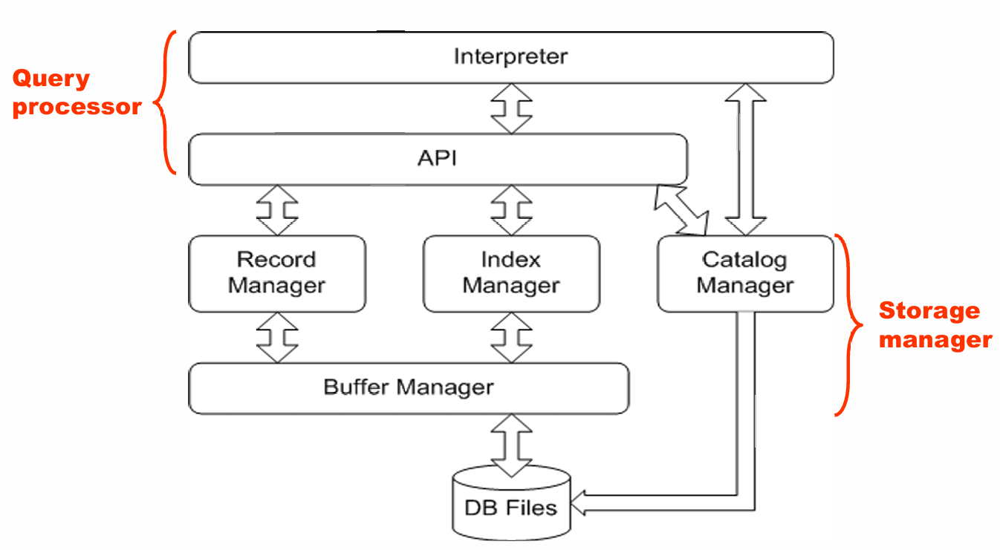

## Physical Storage Media

数据库的物理层最终对应的是文件和存储介质。不同存储介质可以从几个角度进行分类：

- 访问速度；
- 单位数据成本；
- 可靠性；
- 是否易失。

### Volatile and Non-volatile Storage

**易失性存储**（Volatile Storage）在断电后会丢失内容，比如普通内存。**非易失性存储**（Non-volatile Storage）在断电后仍然保留内容，比如磁盘、闪存、磁带等。

数据库系统通常需要同时使用多级存储：上层快但贵、容量小，下层慢但便宜、容量大。一个典型层次如下：

| 层次 | 介质 | 特点 |
| --- | --- | --- |
| Cache | CPU cache | 最快、最贵、易失 |
| Main memory | 主存 | 快、易失，不能长期保存数据库 |
| Flash memory | 闪存 | 非易失，读快写慢 |
| Magnetic disk | 磁盘 | 长期存储数据库的主要介质 |
| Optical storage | 光盘 | 多用于归档 |
| Tape storage | 磁带 | 顺序访问，主要用于备份和长期归档 |

!!! example "Storage Hierarchy"
    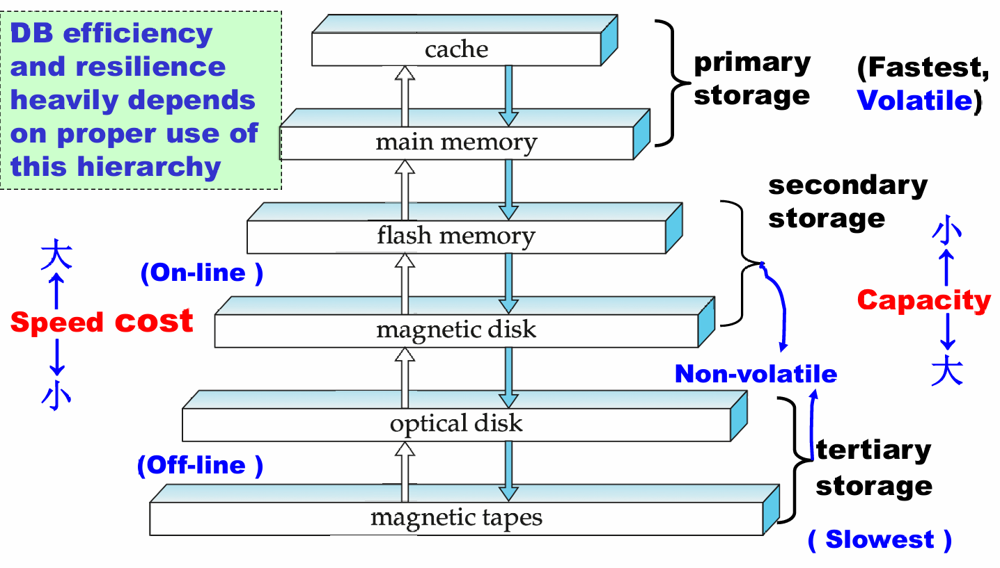

### Common Storage Media

**Cache** 是最快也最贵的存储形式，由硬件管理，一般容量很小。

**Main memory** 访问速度很快，通常在几十纳秒量级，但断电后内容丢失，并且容量和成本都不适合保存完整数据库。

**Flash memory** 是非易失的。它读起来接近内存速度，但写和擦除更慢，并且擦写次数有限。闪存广泛用于 U 盘、手机、嵌入式设备以及 SSD。

**Magnetic disk** 是传统数据库长期存储的主要介质。它容量大、单位成本低、可随机访问，但访问时间远慢于内存。

**Optical storage** 和 **Tape storage** 更偏向归档和备份。尤其磁带是顺序访问，访问很慢，但容量大、成本低，适合冷数据。

!!! quote "Jim Gray"
    Tape is dead, disk is tape, flash is disk.

这句话的意思可以理解为：随着硬件发展，原来磁带承担的冷存储角色逐渐被磁盘替代，而原来磁盘承担的在线存储角色又逐渐被闪存替代。

## Magnetic Disks

磁盘的结构对数据库性能影响非常大，因为磁盘访问的主要成本不是“读写数据本身”，而是机械运动带来的等待时间。

磁盘由盘片、磁道、扇区、读写头和磁臂等部分组成：

- 盘片表面被划分为同心圆磁道；
- 每条磁道进一步划分为扇区；
- 扇区是磁盘能读写的最小物理单位，常见大小为 512B 或 4KB；
- 多个盘片安装在同一主轴上；
- 每个盘面有一个磁头；
- 多个盘面上相同编号的磁道组成一个柱面。

!!! example "Magnetic Hard Disk Mechanism"
    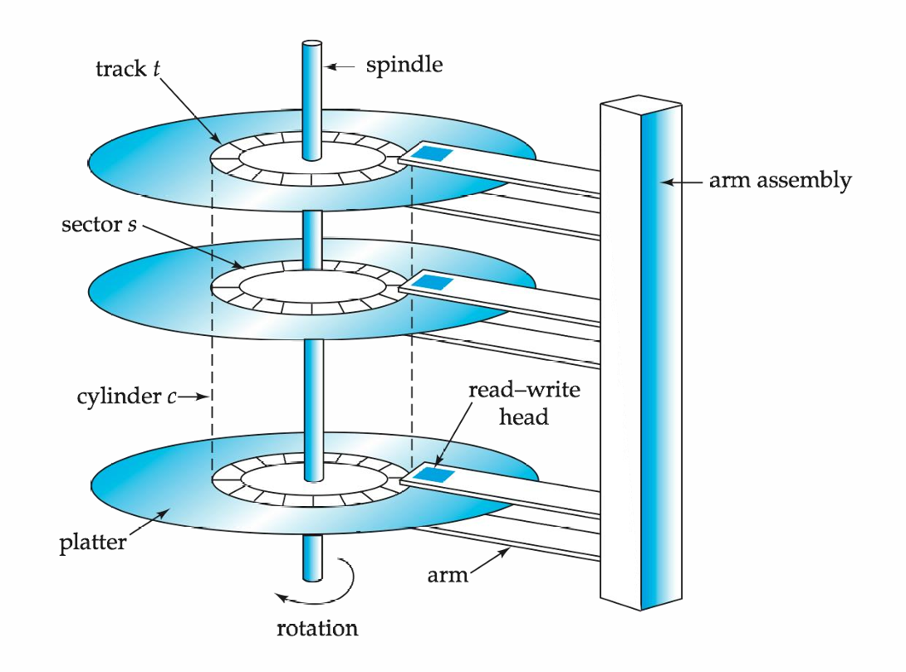

磁盘控制器（Disk Controller）负责连接计算机系统和磁盘硬件。它接受读写扇区的高层命令，并完成移动磁臂、读写数据、校验 checksum、写后读回确认、坏扇区重映射等工作。

### Disk Performance

一次磁盘访问的总时间主要包括：

$$
Access\ Time = Seek\ Time + Rotational\ Latency + Transfer\ Time
$$

其中：

- **Seek Time**：磁臂移动到目标磁道所需时间；
- **Rotational Latency**：目标扇区旋转到磁头下方的等待时间；
- **Transfer Time**：真正传输数据的时间。

!!! example "Performance Measures of Disks"
    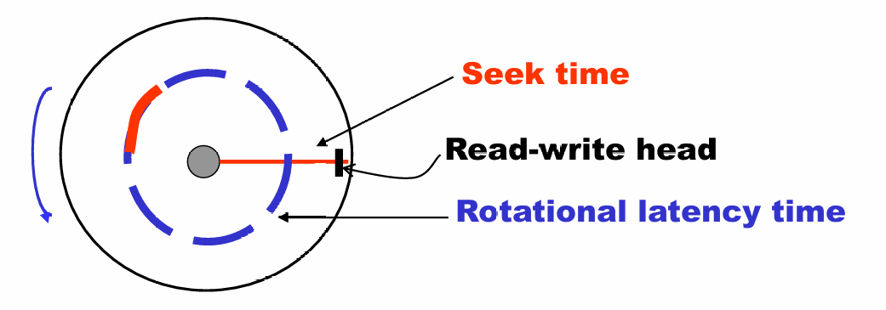

在传统磁盘中，寻道时间和旋转等待往往是主要开销，而数据传输本身相对较快。课件中的例子指出，磁盘访问时间通常在毫秒级，而内存访问大约在纳秒级，二者可能相差约百万倍。

!!! warning "为什么数据库系统特别关心 I/O"
    对 CPU 来说，一次磁盘访问非常慢。数据库优化中的很多技术，本质上都是为了减少磁盘块访问次数，或者把随机 I/O 转化为顺序 I/O。

### Disk Block Access Optimization

数据库通常以块（block）为单位在磁盘和内存之间传输数据。块是一段连续的扇区，常见大小为 4KB 到 16KB。

块大小存在权衡：

- 块太小：需要更多 I/O 次数；
- 块太大：如果只用到其中一小部分，会浪费空间和带宽。

为了减少磁臂移动，可以使用磁盘臂调度算法。典型方法是**电梯算法**（Elevator Algorithm）：磁臂沿一个方向移动并处理同方向请求，直到没有请求后再反向。

除此之外，还可以通过文件组织优化块访问，例如把相关数据放在同一柱面或相邻柱面上。但是文件随着插入和删除会逐渐碎片化，导致顺序访问也需要大量磁臂移动。

## RAID

RAID（Redundant Arrays of Independent Disks）是用多个磁盘组成一个逻辑磁盘的技术。它的目标主要有两个：

- 通过并行访问多个磁盘提高速度；
- 通过冗余信息提高可靠性。

当磁盘数量很多时，系统中“某块磁盘出故障”的概率会显著上升。因此，RAID 使用冗余来避免单盘故障导致数据丢失。

### Redundancy

最直接的冗余方式是镜像（Mirroring）。逻辑上的一个磁盘对应两个物理磁盘，每次写入都写到两个磁盘上，读取则可以从任意一个磁盘读取。

如果其中一个磁盘坏了，另一个仍然保留完整数据。只有在故障磁盘修复前，镜像盘也坏掉，才会真正丢失数据。

### Striping

为了提高并行度，可以将数据条带化（Striping）到多个磁盘上。

=== "Bit-level Striping"
    把每个字节的不同 bit 分散到多个磁盘上。这样一次读写可以并行使用多个磁盘，但每次访问都要牵涉所有磁盘，现在较少使用。

=== "Block-level Striping"
    把文件的第 $i$ 个块放到第 $(i \bmod n)+1$ 个磁盘上。这样不同块的请求可以并行执行，长序列块读取也能利用多个磁盘带宽。

### RAID Levels

| RAID Level | 核心思想 | 特点 |
| --- | --- | --- |
| RAID 0 | 块级条带化，无冗余 | 速度快，但没有可靠性 |
| RAID 1 | 镜像磁盘 | 写性能好，可靠性高，成本高 |
| RAID 3 | bit-level parity | 每次 I/O 需要多个磁盘参与 |
| RAID 4 | block-level parity，单独校验盘 | 随机读较好，但校验盘可能成为写瓶颈 |
| RAID 5 | 分布式 parity | 避免 RAID 4 的单校验盘瓶颈 |
| RAID 6 | 双重冗余 | 可容忍更多磁盘故障，但成本更高 |

实际选择 RAID 时要考虑成本、正常运行时性能、故障时性能、重建时间和可靠性。课件中给出的结论是：RAID 0 只适用于不重要数据；RAID 2/4 基本被 3/5 覆盖；RAID 3 由于 bit striping 的限制较少使用；实际应用中常常是在 RAID 1 和 RAID 5 之间选择。

## Tertiary Storage

三级存储主要包括光盘和磁带，特点是便宜、容量大、访问慢。它们通常不用于频繁查询，而用于备份、归档、冷数据存储以及离线数据迁移。

光盘是非易失的，常见形式包括 CD-ROM、DVD、Blu-ray 等。某些光盘支持 WORM（write once, read many），适合不可变归档。

磁带是顺序访问介质，访问时间远慢于磁盘和光盘，但容量很大、介质便宜，非常适合备份。磁带库可以通过机械装置自动装载磁带，从而支持非常大的离线存储系统。

## Storage Access

数据库文件在逻辑上被划分为固定长度的存储单元，称为**块**（block）。块既是存储分配单位，也是磁盘和内存之间的数据传输单位。

由于磁盘访问非常慢，数据库系统会在主存中开辟一块区域作为**缓冲区**（buffer），用于保存磁盘块的副本。

!!! example "Page Requests from Higher Levels"
    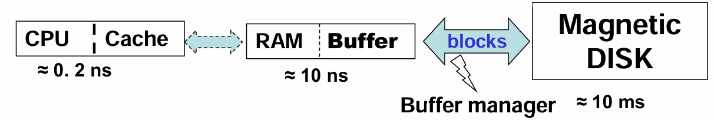

几个概念需要区分：

| 概念 | 含义 |
| --- | --- |
| Block | 磁盘上的存储单位 |
| Page | DBMS 处理的数据单位 |
| Frame | Buffer Pool 中容纳 page 的槽位 |
| Buffer Pool | 主存中缓存磁盘页的区域 |

实际系统中，block 和 page 大小通常近似或相同。

### Buffer Manager

当上层需要某个磁盘块时，会向 Buffer Manager 请求：

1. 如果目标块已经在 buffer 中，直接返回其内存地址；
2. 如果不在 buffer 中，则分配一个 frame；
3. 如果没有空闲 frame，就根据替换策略选择一个旧页淘汰；
4. 如果被淘汰页被修改过，就先写回磁盘；
5. 读入目标块并返回内存地址。

为了管理页面状态，系统会维护一些信息：

- **dirty bit**：页面是否被修改过；
- **pin count**：有多少请求正在使用该页；
- **pinned block**：当前不能被替换的块。

只有 `pin count = 0` 的页才可以成为替换候选。

### Replacement Policies

缓冲区替换策略决定了空间不够时应该淘汰哪个块。

=== "LRU"
    最近最少使用（Least Recently Used）。思想是过去很久没用的块，未来也可能不常用。

    但是在循环扫描等场景下，LRU 可能表现很差，因为它可能淘汰接下来马上要再次访问的块。

=== "MRU"
    最近最常用（Most Recently Used）。在某些扫描场景中，刚处理完的块短期内反而不再需要，因此可以优先淘汰。

=== "Mixed Strategy"
    数据库系统通常可以利用查询优化器提供的访问信息，对替换策略做更精细的选择。比如数据字典频繁访问，适合长期保留在内存中。

!!! warning
    操作系统的通用 LRU 策略并不总是适合数据库。DBMS 知道查询计划和访问模式，因此可以做出更合理的 buffer replacement 决策。

## File Organization

数据库最终以文件形式存储。一个文件是一串记录（record），一个记录是一串字段（field）。记录可以分为固定长度和变长两类。

### Fixed-Length Records

固定长度记录的优点是简单。假设每条记录长度为 $n$，则第 $i$ 条记录可以从：

$$
n(i-1)
$$

处开始存储。

删除固定长度记录时有几种方法：

1. 把后面的记录整体前移；
2. 把最后一条记录移动到删除位置；
3. 不移动记录，而是用 free list 维护空闲记录位置。

free list 的思想是在文件头保存第一个空闲记录地址，然后在空闲记录本身的位置存下一个空闲记录地址。这样可以复用被删除记录的空间。

!!! example "Free Lists"
    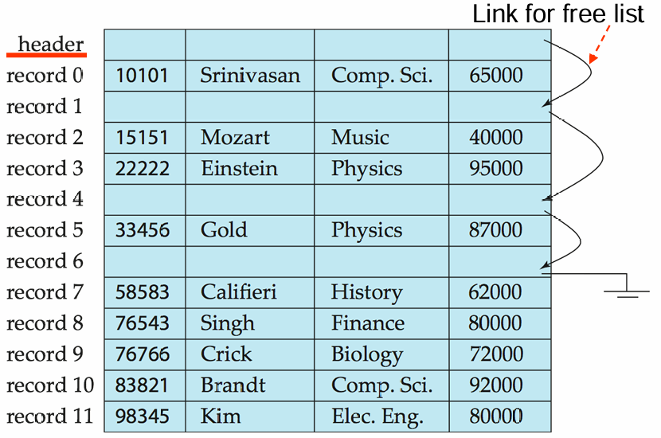

### Variable-Length Records

变长记录在数据库中很常见，来源包括：

- 一个文件中存储多种记录类型；
- 属性中存在 `varchar` 等变长字段；
- 某些旧数据模型允许重复字段。

对于变长属性，常见做法是在记录前部保存固定大小的 `(offset, length)`，真正的变长数据放在后部。对于 null 值，则可以使用 null-value bitmap 表示。

### Slotted Page

变长记录常用的页面组织方式是**分槽页结构**（Slotted Page Structure）。

一个 slotted page 的 header 中通常包含：

- 记录条目数量；
- 块中空闲空间的结束位置；
- 每条记录的位置和长度；
- slot 到记录实际位置的映射。

记录在页内可以移动，以保持连续存储并减少碎片；但记录对应的 slot 不变。索引或外部指针不直接指向记录本身，而是指向 slot entry，这是一种间接指针。

!!! example "Slotted Page Structure"
    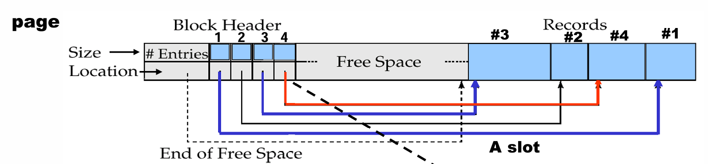

### Large Variable-Length Records

如果记录长度变化很大，还可以使用：

- 预留最大长度空间；
- 指针链表示一个变长记录；
- anchor block 和 overflow block 组合。

预留空间简单，但短记录会浪费空间。指针链更灵活，但可能带来额外指针开销和访问成本。

## Organization of Records in Files

记录在文件中的组织方式会直接影响查询性能。常见组织方式有：

| 文件组织 | 含义 | 适用场景 |
| --- | --- | --- |
| Heap file | 记录可以放在任意有空间的位置 | 插入简单，适合无序访问 |
| Sequential file | 按 search key 顺序存储 | 适合顺序扫描和范围查询 |
| Hashing file | 根据 hash 函数决定记录放在哪个块 | 适合等值查询 |
| Clustering file | 多个关系的相关记录放在同一文件或块中 | 适合频繁连接查询 |

### Sequential File

顺序文件按照某个 search key 排列，适合需要按顺序处理整个文件的应用。

插入时需要找到合适位置。如果目标位置有空闲空间，就直接插入；否则可以插入 overflow block，并更新指针链。随着插入和删除增多，顺序文件会逐渐偏离原本顺序，因此需要定期重组。

!!! example "Sequential File Organization"
    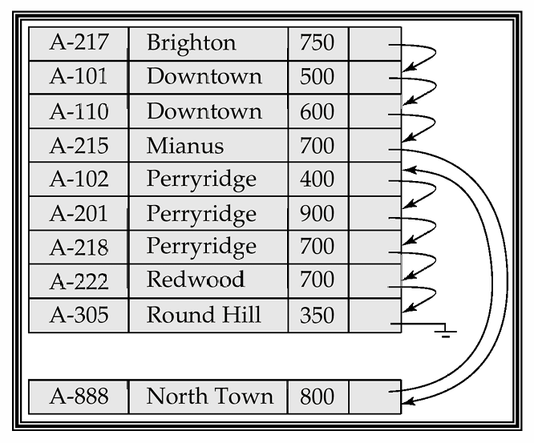

### Multitable Clustering

聚集文件组织可以把多个关系中的相关记录存在同一文件甚至同一块中。比如把 `department` 和对应的 `instructor` 放在一起，可以减少连接查询的 I/O。

它的优点是对连接查询很友好，特别是查询某个 department 及其 instructors 时。但如果只查询 department，自身记录反而会被其它关系的记录夹杂，可能增加读取成本。

!!! example "Multitable Clustering File Organization"
    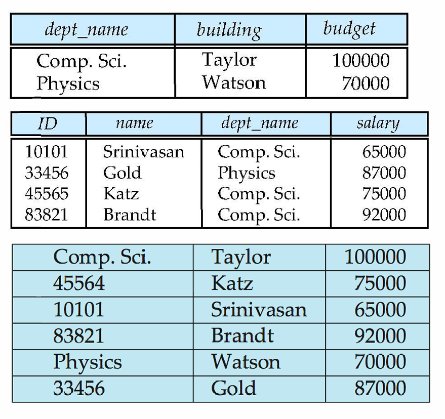

## Data Dictionary Storage

数据字典（Data Dictionary）也叫系统目录（System Catalog），用于存储 metadata，也就是“关于数据的数据”。

数据字典通常包含：

- 关系名；
- 每个关系的属性名和属性类型；
- 视图名和视图定义；
- 完整性约束；
- 用户和权限信息；
- 统计信息，比如每个关系的元组数量；
- 物理文件组织信息，比如顺序文件、散列文件等；
- 文件物理位置，比如操作系统文件名或磁盘块地址；
- 索引信息。

!!! tip
    查询优化器会大量依赖数据字典中的统计信息。因此数据字典不只是“记录表结构”，也直接影响查询优化质量。

在磁盘上，系统 metadata 可以用关系形式存储；在内存中，为了高效访问，DBMS 可能会维护专门的数据结构。

!!! example "Relational Representation of System Metadata"
    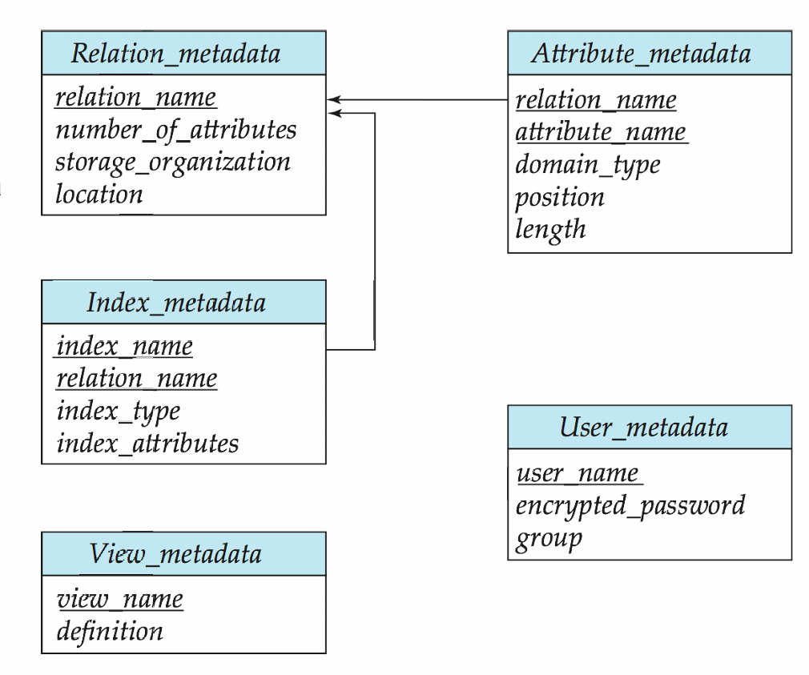

## Column-Oriented Storage

传统关系数据库多采用行存储（row-oriented representation）：一条元组的所有属性放在一起。列式存储（column-oriented storage）则是把一个关系的每个属性分别存储。

例如，对于关系：

```text
account(account-number, branch-name, balance)
```

行存储更像：

```text
(A-101, Perryridge, 500)
(A-102, Downtown, 400)
```

列存储更像：

```text
account-number: A-101, A-102, ...
branch-name:    Perryridge, Downtown, ...
balance:        500, 400, ...
```

列式存储的优点包括：

- 如果查询只访问少数属性，可以减少 I/O；
- 同一列数据类型相同，更利于压缩；
- CPU cache 效果更好；
- 适合现代 CPU 的向量化处理。

缺点包括：

- 重构完整元组成本较高；
- 删除和更新复杂；
- 压缩和解压缩也有额外成本。

因此，列式存储更适合决策支持、分析型查询和大数据场景；传统行存储更适合事务处理。现在一些系统同时支持行存储和列存储，称为 hybrid row/column stores。

!!! example "Column-Oriented Storage"
    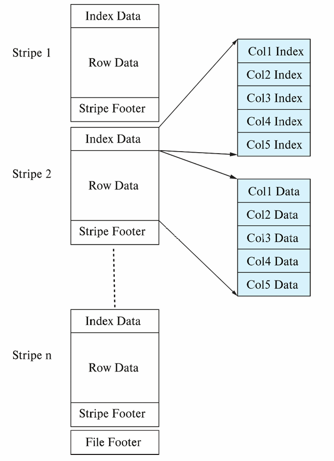

## Main-Memory Databases

在内存数据库中，记录可以直接存储在主存中，不再需要传统意义上的 buffer manager 来缓存磁盘块。对于决策支持类应用，内存中也可以采用列式存储，并通过压缩降低内存占用。

不过，即使数据主要在内存中，系统仍然需要考虑持久化、恢复和日志等问题。也就是说，内存数据库减少了磁盘访问成本，但没有消除数据库系统对可靠存储的需求。

## Summary

本章从物理层面解释了数据库如何存储和访问数据，可以总结为：

1. 存储层次越靠上越快、越贵、容量越小，也越可能易失；
2. 磁盘访问成本主要来自寻道和旋转等待，因此数据库极力减少随机 I/O；
3. RAID 通过并行和冗余提高性能与可靠性；
4. Buffer Manager 负责在内存中缓存磁盘块，并决定替换策略；
5. 文件由记录组成，记录可以是定长或变长；
6. Slotted Page 是管理变长记录的重要页结构；
7. Heap、Sequential、Hashing 和 Clustering 是常见文件组织方式；
8. 数据字典保存 metadata，并服务于查询处理和优化；
9. 列式存储适合分析型场景，行式存储适合事务型场景。

!!! abstract "这一章的核心"
    数据库系统的很多设计，本质上都是围绕一个事实展开的：磁盘很慢，内存有限。因此我们需要用存储层次、缓冲区、文件组织、RAID 和列式存储等技术，让逻辑上的关系操作尽量少付出物理 I/O 成本。
