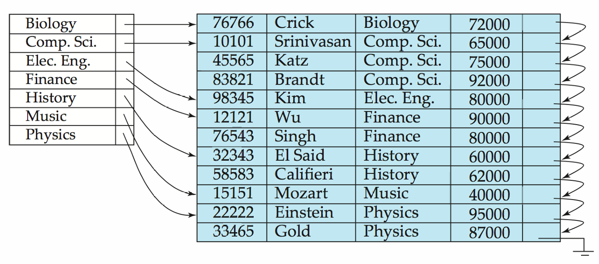
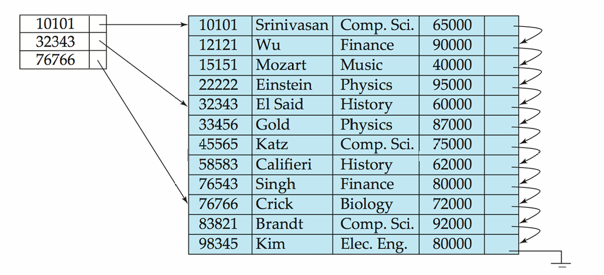
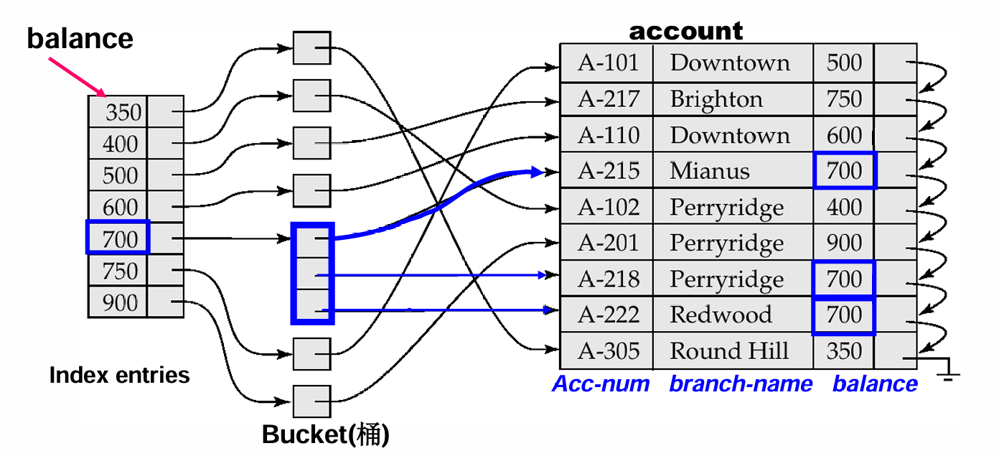
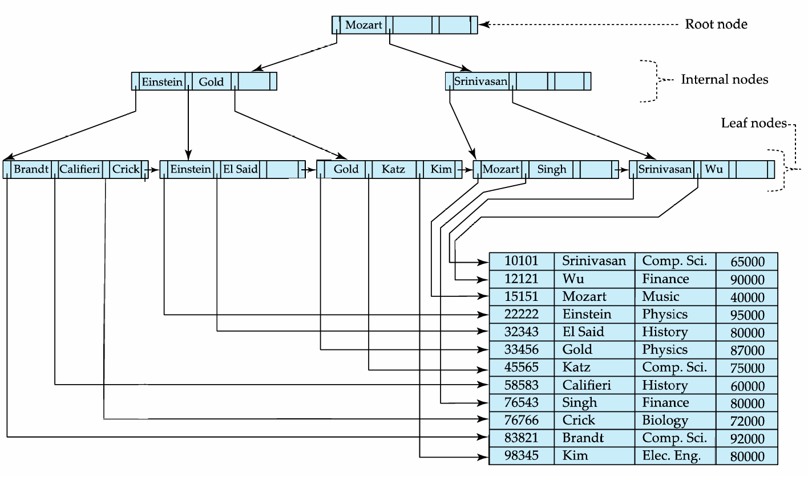
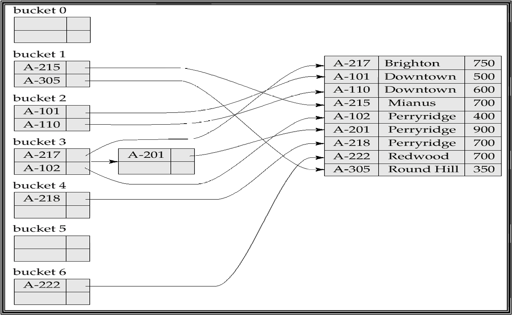
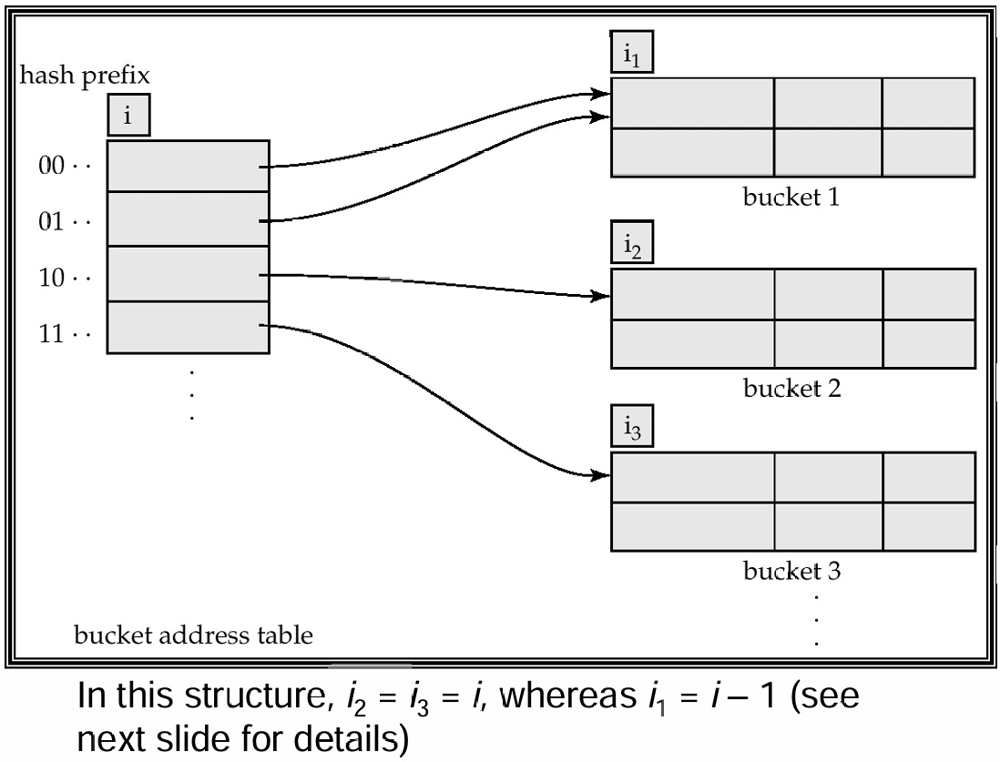
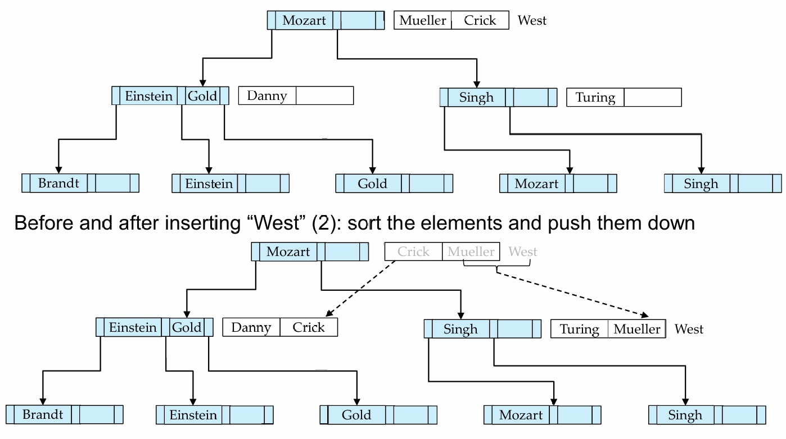
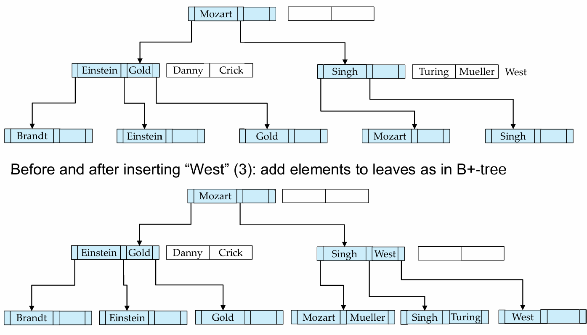
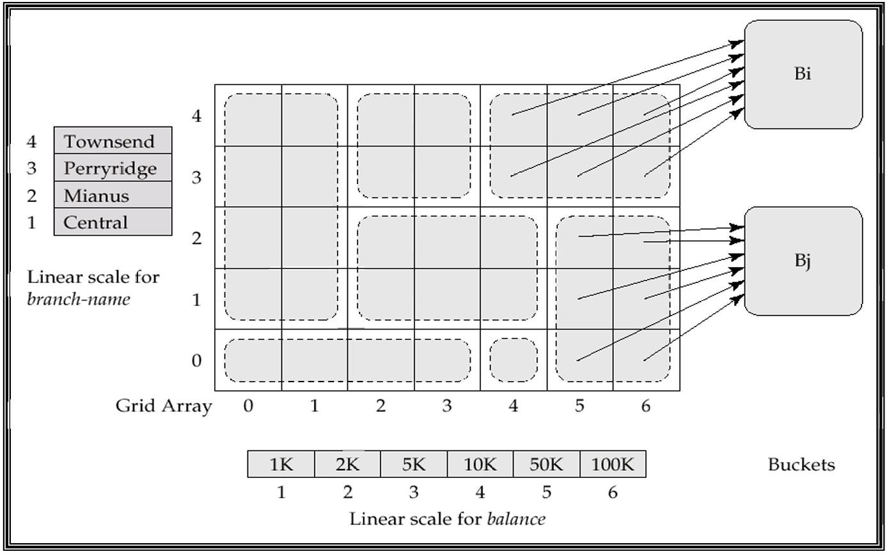
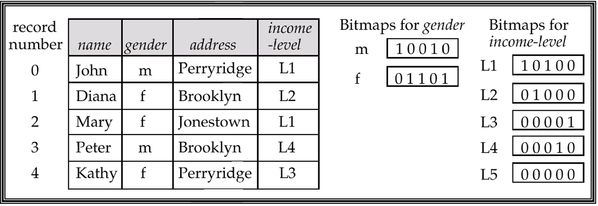

在上一章中，我们讨论了数据库如何把数据存到磁盘块、文件和缓冲区中。这一章继续往下走：既然数据已经被放进文件，那么我们如何快速找到想要的记录？

如果没有索引，查询往往只能扫描整个文件。索引（Index）的作用就是为查询建立一条“捷径”，让系统可以根据某个属性值快速定位记录。它和图书馆里的作者目录很像：目录本身比书小得多，但能告诉我们目标书在哪里。

## Basic Concepts

索引机制用于加速对目标数据的访问。索引建立在一个或多个属性上，这些属性称为**搜索码**（Search Key）。注意，search key 不一定是候选键或主键，它只是用来查找记录的属性集合。

一个索引文件由许多索引项组成，每个索引项通常具有如下形式：

```text
search-key | pointer
```

其中 `pointer` 指向数据记录，或者指向包含多个记录指针的 bucket。

!!! note
    索引文件通常比原始数据文件小得多，因此先查索引、再根据指针访问数据，往往比直接扫描数据文件更快。

索引主要有两类：

- **Ordered Index**：索引项按照 search key 排序；
- **Hash Index**：通过哈希函数把 search key 分散到 bucket 中。

### Evaluation Metrics

评价一个索引结构时，需要考虑：

| 指标 | 含义 |
| --- | --- |
| Access type | 支持等值查询、范围查询等访问方式的能力 |
| Access time | 查找记录所需时间 |
| Insertion time | 插入记录和维护索引的代价 |
| Deletion time | 删除记录和维护索引的代价 |
| Space overhead | 索引额外占用的空间 |

!!! tip
    Hash index 很适合 `where A = v` 这样的等值查询，但不适合 `between` 这样的范围查询。Ordered index 对范围查询更友好。

## Ordered Indices

在顺序索引中，索引项按照 search key 的值排序。它的典型使用场景是：数据文件本身按照某个 search key 排序，然后在其上建立索引。

### Primary and Secondary Index

如果数据文件本身按照某个 search key 排序，并且索引也使用同一个 search key，那么这个索引称为**主索引**（Primary Index），也叫**聚集索引**（Clustering Index）。

!!! note
    主索引的 search key 通常是主键，但不一定必须是主键。这里的 primary 指的是“和数据文件物理顺序一致”，不是 SQL 里的 primary key。

如果索引的 search key 和数据文件的排序属性不同，那么它就是**辅助索引**（Secondary Index），也叫**非聚集索引**（Non-clustering Index）。

例如，`account` 文件按 `account-number` 排序，但我们经常按 `balance` 查询账户，那么可以在 `balance` 上建立辅助索引。

### Dense Index

**稠密索引**（Dense Index）为文件中的每一个 search-key 值都建立索引项。

```text
search-key value -> pointer
```

如果一个 search-key 值对应多条记录，则索引项可以指向一个 bucket，bucket 中保存所有对应记录的指针。

!!! example "Dense Index Files"
    

稠密索引查找快，但空间开销和维护代价更大。插入、删除数据时，索引也需要同步更新。

### Sparse Index

**稀疏索引**（Sparse Index）只为部分 search-key 值建立索引项，通常每个数据块建立一个索引项，索引项对应这个块中的最小 search-key 值。

查找 search-key 为 $K$ 的记录时：

1. 在索引中找到小于等于 $K$ 的最大 search-key；
2. 根据该索引项指向的数据块开始顺序扫描。

稀疏索引的优点是空间小、维护成本低；缺点是定位记录通常比稠密索引慢。

!!! warning
    Sparse index 只能用于按照 search key 顺序排列的数据文件；dense index 则可以用于顺序文件和非顺序文件。

!!! example "Sparse Index Files"
    

### Secondary Index

辅助索引通常必须是稠密的。原因是数据文件并不按照辅助索引的 search key 排序，所以不能只记录每个块的起始 key。

如果一个 search-key 值对应多条记录，辅助索引项通常指向 bucket：

```text
search-key value -> bucket -> record pointers
```

!!! example "Secondary Index on Balance"
    

### Multilevel Index

当索引文件本身太大，无法放入内存时，访问索引也会变贵。此时可以把索引文件看成一个顺序文件，再在它上面建立一层稀疏索引，这就形成了**多级索引**。

- Inner index：底层索引，直接指向数据文件；
- Outer index：建立在 inner index 上的稀疏索引；
- 如果 outer index 仍然太大，还可以继续建立更高层索引。

!!! example
    假设有 1,000,000 条记录，每块 10 条记录，则有 100,000 个数据块。若稀疏索引每块 100 个索引项，则索引文件有 1000 个块。对这 1000 个块做二分查找，大约需要 9 次块读取。多级索引的意义就是继续减少这些索引块访问。

### Index Update

索引带来查询收益，也带来更新开销。数据文件插入或删除记录时，所有相关索引都要维护。

=== "Deletion"
    对稠密索引，如果被删记录是该 search-key 的唯一记录，则删除对应索引项；如果不是唯一记录，则删除对应指针，或者更新指向第一条记录的指针。

    对稀疏索引，如果被删记录没有出现在索引中，索引无需变化；如果它正是某个索引项代表的记录，则要用下一个 search-key 替换，或者直接删除该索引项。

=== "Insertion"
    对稠密索引，如果 search-key 原本不存在，就新增索引项；如果已存在，则增加指针或不变。

    对稀疏索引，如果插入导致产生新块，需要为新块插入索引项；如果新记录成为所在块最小 search-key，则更新该块的索引项。

## B+-Tree Index Files

B+ 树索引是 indexed-sequential file 的一种重要替代。普通索引顺序文件随着插入和删除会产生大量 overflow block，性能逐渐下降，需要周期性重组。而 B+ 树可以通过局部调整来保持平衡，不需要频繁重组整个文件。

!!! note "为什么 B+ 树重要"
    B+ 树是数据库索引里最核心的数据结构之一。它不是为了在内存中打败红黑树，而是为了在磁盘上减少 I/O。它的节点通常对应一个磁盘块，因此高扇出、低高度特别关键。

### Properties of B+-Tree

一棵 B+ 树是一棵有根平衡树，满足：

- 从根到所有叶子的路径长度相同；
- 非根、非叶节点有 $\lceil n/2\rceil$ 到 $n$ 个孩子；
- 叶节点有 $\lceil(n-1)/2\rceil$ 到 $n-1$ 个 search-key 值；
- 如果根不是叶子，则至少有两个孩子；
- 如果根本身是叶子，则可以有 $0$ 到 $n-1$ 个值。

!!! example "Example of B+-Tree"
    

### Node Structure

B+ 树节点通常形如：

```text
P1 K1 P2 K2 ... Pn-1 Kn-1 Pn
```

其中：

- $K_i$ 是 search-key；
- $P_i$ 是指针；
- 非叶节点的指针指向子节点；
- 叶节点的指针指向记录或 bucket；
- 通常一个节点对应一个磁盘块。

在叶节点中，所有 search-key 都实际出现；而非叶节点构成对叶节点的多级稀疏索引。叶节点还通过最后一个指针按 search-key 顺序串起来，方便范围查询和顺序扫描。

### Query on B+-Tree

查找 search-key 值 $V$ 的基本过程：

1. 从根节点开始；
2. 在当前非叶节点中找到应进入的指针区间；
3. 沿指针向下，直到叶节点；
4. 在叶节点中查找 $V$；
5. 若存在，则根据指针访问记录；否则说明记录不存在。

如果文件中有 $K$ 个 search-key，B+ 树高度大约是：

$$
O(\log_{\lceil n/2\rceil}K)
$$

由于 $n$ 通常很大，比如一个 4KB 节点可能容纳约 100 个索引项，所以 B+ 树高度通常很小。课件给出的例子中，100 万个 search-key、$n=100$ 时，最多访问约 4 个节点。

!!! tip
    这就是 B+ 树适合磁盘的原因：它不追求二叉，而追求“矮胖”。树越矮，磁盘 I/O 越少。

### Handling Duplicates

如果 search-key 不唯一，可以用几种方法处理：

- 在叶节点中让 key 指向 bucket；
- 每个 key 后保存一个 tuple pointer list；
- 给 search-key 加上 record identifier，使其变成唯一键。

实际系统中，给 search-key 添加 record-id 是常见方法。它会增加存储开销，但插入和删除逻辑更简单。

### Insertion

B+ 树插入的基本过程：

1. 找到 search-key 应该出现的叶节点；
2. 如果 key 已存在，则插入记录并更新 bucket 或 pointer list；
3. 如果 key 不存在，尝试把 `(key, pointer)` 插入叶节点；
4. 如果叶节点已满，则分裂叶节点；
5. 将新节点的最小 key 插入父节点；
6. 如果父节点也满，则继续向上分裂；
7. 如果根分裂，则树高增加 1。

叶节点分裂时，把包含新插入项在内的 $n$ 个 `(key, pointer)` 按序排列，前 $\lceil n/2\rceil$ 个放原节点，剩余放新节点。

### Deletion

B+ 树删除的基本过程：

1. 找到并删除主文件中的记录；
2. 如果使用 bucket，也从 bucket 中删除对应指针；
3. 如果某个 leaf entry 不再需要，则从叶节点删除；
4. 如果节点低于最小占用，尝试和兄弟节点合并；
5. 如果不能合并，则向兄弟节点借 entry 并重新分配；
6. 必要时向上递归更新父节点；
7. 如果根节点只剩一个孩子，则删除根，孩子成为新根。

## B-Tree Index Files

B 树和 B+ 树相似，但 B 树中 search-key 只出现一次，非叶节点中的 search-key 不会再出现在叶节点中。因此非叶节点除了子指针外，还要保存指向记录或 bucket 的指针。

它的优点是：

- 可能比对应 B+ 树使用更少节点；
- 有时不需要到叶节点就能找到目标 key。

但缺点更明显：

- 大多数 key 仍然需要走到较低层；
- 非叶节点更大，导致扇出降低，树可能更深；
- 插入删除更复杂；
- 实现难度更高。

因此，数据库系统中通常更偏好 B+ 树。

## Static Hashing

哈希文件组织通过哈希函数直接根据 search-key 找到 bucket。

设 $K$ 是所有 search-key 值集合，$B$ 是 bucket 地址集合，哈希函数：

$$
h:K\to B
$$

将 search-key 映射到对应 bucket。

Bucket 通常是一个磁盘块，里面可以存放一个或多个记录。由于不同 search-key 可能映射到同一个 bucket，因此 bucket 内仍然需要顺序查找。

### Hash Functions

一个糟糕的哈希函数可能把所有 key 都映射到同一个 bucket，这样查找退化成线性扫描。理想哈希函数应该尽量均匀，使记录平均分布到各个 bucket。

实际哈希函数通常对 search-key 的内部二进制表示做计算。例如，对字符串，可以把各字符的二进制表示相加后对 bucket 数取模。

### Bucket Overflow

Bucket overflow 可能由两类原因导致：

- bucket 数量不足；
- 数据分布倾斜，比如大量记录拥有相同 search-key，或者哈希函数不均匀。

overflow 无法完全避免，通常用 overflow bucket 处理。给定 bucket 的 overflow bucket 通过链表连接，这称为 overflow chaining。

!!! warning
    课件中称这种使用 overflow bucket 的方式为 closed hashing。另一种 open hashing 不使用 overflow bucket，但并不适合数据库应用。

### Hash Index

哈希不仅可以作为文件组织方式，也可以作为索引结构。Hash index 把 search-key 和对应记录指针组织成哈希文件。

严格来说，hash index 总是辅助索引。如果数据文件本身已经按同一个 search-key 做哈希组织，就不需要再额外建立相同 search-key 的主哈希索引。

!!! example "Example of Hash Index"
    

### Deficiencies of Static Hashing

静态哈希的问题在于 bucket 数固定：

- 数据增长时，overflow bucket 变多，性能下降；
- 如果提前按未来规模分配 bucket，初期会浪费大量空间；
- 数据缩小时，空间也会浪费；
- 重新组织文件并选择新哈希函数代价很高。

因此实际系统常常需要动态哈希。

## Dynamic Hashing

动态哈希适合会增长和缩小的数据库。它允许 hash function 的使用方式动态变化，而不是固定映射到一组 bucket。

### Extendable Hashing

可扩展哈希（Extendable Hashing）是动态哈希的一种形式。它的思想是：

- 哈希函数生成一个很大范围的值，通常是 $b$ 位整数；
- 当前只使用哈希值的前 $i$ 位作为 bucket address table 的下标；
- bucket address table 大小为 $2^i$；
- $i$ 会随着数据库增长和缩小而变化；
- 多个 table entry 可以指向同一个 bucket；
- 每个 bucket 自己也保存一个局部深度 $i_j$。

查找 search-key $K_j$：

1. 计算 $h(K_j)=X$；
2. 取 $X$ 前 $i$ 位；
3. 在 bucket address table 中找到 bucket 指针；
4. 在 bucket 中查找记录。

!!! example "General Extendable Hash Structure"
    

插入时，如果目标 bucket 未满，直接插入。如果满了，则分裂 bucket：

=== "$i > i_j$"
    说明 bucket address table 中有多个 entry 指向该 bucket。此时新建 bucket，把局部深度加 1，并让一半 table entry 指向新 bucket，然后重新分布原 bucket 中的记录。

=== "$i = i_j$"
    说明当前 table 不够区分该 bucket。此时先把全局深度 $i$ 加 1，bucket address table 翻倍，再按上面的情况分裂 bucket。

删除时，如果 bucket 为空，可以删除 bucket，并在可能时和 buddy bucket 合并。缩小 bucket address table 也可以做，但代价较高，通常只有 bucket 数远小于 table size 时才考虑。

## Ordered Indexing vs Hashing

Ordered index 和 hash index 没有绝对优劣，取决于查询类型和更新模式。

| 场景 | 更适合 |
| --- | --- |
| 等值查询 `A = v` | Hash index |
| 范围查询 `A between x and y` | Ordered index |
| 顺序扫描 | Ordered index |
| 数据增长频繁 | B+ tree 或 dynamic hashing |
| 平均访问时间优先 | Hashing 可能更好 |
| 最坏情况可控性 | Ordered index 更稳 |

!!! tip
    如果系统中范围查询很多，B+ 树通常是更稳妥的默认选择。这也是它在数据库中存在感极强的原因。

## Write-Optimized Indices

传统 B+ 树对查询很友好，但频繁插入时可能产生大量随机 I/O。写优化索引的目标是把小的随机写变成较大的顺序写。

### LSM Tree

LSM Tree（Log Structured Merge Tree）的基本思想是：

1. 新记录先插入内存中的 $L_0$ tree；
2. 当 $L_0$ 满了，将其批量写入磁盘，构造或合并到 $L_1$ tree；
3. 当 $L_1$ 超过阈值，再合并到 $L_2$；
4. 依此类推。

其优点是：

- 插入主要使用顺序 I/O；
- 叶子节点填充率高，空间浪费少；
- 每条插入记录的 I/O 成本比普通 B+ 树低。

缺点是：

- 查询需要查多个 level；
- 合并时数据可能被多次复制；
- 删除需要用特殊 delete entry 表示。

LSM Tree 及其变体广泛用于写入密集型系统，比如 BigTable、Cassandra、LevelDB、MyRocks 等。

### Buffer Tree

Buffer Tree 是另一种写优化索引。它的核心想法是：在 B+ 树的每个内部节点上放一个 buffer，用来暂存插入操作。

插入时，记录先进入较高层节点的 buffer。当 buffer 满时，再把其中记录排序并批量推送到下一层。这样每次向下移动的是一批记录，摊到每条记录上的 I/O 成本降低。

优点：

- 查询开销比 LSM Tree 小；
- 可以用于多种树索引结构；
- 可用于 PostgreSQL 的 GiST 索引。

缺点是：相比 LSM Tree，Buffer Tree 会有更多随机 I/O。

??? example "Buffer Tree Insertion"
    

    

## Index Definition in SQL

SQL 中可以用 `create index` 创建索引：

```sql
create index <index-name> on <table-name> (<attribute-list>);
```

例如：

```sql
create index b-index on branch(branch-name);

create index cust-strt-city-index
on customer(customer-city, customer-street);
```

如果需要间接指定 search key 是候选键，可以使用：

```sql
create unique index uni-acnt-index
on account(account-number);
```

删除索引：

```sql
drop index <index-name>;
```

!!! note
    如果 SQL 已经支持 `unique` 完整性约束，那么 `create unique index` 不一定是逻辑上必须的。但在很多系统中，唯一约束底层也会通过唯一索引实现。

## Multiple-Key Access

现实查询往往不只涉及一个属性。例如：

```sql
select account_number
from account
where branch_name = 'Perryridge'
  and balance = 1000;
```

如果只有单属性索引，可以有几种策略：

1. 用 `branch_name` 索引找到 Perryridge 的所有账户，再筛选 `balance = 1000`；
2. 用 `balance` 索引找到余额为 1000 的所有账户，再筛选 branch；
3. 分别用两个索引得到记录指针集合，再求交集。

### Composite Index

如果建立组合 search-key 索引：

```text
(branch-name, balance)
```

那么对于：

```sql
where branch_name = 'Perryridge'
  and balance = 1000
```

可以直接定位同时满足两个条件的记录。

它也能较好支持：

```sql
where branch_name = 'Perryridge'
  and balance < 1000
```

但对下面这种查询并不高效：

```sql
where branch_name < 'Perryridge'
  and balance = 1000
```

原因是组合索引的顺序很重要。前导属性上的范围条件可能导致后续属性无法被高效利用。

### Grid Files

Grid File 用于加速多个 search-key 上的一般查询。它为每个 search-key 属性建立一个线性刻度，并用一个多维 grid array 指向 bucket。

查找时，根据每个属性的值定位 grid 中的单元格，再跟随指针找到 bucket。

!!! example "Example Grid File for Account"
    

Grid File 的问题是空间开销可能很高，而且如果刻度划分不好，会产生很多 overflow bucket。周期性重组可以改善分布，但代价也很高。

### Bitmap Indices

Bitmap index 是一种适合多键查询的特殊索引，尤其适合取值种类较少的属性，比如 gender、state、income-level 等。

对于某个属性的每个取值，建立一个 bitmap。假设记录从 0 开始编号，那么 bitmap 中第 $i$ 位为 1 表示第 $i$ 条记录具有该取值。

例如：

```text
gender = male:   10010
income = L1:     10100
AND result:      10000
```

这表示同时满足两个条件的记录只有对应 bit 为 1 的位置。

Bitmap index 的优点是：

- 对多属性条件可以直接做 bitwise AND / OR / NOT；
- bitmap 通常很小；
- CPU 可以一次处理 32 或 64 位，速度很快；
- 对统计满足条件的记录数量尤其高效。

但它更适合低基数属性。如果一个属性几乎每条记录都不同，bitmap 数量会非常大，优势就会下降。

!!! example "Bitmap Indices"
    

## Summary

本章的主线可以总结为：

1. 索引用更小的索引文件换取更快的数据定位；
2. Ordered index 适合范围查询，Hash index 适合等值查询；
3. Dense index 为每个 search-key 建项，Sparse index 只为部分 key 建项；
4. 辅助索引通常必须是 dense index，并通过 bucket 处理重复 key；
5. 多级索引把索引本身继续索引化，减少磁盘访问；
6. B+ 树通过高扇出和平衡结构减少 I/O，是数据库最常用索引结构；
7. B 树理论上减少 key 重复，但实现和性能权衡通常不如 B+ 树；
8. 静态哈希简单但不适应文件大小变化；
9. 可扩展哈希通过 bucket address table 和局部深度支持动态增长；
10. LSM Tree 和 Buffer Tree 用批量写入思想优化写密集场景；
11. 多键访问可以使用组合索引、Grid File 或 Bitmap Index。

!!! abstract "这一章的核心"
    索引的本质是用额外空间和维护成本换查询速度。真正的设计问题不是“要不要索引”，而是：为哪些属性建索引、用什么索引结构、如何在查询速度、更新代价和空间开销之间平衡。
