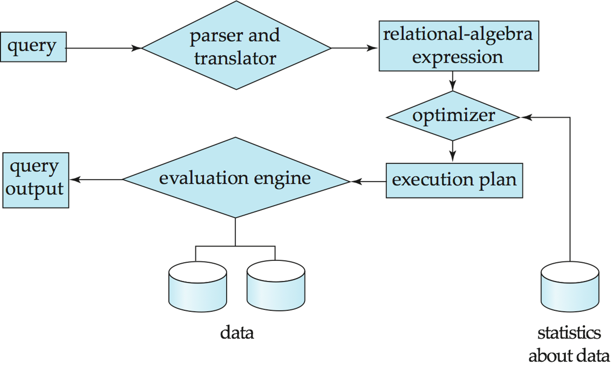
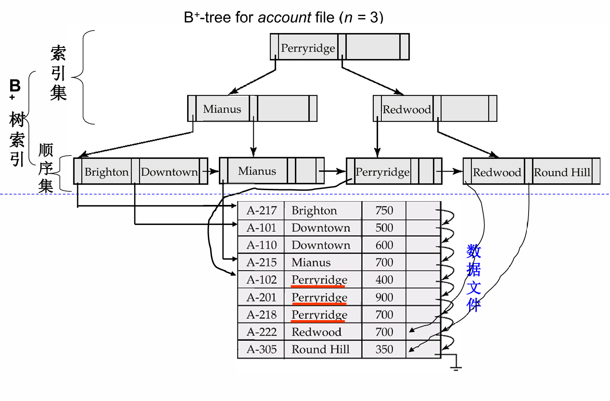
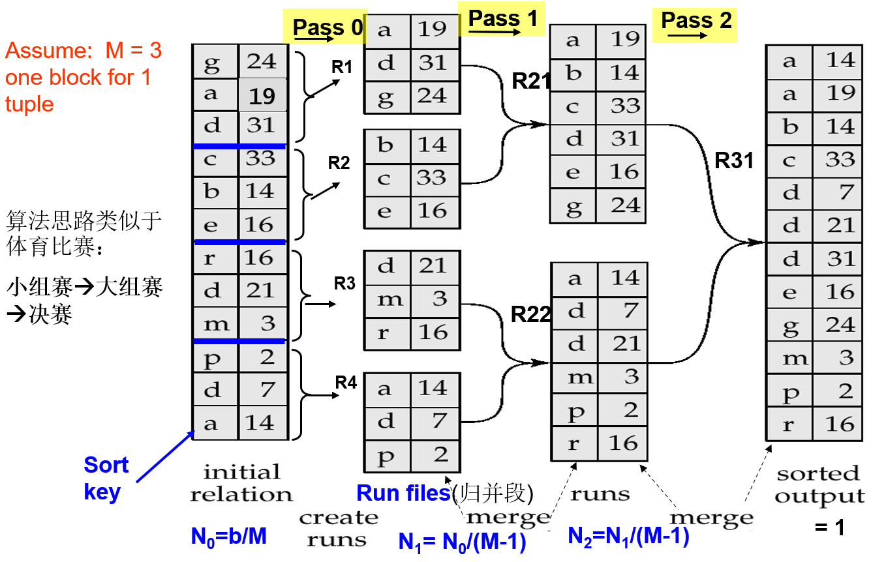
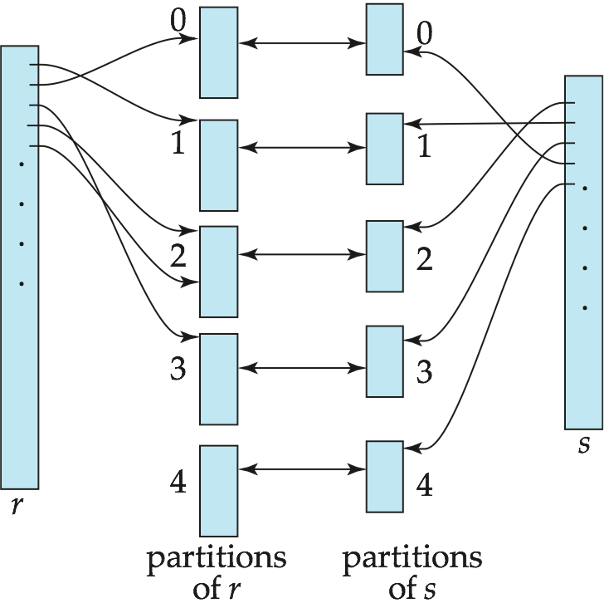

前面几章讨论了数据如何存储、如何建立索引。到了查询处理（Query Processing），问题就变成：给定一条 SQL，数据库系统到底如何把它变成可执行的物理操作，并尽量用较低的代价得到结果。

查询处理并不是简单地“按 SQL 写的顺序执行”。同一个 SQL 可以转化成多个等价的关系代数表达式，而同一个关系代数操作又可以用不同算法实现。因此数据库系统需要在很多可选方案中选择一个代价较低的执行计划。

## Overview

查询处理大致可以分为三个阶段：

1. 语法分析与翻译（Parsing and Translation）：检查 SQL 是否合法，验证关系和属性是否存在，并把 SQL 转换成内部形式；
2. 优化（Optimization）：优化器为查询选择较优的执行计划；
3. 执行（Evaluation）：查询执行引擎按照执行计划运行，并返回结果。

其中，内部形式通常可以理解为扩展关系代数表达式（Extended Relational Algebra, ERA）。而执行计划（Evaluation Plan）会进一步说明每个关系代数操作具体使用哪种算法，以及这些操作之间如何协调执行。

!!! example "查询处理的基本步骤"
    

## Why Optimization

优化的原因有两个。

首先，同一个 SQL 查询可能对应多个等价的关系代数表达式。比如：

```sql
select balance
from account
where balance > 2500;
```

可以理解成：

$$
\sigma_{balance>2500}(\Pi_{balance}(account))
$$

也可以理解成：

$$
\Pi_{balance}(\sigma_{balance>2500}(account))
$$

第二种通常更好，因为先选择再投影，可以更早减少中间结果。

其次，同一个关系代数操作也有很多实现算法。比如选择操作可以线性扫描，也可以走索引。将关系代数表达式加上具体算法后，就形成了执行计划。

!!! example "执行计划"
    对 `balance > 2500`，如果有合适索引，执行计划可能会写成：

    ```text
    projection balance
        selection balance > 2500 using index
            account
    ```

    可配图：课件第 6 页，使用索引处理 `balance > 2500` 的执行计划。

查询优化（Query Optimization）就是在所有等价的执行计划中选择估计代价最低的一个。代价既和具体算法有关，也依赖数据库目录（catalog）中的统计信息，例如关系的元组数、元组大小、磁盘块数和索引高度。

## Cost Measures

查询处理中的代价估计通常以磁盘输入输出（I/O）为主。虽然真实系统还会考虑 CPU、网络通信、并发和缓存状态，但课件为了简化主要采用两个指标：

- 磁盘块传输（block transfer）数量；
- 磁盘寻道（seek）数量。

设：

- $t_T$：传输一个磁盘块的时间；
- $t_S$：一次磁盘寻道的时间；
- $b$：磁盘块传输次数；
- $S$：磁盘寻道次数。

则代价估计为：

$$
b\cdot t_T + S\cdot t_S
$$

!!! note
    课件中给出的量级是 $t_T\approx 0.1ms$，$t_S\approx 4ms$。因此磁盘寻道往往比单个磁盘块传输贵得多，这也是数据库算法尽量追求顺序 I/O 的原因。

在课堂公式中，通常会忽略 CPU 代价，也不把最终查询结果写回磁盘的代价计入公式。原因是最终结果可能直接交给父操作或客户端，而不是作为临时关系写回磁盘。

!!! warning "缓冲区大小会影响代价"
    内存缓冲区（buffer）越大，磁盘访问通常越少。但优化器在真正执行前很难精确知道当时还有多少缓冲区可用，因此课件常常使用最坏情况（worst case）或最好情况（best case）来估计。

## Selection Operation

选择操作对应关系代数中的 $\sigma$。它的目标是找出满足某个条件的记录。选择算法大致可以分为两类：

- 文件扫描（File Scan）：不使用索引，直接扫描文件；
- 索引扫描（Index Scan）：使用索引定位满足条件的记录。

### File Scan

**A1：线性扫描（Linear Search）**

线性扫描会读入文件的每一个磁盘块，并检查其中每条记录是否满足条件。

若关系 $r$ 占用 $b_r$ 个磁盘块，则代价为：

$$
b_r\text{ 次磁盘块传输}+1\text{ 次磁盘寻道}
$$

如果选择条件作用在键属性（key attribute）上，那么找到目标记录后可以停止。平均代价约为：

$$
\frac{b_r}{2}\text{ 次磁盘块传输}+1\text{ 次磁盘寻道}
$$

线性扫描的优点是适用范围广，不依赖文件排序，也不依赖索引。缺点也很直接：数据大时会很慢。

**A2：二分查找（Binary Search）**

如果文件按照选择属性排序，并且选择条件是等值比较，则可以使用二分查找。假设关系的磁盘块连续存放，定位第一条满足条件的记录需要：

$$
\lceil \log_2(b_r)\rceil\text{ 次磁盘块传输}+\lceil \log_2(b_r)\rceil\text{ 次磁盘寻道}
$$

如果选择条件不是键属性，还需要继续读取包含所有匹配记录的磁盘块。

!!! warning
    二分查找在数据库文件上并不总是好用。因为数据未必物理连续，而且频繁磁盘寻道可能比索引访问更贵。因此除非文件确实按目标属性有序，否则通常不会直接对磁盘文件做二分查找。

### Index Scan

索引扫描要求选择条件作用在索引的搜索键（search key）上。

**A3：主索引上的键等值查询（Primary Index, Equality on Key）**

如果选择条件是主索引（primary index）上的键等值查询，并且只返回一条记录，那么需要先走索引，再取数据记录。设索引高度为 $h_i$，代价可估为：

$$
(h_i+1)(t_T+t_S)
$$

**A4：主索引上的非键等值查询（Primary Index, Equality on Non-key）**

如果选择条件作用在主索引上，但搜索键不是唯一键，那么会返回多条连续记录。设包含结果记录的磁盘块数为 $b'$，代价近似为：

$$
h_i(t_T+t_S)+t_S+t_T\cdot b'
$$

其中：

$$
b'=\left\lceil\frac{sc(A,r)}{f_r}\right\rceil
$$

$A$ 表示选择属性，$sc(A,r)$ 表示关系 $r$ 中满足该等值条件的记录数，$f_r$ 表示关系 $r$ 中每个磁盘块能放多少条记录，$b'$ 表示这些记录实际占用的磁盘块数。因为主索引对应的数据文件按搜索键有序，所以匹配记录通常位于连续磁盘块上，后续读取可以比较顺。

!!! example "B+-tree for account file"
    

**A5：辅助索引上的等值查询（Secondary Index, Equality on Non-key）**

如果选择条件使用的是辅助索引（secondary index），情况要分两种：

- 如果搜索键是候选键（candidate key），则最多返回一条记录，代价和 A3 类似：

$$
(h_i+1)(t_T+t_S)
$$

- 如果搜索键不是候选键，则会返回多条记录。辅助索引只保证索引项有序，不保证数据文件中的记录连续，因此每条匹配记录都可能位于不同磁盘块。

设匹配记录数为 $n_A$，也就是满足属性 $A$ 上等值条件的记录条数，最坏情况下代价为：

$$
(h_i+n_A)(t_T+t_S)
$$

!!! warning
    A5 在返回记录很多时可能非常贵，因为它容易退化成大量随机 I/O。辅助索引上的非键等值查询并不一定比线性扫描好，这一点在实际选计划时很重要。

**A6/A7：比较选择（Comparison Selection）**

对于比较条件，如 $A<v$、$A\le v$、$A>v$、$A\ge v$，其中 $A$ 是被比较的属性，$v$ 是比较常量：

- 主索引适合在有序文件上找到起点后顺序扫描；
- 辅助索引可以顺序扫描叶子节点得到记录指针，但如果返回记录很多，可能产生大量随机 I/O。

!!! example "Bitmap Index Scan"
    它适合处理“匹配记录数量执行前不确定”的情况：先通过索引找到记录标识符（record id），并在位图（bitmap）中标记对应页面；再做一次类似线性扫描的页面读取，只读取位图中被标记的页面。

    这样做的好处是：匹配记录很少时接近普通索引扫描，匹配记录很多时接近线性文件扫描，不容易像普通辅助索引扫描那样因为大量随机 I/O 而变得特别差。

### Complex Selection

复杂选择条件通常由多个谓词通过“与”（AND）或“或”（OR）组合而成。

**合取选择（Conjunctive Selection）**：

$$
\theta_1\land\theta_2\land\cdots\land\theta_n
$$

可用策略：

1. 使用其中一个谓词对应的索引，取出候选记录后再检查其它条件；
2. 如果有复合索引（composite index），直接使用多属性索引；
3. 对每个条件分别使用索引得到记录指针（record pointer）集合，再求交集。

**析取选择（Disjunctive Selection）**：

$$
\theta_1\lor\theta_2\lor\cdots\lor\theta_n
$$

如果每个条件都有可用索引，可以分别得到记录指针集合后求并集。否则可能退回线性扫描。

!!! tip
    合取条件适合“缩小候选集”，析取条件容易“扩大候选集”。这也是优化器评估选择率时特别关心谓词结构的原因。

## Sorting

排序在数据库中非常常见，原因包括：

- `order by` 需要排序输出；
- 排序归并连接（sort-merge join）需要输入有序；
- 去重、分组、集合操作可以借助排序实现；
- 排序后可以建立索引或方便后续处理。

如果关系能全部放进内存，可以使用快速排序（quicksort）等内存排序算法。但数据库关系常常大于内存，因此需要**外部排序归并**（External Sort-Merge）。

### External Sort-Merge

外部排序归并通常分两步：

1. 归并段生成（Run Generation）：读入内存能容纳的一批磁盘块，在内存中排序后写出成一个有序归并段（sorted run）；
2. 多轮归并（Merge Passes）：每次把多个有序归并段合并成更大的归并段，直到只剩一个有序文件。

设内存中有 $M$ 个磁盘块可用于排序，关系 $r$ 占用 $b_r$ 个磁盘块。第一阶段每次读入 $M$ 个磁盘块，因此初始归并段数约为：

$$
\left\lceil\frac{b_r}{M}\right\rceil
$$

归并阶段每次最多可以归并 $M-1$ 个归并段，因为还需要一个输出缓冲区。若初始归并段数超过 $M-1$，就需要多轮归并。

!!! example "External Sorting Using Sort-Merge"
    

总归并轮数为：

$$
\left\lceil \log_{M-1}\left(\frac{b_r}{M}\right)\right\rceil
$$

忽略最终写回磁盘的代价后，外部排序的磁盘块传输次数为：

$$
b_r\left(2\left\lceil \log_{M-1}\left(\frac{b_r}{M}\right)\right\rceil+1\right)
$$

若每次读写以 $b_b$ 个磁盘块为单位，即 $b_b$ 表示一次连续读写的缓冲区块数，则磁盘寻道次数近似为：

$$
2\left\lceil\frac{b_r}{M}\right\rceil+
\left\lceil\frac{b_r}{b_b}\right\rceil
\left(2\left\lceil \log_{M-1}\left(\frac{b_r}{M}\right)\right\rceil-1\right)
$$

!!! example "为什么不直接用索引读出有序结果？"
    如果有索引，我们可以按索引顺序读取关系，这在逻辑上是有序的。但如果记录物理上不是按这个顺序存放，可能几乎每条元组都会触发一次随机磁盘块访问，代价很高。

## Join Operation

连接是查询处理中最重要、也最昂贵的操作之一。下面设两个关系为 $r$ 和 $s$，它们占用的磁盘块数分别为 $b_r,b_s$，元组数分别为 $n_r,n_s$。除非特别说明，后面的代价公式都默认 $r$ 是外层关系，$s$ 是内层关系。

### Nested-Loop Join

嵌套循环连接（Nested-Loop Join）是最直接的连接算法：

```text
对 r 中的每个元组 tr:
    对 s 中的每个元组 ts:
        如果 tr 和 ts 满足连接条件:
            输出 tr 与 ts 的连接结果
```

其中 $r$ 称为外层关系（outer relation），$s$ 称为内层关系（inner relation）。该算法不需要索引，适用于任意连接条件，但代价可能非常高。

在最坏情况下，如果内存只能容纳每个关系一个磁盘块，则估计代价为：

$$
n_r\cdot b_s+b_r\text{ 次磁盘块传输}
$$

以及：

$$
n_r+b_r\text{ 次磁盘寻道}
$$

!!! warning
    嵌套循环连接不依赖索引，也不要求连接条件有特殊形式，因此适用范围很广。但它需要检查大量元组对，在大关系上通常不是好选择。

### Block Nested-Loop Join

块嵌套循环连接（Block Nested-Loop Join）是嵌套循环连接的块版本。它不是逐元组匹配，而是每次读外层关系的一个或多个磁盘块，与内层关系的每个磁盘块配对。

基本形式：

```text
对 r 中的每个磁盘块 Br:
    对 s 中的每个磁盘块 Bs:
        对 Br 中的每个元组 tr:
            对 Bs 中的每个元组 ts:
                如果 tr 和 ts 满足连接条件:
                    输出 tr 与 ts 的连接结果
```

它的优势是减少内层关系的扫描次数。若内存只有 3 个磁盘块，最坏情况为：

$$
b_r\cdot b_s+b_r\text{ 次磁盘块传输}
$$

以及大约：

$$
2b_r\text{ 次磁盘寻道}
$$

如果内存有 $M$ 个磁盘块，可以用 $M-2$ 个磁盘块作为外层关系的分块单位，剩下两个磁盘块分别作为内层输入缓冲区和输出缓冲区。此时代价可改进为：

$$
\left\lceil\frac{b_r}{M-2}\right\rceil b_s+b_r\text{ 次磁盘块传输}
$$

以及：

$$
2\left\lceil\frac{b_r}{M-2}\right\rceil\text{ 次磁盘寻道}
$$

!!! tip
    做块嵌套循环连接时，通常应该把较小的关系作为外层关系。这样外层关系的分块轮数更少，内层关系被重复扫描的次数也更少。

### Indexed Nested-Loop Join

如果连接是等值连接（equi-join）或自然连接（natural join），并且内层关系的连接属性（join attribute）上有索引，那么可以使用索引嵌套循环连接（Indexed Nested-Loop Join）。

算法思想是：对外层关系中的每个元组 $t_r$，用其连接属性值去内层关系的索引中查找匹配元组。

代价可以理解为：

$$
b_r(t_T+t_S)+n_r\cdot c
$$

其中 $c$ 是对内层关系做一次索引选择的代价。每个外层元组都要付出一次索引查找成本。

!!! tip
    如果两个关系在连接属性上都有索引，通常应把元组较少的关系作为外层关系，这样索引查找次数更少。

### Merge Join

归并连接（Merge Join），也叫排序归并连接（Sort-Merge Join），适用于等值连接和自然连接。

步骤：

1. 将两个关系按连接属性排序；
2. 同时扫描两个有序关系；
3. 对相同连接值（join value）的元组组合输出。

如果输入已经按连接属性排好序，并且每个连接值对应的元组组能放进内存，那么每个磁盘块只需要读一次。代价为：

$$
b_r+b_s\text{ 次磁盘块传输}
$$

若仍然使用前面定义的 $b_b$ 表示一次连续读写的缓冲区块数，则磁盘寻道次数为：

$$
\left\lceil\frac{b_r}{b_b}\right\rceil+
\left\lceil\frac{b_s}{b_b}\right\rceil
$$

如果输入无序，则还需要加上排序成本。

### Hash Join

哈希连接（Hash Join）也适用于等值连接和自然连接。

基本思想是用同一个哈希函数（hash function）按连接属性对两个关系分区。设哈希函数把连接属性值映射到 $1,2,\ldots,n_h$，其中 $n_h$ 是分区个数：

- $r$ 中的元组 $t_r$ 被放入分区 $r_i$；
- $s$ 中的元组 $t_s$ 被放入分区 $s_i$；
- 只有同一编号的分区 $r_i,s_i$ 之间可能产生连接结果。

随后对每一对分区做连接。通常选择较小的一边作为构建输入（build input），在内存中建立哈希表（hash table）；另一边作为探测输入（probe input），逐个查找匹配项。

!!! example "Hash-Join Partitions"
    

如果不需要递归分区，哈希连接的磁盘块传输代价约为：

$$
3(b_r+b_s)+4n_h
$$

$n_h$ 表示分区数。额外的 $4n_h$ 来自分区块不满造成的读写开销。对应磁盘寻道代价可估为：

$$
2\left(\left\lceil\frac{b_r}{b_b}\right\rceil+
\left\lceil\frac{b_s}{b_b}\right\rceil\right)+2n_h
$$

如果某个分区太大放不进内存，可能需要递归分区，或者退回块嵌套循环连接。

!!! example "混合哈希连接（Hybrid Hash Join）"
    混合哈希连接会把构建关系的第一个分区保留在内存中，不写回磁盘。这样探测关系中对应分区的元组到来时可以立刻参与连接，减少一部分 I/O。

## Other Operations

### Duplicate Elimination

去重可以通过排序或哈希实现。

- 排序方法：排序后重复元组相邻，保留其中一个即可；
- 哈希方法：将元组按哈希值分区，在每个分区内去重。

外部排序时，还可以在归并段生成和中间归并阶段提前删除重复项，从而减少后续数据量。

### Aggregation

聚合（Aggregation）操作可以用类似去重的方法实现：先通过排序或哈希把同组元组放到一起，再对每个分组应用聚合函数。

对于 `count`、`min`、`max`、`sum`，可以在归并段生成或中间归并阶段维护部分聚合值（partial aggregate），提前合并同组数据。对于 `avg`，则需要同时维护 `sum` 和 `count`，最后再做除法。

!!! example
    如果按 `branch_name` 做 `sum(balance)`，外部排序过程中遇到相同 `branch_name` 的记录时，可以先局部累加。这样后续传递的是更小的中间结果，而不是所有原始元组。

### Set Operations

集合操作（Set Operations）包括并、交、差，也就是 SQL 中的 `union`、`intersection`、`except` 等。它们也可以用排序或哈希实现。

=== "排序方法"
    将两个输入排序，然后类似归并连接一样同步扫描，判断哪些元组应该输出。

=== "哈希方法"
    对两个输入使用相同哈希函数分区，然后逐分区处理。比如求交集时，可以先把分区 $r_i$ 建成内存哈希表，再扫描对应分区 $s_i$ 查找是否存在。其中 $r_i$ 和 $s_i$ 表示两个关系中编号相同的分区。

### Outer Join

外连接（Outer Join）可以在普通连接的基础上实现。关键区别是：未匹配的元组不能直接丢弃，而是需要用空值（null）补齐后输出。

因此外连接通常需要额外追踪哪些元组已经匹配，或者在连接结果之外补充未匹配的外侧元组。

!!! note
    归并连接和哈希连接都可以修改成外连接版本。比如左外连接（left outer join）中，若 $r$ 的某个元组没有匹配到 $s$，就输出该元组，并把来自 $s$ 的属性补成空值。

## Evaluation of Expressions

一个 SQL 查询通常会被转换成表达式树。执行表达式树有两种基本方式：物化（Materialization）和流水线（Pipelining）。

### Materialization

物化执行会逐个执行表达式树中的操作，并把每个中间结果写入临时关系，供父节点继续使用。

优点是简单，适用于所有操作。缺点是中间结果写磁盘、再读回来，代价可能很高。

整体代价可以理解为：

$$
\sum\text{各操作代价}+\text{写中间结果到磁盘的代价}
$$

课件提到可以用双缓冲（double buffering）改善：为每个操作使用两个输出缓冲区，一个写磁盘时另一个继续填充，从而让磁盘写和计算部分重叠。

### Pipelining

流水线执行会让多个操作同时进行，一个操作产生的元组直接传给父操作，不写成临时关系。

例如：

```text
selection -> join -> projection
```

选择操作的输出可以直接传给连接操作，连接操作的输出又直接传给投影操作。

优点是减少中间结果 I/O，并且能更早开始上层操作。缺点是并非所有操作都天然支持流水线，比如排序、某些聚集和哈希连接的构建阶段会阻塞。

### Demand-Driven and Producer-Driven

流水线可以用两种方式执行。

**需求驱动（Demand-driven，也称 lazy evaluation）**中，系统从表达式树顶部反复请求下一个元组。每个操作为了产生下一个输出元组，会向自己的子操作请求输入。

每个操作可以实现成一个迭代器（iterator），常见接口包括：

```text
open()
next()
close()
```

操作之间通过 `next()` 逐步拉取结果。这种模型让流水线执行变得自然，也方便组合不同操作。

**生产者驱动（Producer-driven，也称 eager pipelining）**中，子操作主动产生元组并放入父操作可读取的缓冲区。若缓冲区满了，子操作等待；若缓冲区空了，父操作等待。它更像生产者和消费者之间通过缓冲区协调。

!!! note
    有些算法的普通版本不能边读边输出，例如归并连接或哈希连接。但可以设计变体来提高流水线能力。课件提到混合哈希连接和双流水线连接（double-pipelined join）：它们会尽量把部分分区留在内存中，使某些匹配结果可以更早输出。

## Summary

本章讨论的是 SQL 从逻辑表达式到物理执行计划的过程，可以总结为：

1. SQL 会先被解析并转换成内部关系代数表达式；
2. 一个查询有许多等价表达式，也有许多物理实现方式；
3. 优化器需要根据代价模型选择执行计划；
4. 代价估计通常以磁盘块传输和磁盘寻道为核心；
5. 选择操作可以通过文件扫描或索引扫描实现；
6. 排序在大关系上通常需要外部排序归并；
7. 连接是查询处理中最重要的高成本操作，常见算法包括嵌套循环连接、块嵌套循环连接、索引嵌套循环连接、归并连接和哈希连接；
8. 去重、聚合、集合操作等也可以基于排序或哈希实现；
9. 表达式执行可以采用物化或流水线；
10. 迭代器模型是实现需求驱动流水线的一种自然方式。

!!! abstract "这一章的核心"
    查询处理的本质是把“我想要什么”变成“系统具体怎么做”。同一条 SQL 背后可能有很多条路，优化器的工作就是尽量选一条 I/O 少、磁盘寻道少、中间结果小的路。
