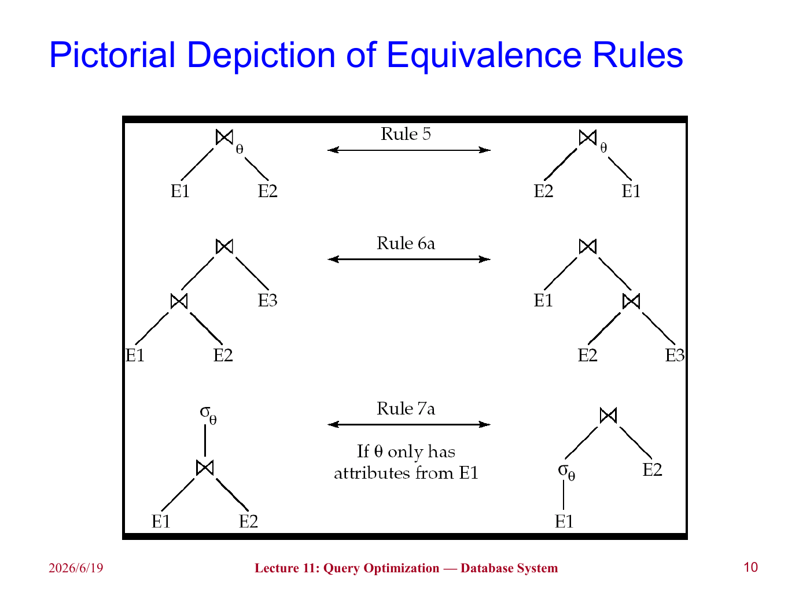
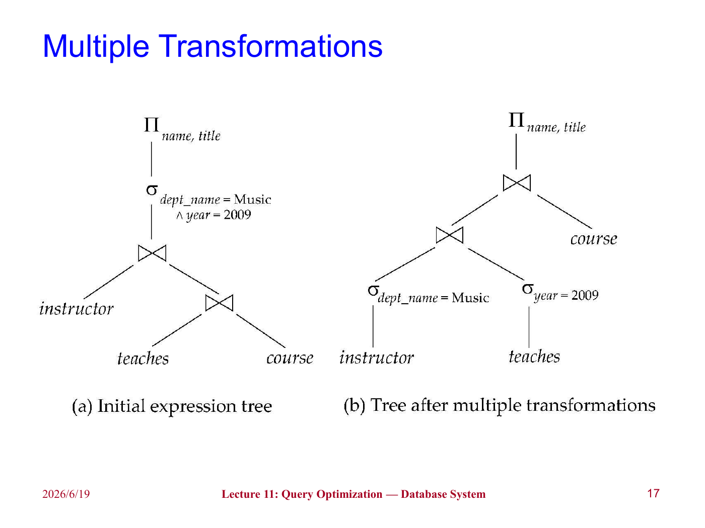
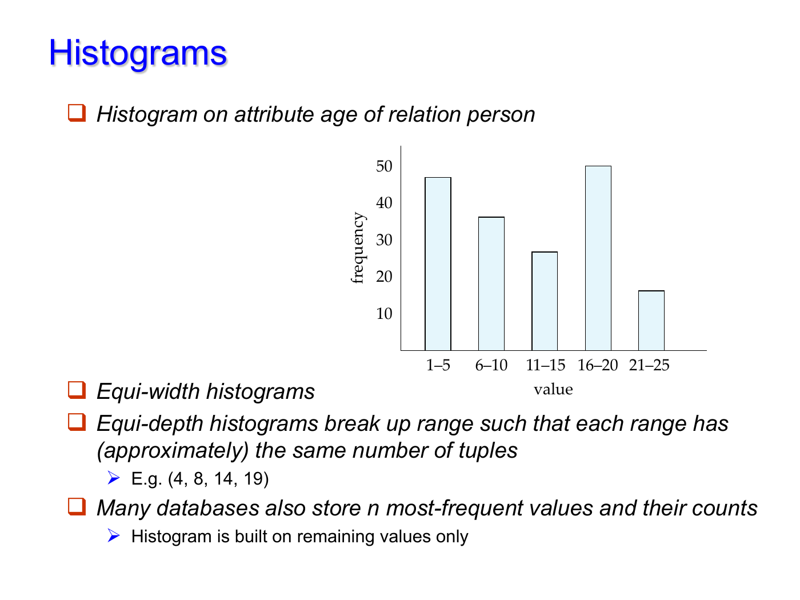
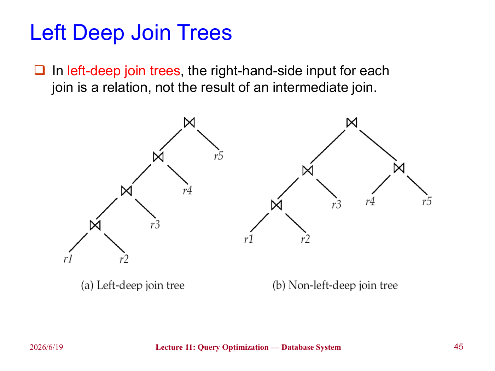

上一章讨论的是：给定一个执行计划，某个选择、排序、连接操作可以如何执行，以及代价大概是多少。这一章继续往上走，讨论**查询优化**（Query Optimization）：同一条 SQL 往往可以有许多等价写法和执行方式，数据库系统需要在其中选一个代价较低的计划。

直观地说，查询优化器做的事情很像我们手写关系代数表达式时会做的化简：能先筛掉的先筛掉，能少带的属性就少带，连接顺序尽量让中间结果小一些。区别在于，数据库系统必须把这些想法形式化，并结合统计信息和代价模型自动作出选择。

## Introduction

同一个查询可能有两类可替代方案：

- 等价的关系代数表达式不同；
- 每个关系代数操作对应的物理算法不同。

比如一个选择操作可以线性扫描，也可以走索引；一个连接操作可以用嵌套循环、归并连接或哈希连接。把逻辑表达式中的每个操作都标注上具体算法后，就得到了执行计划（Evaluation Plan）。

基于代价的查询优化一般分成三步：

1. 用等价规则生成逻辑上等价的表达式；
2. 给这些表达式标注具体算法，形成多个候选执行计划；
3. 根据估计代价选择最便宜的计划。

!!! warning
    “估计代价最低”不等于“真实运行一定最快”。优化器依赖统计信息和模型假设，如果统计信息过期，或者属性之间相关性很强，估计就可能偏离真实情况。不过在大多数复杂查询中，优化仍然非常值得，因为不同计划之间的差距可能是秒和天的差别。

## Transformation of Relational Expressions

两个关系代数表达式如果在所有合法数据库实例上都产生相同结果，就称为**等价**。这里强调“合法”是因为数据库实例还要满足完整性约束；对于违反约束的奇怪实例，我们通常不要求等价规则仍然保持。

需要注意的是，关系代数默认结果是集合，而 SQL 默认结果更接近多重集（multiset）。因此在 SQL 优化中，有些集合语义下成立的变换，在多重集语义下要重新检查是否会改变重复元组的数量。

### Equivalence Rules

等价规则（Equivalence Rules）给出了可以互相替换的表达式形式。下面列出最常用、也最有优化意义的一些。

**选择操作的拆分和交换**：

$$
\sigma_{\theta_1\land\theta_2}(E)=\sigma_{\theta_1}(\sigma_{\theta_2}(E))
$$

$$
\sigma_{\theta_1}(\sigma_{\theta_2}(E))=\sigma_{\theta_2}(\sigma_{\theta_1}(E))
$$

也就是说，一个复杂的选择条件可以拆成多个简单条件，并且这些选择的顺序可以交换。这是后面“选择下推”的基础。

**投影操作的合并**：

$$
\Pi_{L_1}(\Pi_{L_2}(\cdots(\Pi_{L_n}(E))\cdots))=\Pi_{L_1}(E)
$$

连续投影时，真正保留下来的只有最后需要的属性集合。这里要求 $L_1\subseteq L_2\subseteq\cdots\subseteq L_n$，否则外层投影需要的属性可能已经被内层丢掉。

**选择和连接的结合**：

$$
\sigma_{\theta}(E_1\times E_2)=E_1\bowtie_{\theta}E_2
$$

这条规则的意义很直接：如果笛卡尔积后面立刻跟着连接条件，那么应该把它看成连接，而不是真的先产生巨大的笛卡尔积。

**连接的交换律和结合律**：

$$
E_1\bowtie_{\theta}E_2=E_2\bowtie_{\theta}E_1
$$

自然连接也满足结合律：

$$
(E_1\bowtie E_2)\bowtie E_3=E_1\bowtie(E_2\bowtie E_3)
$$

这说明连接顺序可以改变。连接顺序本身不改变最终结果，但会显著影响中间结果大小。

!!! example "Pictorial Depiction of Equivalence Rules"
    

### Pushing Selections

选择下推（Pushing Selections）是最重要的启发式优化之一。它的基本想法是：如果选择条件只涉及某一个子表达式中的属性，就应该尽量把选择操作移动到这个子表达式上。

比如：

$$
\sigma_{\theta_0}(E_1\bowtie_{\theta}E_2)
=
(\sigma_{\theta_0}(E_1))\bowtie_{\theta}E_2
$$

这里要求 $\theta_0$ 只涉及 $E_1$ 中的属性。这样做不会改变结果，但可以提前减少参与连接的元组数量。

考虑查询：找到 Music 系所有老师的姓名，以及他们教授课程的标题。原始表达式可以写成：

$$
\Pi_{name,title}(\sigma_{dept\_name='Music'}(instructor\bowtie teaches\bowtie course))
$$

如果先把 `instructor` 和其它大关系连接，再筛选 Music 系，就会产生不必要的中间结果。更自然的方式是：

$$
\Pi_{name,title}((\sigma_{dept\_name='Music'}(instructor))\bowtie teaches\bowtie course)
$$

!!! note
    选择下推并不是“永远越早越好”的机械规则。如果选择条件本身计算很昂贵，或者下推会破坏某些更有利的物理顺序，优化器仍然需要结合代价估计判断。不过在普通谓词上，它通常是非常有效的。

!!! example "Multiple Transformations"
    

### Pushing Projections

投影下推（Pushing Projections）的想法是尽早丢掉后面不需要的属性。这样可以减小中间关系的元组长度，从而减少磁盘块数和内存占用。

比如某个中间关系的模式为：

```text
(ID, name, dept_name, salary, course_id, sec_id, semester, year)
```

但后面只需要 `name` 和 `course_id` 参与后续计算，那么就没必要一直带着 `salary, sec_id, semester, year` 这些属性。

需要注意的是，投影下推不能把连接条件要用的属性提前丢掉。假设最终只输出 $L_1\cup L_2$，但连接条件还需要 $L_3,L_4$ 中的属性，那么下推时必须暂时保留这些属性：

$$
\Pi_{L_1\cup L_2}(E_1\bowtie_{\theta}E_2)
=
\Pi_{L_1\cup L_2}((\Pi_{L_1\cup L_3}(E_1))\bowtie_{\theta}(\Pi_{L_2\cup L_4}(E_2)))
$$

其中 $L_3$ 是 $E_1$ 中参与连接但不在最终输出中的属性，$L_4$ 是 $E_2$ 中参与连接但不在最终输出中的属性。

### Join Ordering

连接顺序（Join Ordering）是查询优化中最关键、也最容易爆炸的问题之一。对于三个关系：

$$
(r_1\bowtie r_2)\bowtie r_3=r_1\bowtie(r_2\bowtie r_3)
$$

这两个表达式结果相同，但中间结果可能差很多。如果 $r_1\bowtie r_2$ 很小，而 $r_2\bowtie r_3$ 很大，那么先做 $r_1\bowtie r_2$ 往往更好。

!!! tip
    一个很好用的直觉是：连接不只是看原关系大小，还要看连接后的选择性。两个大表如果连接条件非常强，结果可能很小；两个小表如果几乎做成笛卡尔积，结果反而可能很大。

### Enumeration of Equivalent Expressions

理论上，优化器可以反复对所有子表达式应用所有等价规则，直到不再产生新表达式为止。但这个方法空间和时间代价都很高，因为等价表达式数量会迅速膨胀。

实际系统通常会：

- 共享公共子表达式，避免复制整棵表达式树；
- 检测重复生成的表达式；
- 用动态规划或记忆化搜索保存已经计算过的子问题；
- 用剪枝规则避免枚举明显不可能好的计划。

## Statistics for Cost Estimation

优化器要比较计划，就必须估计每个计划的代价。代价估计依赖统计信息。设关系为 $r$，常见统计量包括：

| 记号 | 含义 |
| --- | --- |
| $n_r$ | 关系 $r$ 中的元组数 |
| $b_r$ | 存放关系 $r$ 的磁盘块数 |
| $l_r$ | 关系 $r$ 中一个元组的大小 |
| $f_r$ | 一个磁盘块中能放下多少个 $r$ 的元组 |
| $V(A,r)$ | 属性 $A$ 在关系 $r$ 中不同取值的个数 |
| $SC(A,r)$ | 属性 $A$ 上等值选择平均能选出的记录数 |

如果关系 $r$ 的元组在物理文件中连续存放，则通常有：

$$
b_r=\left\lceil\frac{n_r}{f_r}\right\rceil
$$

### Histograms

只有 $V(A,r)$ 还不够，因为它看不出数据分布是否均匀。比如年龄属性中，`18-25` 可能很多，`80-90` 可能很少。如果仍然假设所有值均匀分布，选择率估计就会偏。

直方图（Histogram）用若干区间记录属性值的分布。常见形式包括：

- 等宽直方图（Equi-width Histogram）：每个区间宽度相同；
- 等深直方图（Equi-depth Histogram）：每个区间包含的元组数大致相同。

!!! example "Histograms"
    

!!! warning
    统计信息通常来自抽样，而且可能过期。因此数据库系统常常需要 `analyze` 之类的命令来更新统计信息，有些系统也会在表大小变化到一定比例后自动更新。统计信息不准，是优化器选错计划的常见原因。

### Selection Size Estimation

对于等值选择：

$$
\sigma_{A=v}(r)
$$

若 $A$ 不是键属性，并且假设 $A$ 的取值均匀分布，则结果大小估计为：

$$
\frac{n_r}{V(A,r)}
$$

如果 $A$ 是键属性，则最多只有一条记录满足条件，估计大小为 1。

对于范围选择：

$$
\sigma_{A\le v}(r)
$$

如果目录中有属性 $A$ 的最小值 $min(A,r)$ 和最大值 $max(A,r)$，并且假设值均匀分布，那么满足条件的元组数 $c$ 可以估计为：

$$
c=n_r\cdot\frac{v-min(A,r)}{max(A,r)-min(A,r)}
$$

如果没有任何统计信息，课件中给出的粗略估计是 $n_r/2$。

!!! note
    这个范围估计隐含了一个很强的均匀分布假设。现实中属性值经常倾斜，比如成绩、收入、访问量都可能有明显长尾。因此有直方图时，应该优先用直方图细化估计。

### Complex Selections

设条件 $\theta_i$ 在关系 $r$ 上能选出 $s_i$ 个元组，则其选择率为：

$$
\frac{s_i}{n_r}
$$

对于合取条件：

$$
\sigma_{\theta_1\land\theta_2\land\cdots\land\theta_n}(r)
$$

如果假设各条件相互独立，则结果大小估计为：

$$
n_r\cdot\frac{s_1}{n_r}\cdot\frac{s_2}{n_r}\cdots\frac{s_n}{n_r}
=
\frac{s_1s_2\cdots s_n}{n_r^{n-1}}
$$

对于析取条件：

$$
\sigma_{\theta_1\lor\theta_2\lor\cdots\lor\theta_n}(r)
$$

估计结果为：

$$
n_r\left(1-\prod_{i=1}^{n}\left(1-\frac{s_i}{n_r}\right)\right)
$$

对于否定条件：

$$
|\sigma_{\neg\theta}(r)|=n_r-|\sigma_{\theta}(r)|
$$

!!! warning
    独立性假设并不总可靠。比如 `dept_name='Music'` 和 `building='Arts'` 可能高度相关，把它们当成独立事件会低估或高估结果大小。这也是查询优化难的原因之一。

### Join Size Estimation

设关系 $r(R)$ 和 $s(S)$ 做自然连接。若 $R\cap S=\emptyset$，自然连接退化为笛卡尔积，结果元组数为：

$$
n_r\cdot n_s
$$

如果公共属性是某一边的键，则连接大小会受到明显限制。比如 $R\cap S$ 是 $R$ 的键，那么 $s$ 中每个元组最多匹配 $r$ 中一个元组，因此结果大小不超过 $n_s$。

如果 $R\cap S=\{A\}$，且 $A$ 不是任一边的键，可以用如下估计：

$$
\frac{n_r\cdot n_s}{V(A,s)}
$$

或者从另一边看：

$$
\frac{n_r\cdot n_s}{V(A,r)}
$$

通常取二者较小值作为估计：

$$
\frac{n_r\cdot n_s}{\max(V(A,r),V(A,s))}
$$

这里的直觉是：公共属性的不同值越多，每个值对应的匹配元组通常越少，连接结果也越小。

!!! example "student 和 takes 的连接"
    课件中的例子有：

    ```text
    n_student = 5000
    n_takes = 10000
    V(ID, student) = 5000
    V(ID, takes) = 2500
    ```

    如果不用外键信息，则两个估计分别是：

    $$
    \frac{5000\cdot10000}{2500}=20000
    $$

    $$
    \frac{5000\cdot10000}{5000}=10000
    $$

    取较小值为 10000。若知道 `takes.ID` 是引用 `student.ID` 的外键，也能直接得到连接结果大小是 $n_{takes}=10000$。

### Other Operations

投影和聚合的结果大小通常与不同值个数有关：

$$
|\Pi_A(r)|=V(A,r)
$$

如果按属性 $A$ 分组聚合，那么分组数也可以估计为 $V(A,r)$。

集合操作的估计通常比较粗糙。对于不同关系上的集合操作，课件给出一些上界式估计：

- $|r\cup s|\le |r|+|s|$；
- $|r\cap s|\le \min(|r|,|s|)$；
- $|r-s|\le |r|$。

这些估计不一定准，但能给优化器一个保守的规模判断。

## Dynamic Programming for Choosing Evaluation Plans

连接顺序的数量非常大。对于 $n$ 个关系，所有可能连接树的数量增长很快。课件中提到，当 $n=7$ 时就有 665280 种连接顺序，当 $n=10$ 时超过 1760 亿。

因此优化器不可能简单枚举全部顺序。动态规划（Dynamic Programming）的核心思想是：任意一个关系子集的最优连接计划只计算一次，之后重复使用。

设 $S$ 是一组关系。为了求 $S$ 的最优计划，可以枚举所有非空真子集 $S_1$，把计划看作：

$$
S_1\bowtie(S-S_1)
$$

递归求出 $S_1$ 和 $S-S_1$ 的最优计划，再加上二者连接的代价，选择总代价最小的方案。

```text
findbestplan(S):
    如果 bestplan[S] 已经算过，直接返回
    如果 S 只包含一个关系：
        选择访问该关系的最佳方式
    否则：
        枚举 S 的非空真子集 S1
        P1 = findbestplan(S1)
        P2 = findbestplan(S - S1)
        A = 连接 P1 和 P2 的最佳算法
        用 P1.cost + P2.cost + cost(A) 更新 bestplan[S]
```

!!! note
    这里的“最佳”仍然是基于估计代价。动态规划解决的是“不要重复计算”和“系统地搜索计划空间”，并不能消除统计估计本身的不确定性。

### Left Deep Join Trees

左深连接树（Left Deep Join Trees）是一类受限制的连接树：每次连接的右输入都是一个原始关系，而不是另一个中间连接结果。

!!! example "Left Deep Join Trees"
    

很多优化器只考虑左深树，原因有两个：

1. 搜索空间小很多；
2. 左深树更适合流水线执行，因为左边可以不断产生中间结果，右边通常是一个可扫描或可索引访问的基本关系。

若只考虑左深树，寻找最佳连接顺序的时间复杂度可以降到：

$$
O(n2^n)
$$

空间复杂度仍然是：

$$
O(2^n)
$$

### Interesting Sort Orders

有时一个局部计划虽然当前代价更高，但会产生后续操作需要的排序顺序，这种顺序称为**有趣排序顺序**（Interesting Sort Order）。

比如计算 $r_1\bowtie r_2$ 时，哈希连接可能比归并连接便宜。但归并连接可能产生按属性 $A$ 排序的结果，而之后还要和 $r_3$ 在 $A$ 上做归并连接。此时保留一个看似局部不优、但排序顺序有用的计划，可能让整体计划更便宜。

!!! tip
    这提醒我们，优化不能只看某个子表达式的最小代价。有时还要保留“带有有用物理性质”的计划，比如排序顺序、分区方式等。

## Additional Optimization Techniques

### Heuristic Optimization

基于代价的优化很强，但也很贵。启发式优化（Heuristic Optimization）使用一些通常有益的规则，快速把查询树改写成更好的形式。

常见启发式规则包括：

1. 尽早执行选择操作，减少元组数；
2. 尽早执行投影操作，减少属性数；
3. 优先执行结果最小的选择和连接；
4. 把“笛卡尔积后选择”改写为连接；
5. 找出可以流水线执行的子树，尽量避免物化中间结果。

!!! warning
    启发式规则是“通常有效”，不是数学上总能得到最优计划。例如投影下推可能让某个已有排序顺序失效，选择下推也可能和某些索引访问方式相互影响。因此现代优化器往往会把启发式改写和代价估计结合起来。

### Structure of Query Optimizers

真实优化器通常不会完全枚举所有可能计划，而是分层处理：

- 先做启发式重写，比如选择下推、投影下推、子查询改写；
- 再对核心连接块做基于代价的连接顺序优化；
- 对非常便宜的查询可能直接采用简单规则；
- 对昂贵查询才投入更多优化时间；
- 对重复出现的查询，可以缓存计划（Plan Caching）。

这种设计的核心取舍是：优化本身也要花时间。一个查询如果本来只要几毫秒，花几百毫秒优化就不划算；但如果查询可能跑几小时，优化多花一点时间通常很值得。

## Optimizing Nested Subqueries

SQL 中的嵌套子查询在概念上可以理解为：对子查询外层的每个元组，都执行一次内部查询。如果内部查询引用了外层查询中的变量，这些变量称为相关变量（correlation variables），这种执行方式称为相关执行（correlated evaluation）。

例如：

```sql
select name
from instructor
where exists (
    select *
    from teaches
    where instructor.ID = teaches.ID
      and teaches.year = 2007
)
```

如果真的对每个 `instructor` 元组都执行一次内部查询，代价可能很高。因此优化器会尝试把它改写成连接。

一个可能的改写是：

```sql
select name
from instructor, teaches
where instructor.ID = teaches.ID
  and teaches.year = 2007
```

但是这里要小心重复元组。原来的 `exists` 只关心是否存在匹配记录，而改写成普通连接后，如果一个老师在 2007 年教了多门课，就可能产生多个重复姓名。因此更稳妥的改写是先生成去重后的临时关系：

```sql
create table t1 as
select distinct ID
from teaches
where year = 2007;

select name
from instructor, t1
where instructor.ID = t1.ID;
```

把嵌套查询替换为连接或临时关系的过程称为**去相关**（decorrelation）。

!!! note
    去相关不是简单地把内层 `from` 搬到外层 `from`。聚合、`not exists`、重复元组、空值语义都会让改写变复杂。这里课件给的是基本思想，真实 SQL 优化器需要处理更多边界情况。

## Materialized Views

物化视图（Materialized View）是已经计算并存储结果的视图。普通视图只保存定义，查询时再展开；物化视图则直接保存结果。

比如：

```sql
create view department_total_salary(dept_name, total_salary) as
select dept_name, sum(salary)
from instructor
group by dept_name;
```

如果系统经常查询每个系的工资总和，把这个视图物化可以避免每次都扫描 `instructor` 并重新聚合。

### Materialized View Maintenance

物化视图的问题是：底层表变了，视图也要保持最新。这称为物化视图维护（Materialized View Maintenance）。

最直接的方式是每次更新后重新计算整个视图，但这通常太贵。更好的方法是**增量维护**（Incremental View Maintenance）：只根据底层关系发生的变化，计算视图应该增加或删除哪些元组。

设插入到关系 $r$ 的元组集合为 $i_r$，从关系 $r$ 删除的元组集合为 $d_r$。

对于选择视图：

$$
v=\sigma_{\theta}(r)
$$

插入时：

$$
v_{new}=v_{old}\cup\sigma_{\theta}(i_r)
$$

删除时：

$$
v_{new}=v_{old}-\sigma_{\theta}(d_r)
$$

对于连接视图：

$$
v=r\bowtie s
$$

如果向 $r$ 插入 $i_r$，那么新产生的视图元组只可能来自：

$$
i_r\bowtie s
$$

因此：

$$
v_{new}=v_{old}\cup(i_r\bowtie s)
$$

删除时类似：

$$
v_{new}=v_{old}-(d_r\bowtie s)
$$

### Projection and Aggregation

投影的增量维护比选择和连接麻烦。比如：

```text
r(A, B) = {(a, 2), (a, 3)}
```

投影 $\Pi_A(r)$ 只有一个元组 `(a)`。如果删除 `(a,2)`，不能立刻从投影结果中删除 `(a)`，因为 `(a,3)` 仍然能推出 `(a)`。

因此系统通常需要为投影结果中的每个元组维护一个计数，表示它由多少个底层元组推出。插入时计数加一，删除时计数减一，只有计数变成 0 时才真正删除该投影元组。

聚合也有类似问题：

- `count`：插入加一，删除减一；
- `sum`：插入加对应值，删除减对应值，同时还要维护计数；
- `avg`：维护 `sum` 和 `count`，最后再相除；
- `min` 和 `max`：插入容易，删除可能很贵，因为删除当前最小值后需要在同组其它元组中重新找最小值。

!!! warning
    对 `sum` 不能仅仅通过结果是否为 0 来判断某个分组是否应该删除。因为一个非空分组的求和结果也可能正好为 0，所以仍然需要维护 count。

### Query Optimization and Materialized Views

物化视图也会参与查询优化。如果已经有：

$$
v=r\bowtie s
$$

那么用户查询：

$$
r\bowtie s\bowtie t
$$

就可能被改写为：

$$
v\bowtie t
$$

但反过来也可能发生：如果物化视图 $v$ 没有合适索引，而底层表有更好的索引，那么优化器可能选择把 $v$ 展开回定义，用底层表重新计算。

!!! note
    物化视图不是“有就一定用”。它需要占用存储空间，也会增加更新维护成本。是否物化某个视图，本质上要结合典型查询负载、更新频率、空间限制和关键查询的响应时间要求来决定。

## Summary

这一章的核心是：查询优化不是只靠几条固定规则，而是把**等价变换、统计估计、物理算法代价**结合起来选择执行计划。

可以总结为：

1. 等价规则保证表达式改写不改变查询结果；
2. 选择下推和投影下推通常能减小中间结果；
3. 连接顺序会极大影响临时关系大小，是优化的重点；
4. 代价估计依赖 $n_r,b_r,V(A,r)$ 等统计信息；
5. 选择率、连接大小估计常常依赖均匀性和独立性假设；
6. 动态规划可以避免重复计算连接子问题；
7. 启发式优化能减少搜索空间，但不保证最优；
8. 嵌套子查询可以通过去相关改写为连接；
9. 物化视图可以加速查询，但需要维护成本；
10. 真实优化器做的是工程上的权衡：优化时间、执行时间、统计准确性和计划空间都要一起考虑。

!!! abstract "这一章的核心"
    查询优化器并不是在“理解 SQL 的意思”之后直接执行，而是在一大堆等价但代价不同的道路中做选择。我们手算时常说“先筛选再连接”，优化器则要把这个直觉变成可验证的等价规则和可比较的代价估计。
