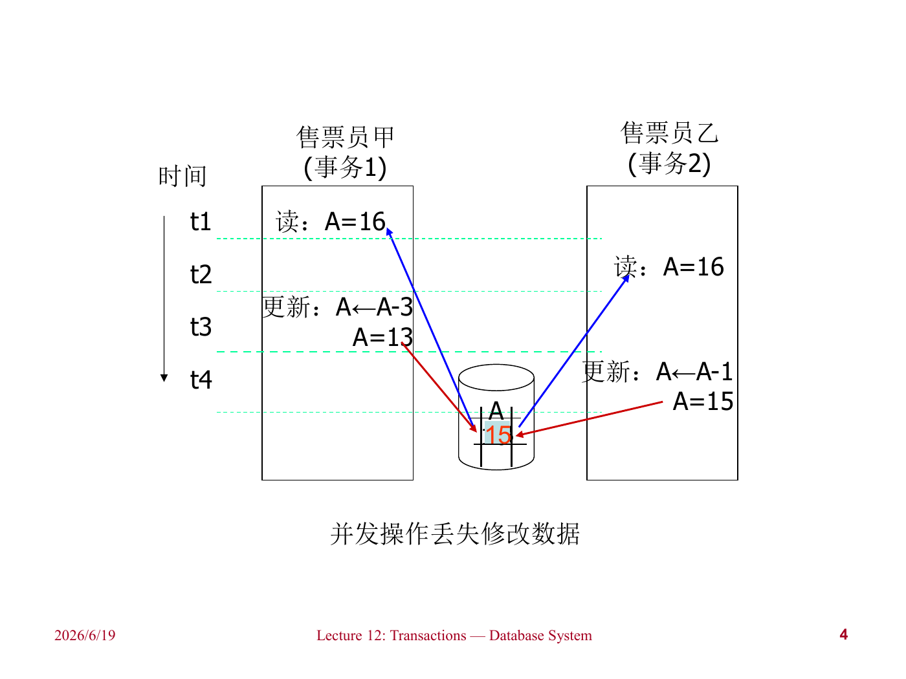
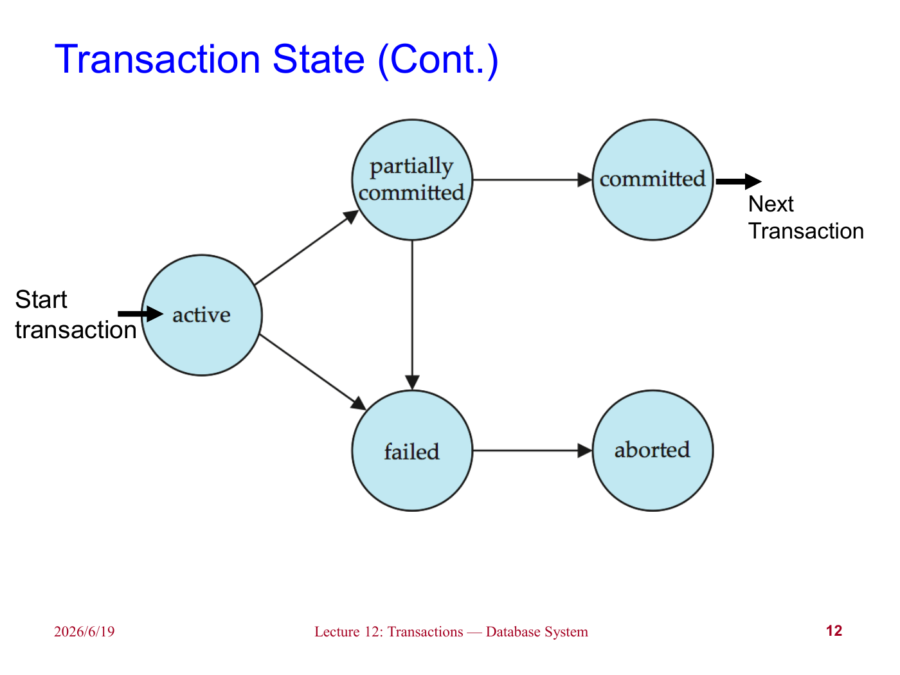
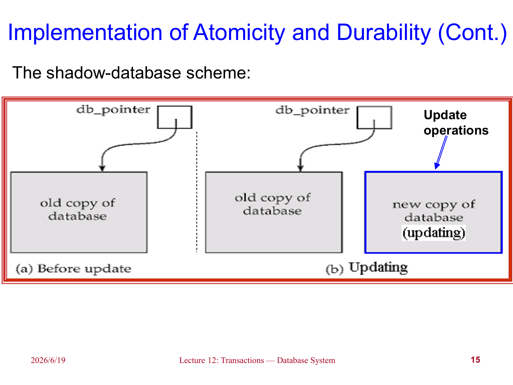
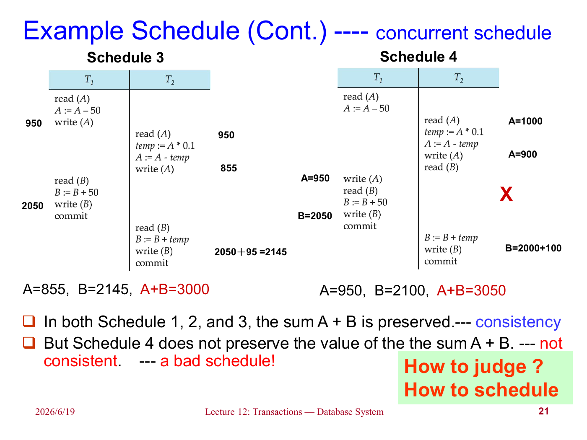
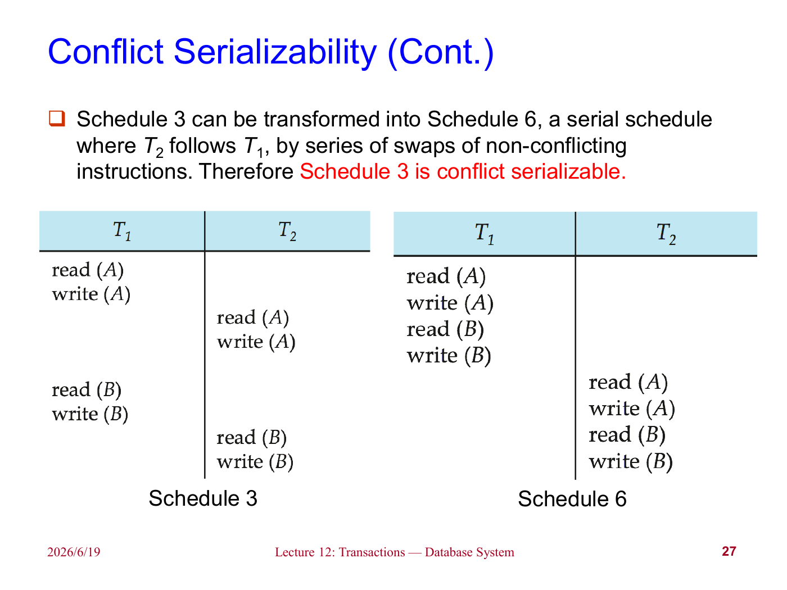
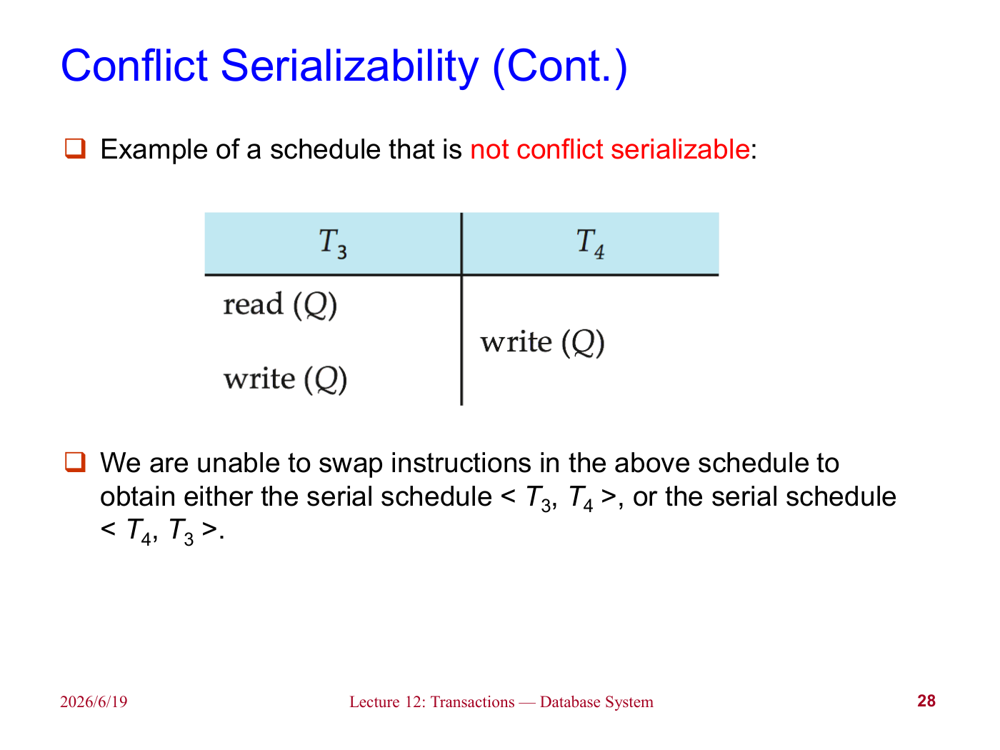
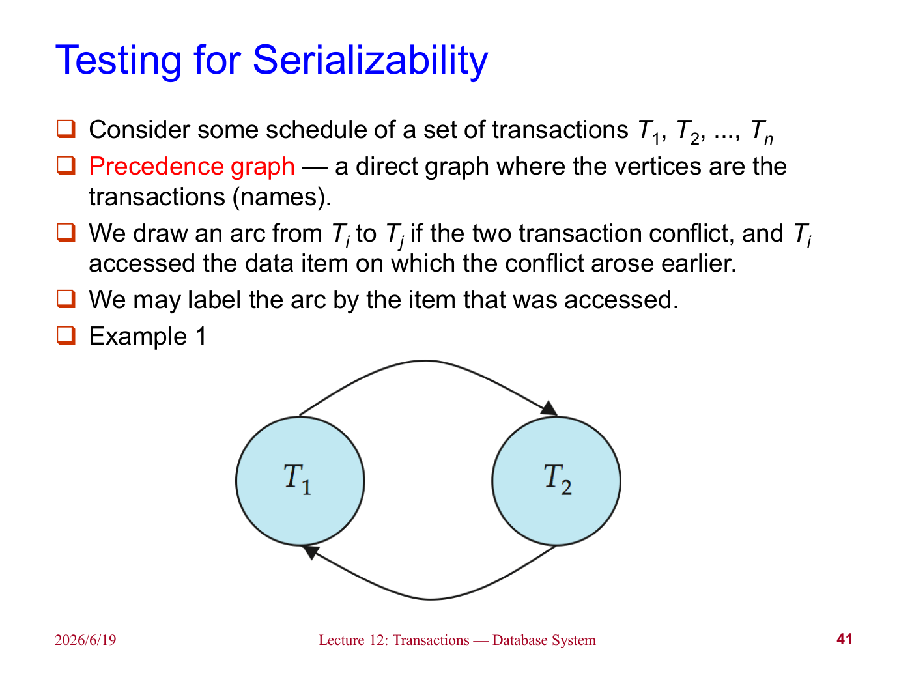

前面几章中，我们讨论了 SQL 如何执行、如何优化。但是数据库系统真正运行时，不会只有一个用户、一个查询、一个完美无故障的环境。现实中会有多个事务同时执行，也会有系统崩溃、硬件故障、程序错误等情况。

事务（Transaction）就是为了解决这些问题而提出的抽象。它把一组数据库操作包装成一个逻辑单位，使得系统可以讨论：这些操作要么全做要么全不做；并发执行时不能互相看见不该看见的中间状态；一旦提交，就算系统崩溃，结果也不能丢。

## Transaction Concept

对数据库系统来说，事务主要应对两个问题：

- 多个用户或程序并发执行；
- 各种故障，比如系统崩溃、硬件错误、软件错误。

如果没有事务，简单的并发操作就可能破坏数据。比如售票系统中，两个售票员同时读取剩余票数 `A=16`，一个卖出 3 张，一个卖出 1 张。如果二者都基于旧值更新，最后可能只保留了其中一次修改。

!!! example "Lost Update"
    

这类问题的本质是：每个程序单独看也许都是正确的，但并发交错后，整体结果不再正确。

事务可以理解为一段程序执行过程，它会访问并可能更新多个数据项。一个事务通常由多条 SQL 语句组成，并以提交（commit）或回滚（rollback）结束。

!!! note
    事务执行过程中，数据库可以暂时处于不一致状态；但是事务提交后，数据库必须重新回到一致状态。比如转账过程中，先从 A 扣钱再给 B 加钱，中间短暂时刻总金额减少了，但提交后总金额必须恢复正确。

### ACID Properties

为了保证事务的可靠性，数据库系统需要满足 ACID 四个性质。

**Atomicity**：原子性。事务中的操作要么全部反映到数据库中，要么全部不反映。不能只执行一半。

**Consistency**：一致性。若事务开始前数据库是一致的，并且事务逻辑本身正确，那么事务结束后数据库仍应是一致的。

**Isolation**：隔离性。多个事务并发执行时，每个事务看起来都像是在某个串行顺序中独立执行。一个事务不应该看到另一个事务尚未提交的中间结果。

**Durability**：持久性。事务一旦成功提交，它对数据库造成的修改就必须持久保存，即使之后发生系统故障也不能丢失。

考虑从账户 A 向账户 B 转账 50：

```text
read(A)
A := A - 50
write(A)
read(B)
B := B + 50
write(B)
```

- 原子性要求：如果扣了 A 的钱后系统崩溃，不能只留下 A 减少而 B 没增加的结果；
- 一致性要求：转账前后 A 和 B 的总金额不变；
- 隔离性要求：其它事务不能在扣 A 之后、加 B 之前读到错误总额；
- 持久性要求：用户看到转账成功后，即使系统崩溃，结果也不能消失。

!!! warning
    一致性并不只由数据库系统保证。数据库可以维护主键、外键、检查约束等显式约束，但“转账金额必须守恒”这类业务逻辑也需要事务程序本身写对。如果事务逻辑错误，ACID 不能自动把错误业务变正确。

## Transaction State

一个事务在执行过程中会经历若干状态：

- **Active**：初始状态，事务正在执行；
- **Partially committed**：最后一条语句已经执行完，但结果可能还在内存缓冲区中；
- **Failed**：发现事务无法继续正常执行；
- **Aborted**：事务已经回滚，数据库恢复到事务开始前的状态；
- **Committed**：事务成功完成。

!!! example "Transaction State"
    

事务进入 aborted 状态后，一般有两种选择：

1. 重新启动事务：适用于不是事务内部逻辑错误导致的失败，比如死锁回滚后重试；
2. 杀死事务：适用于事务本身存在逻辑错误，再运行也没有意义。

## Implementation of Atomicity and Durability

原子性和持久性通常由恢复管理器（Recovery Manager）来实现。课件先介绍了一个非常简单但低效的方案：影子数据库（Shadow Database）。

该方案维护一个指针 `db_pointer`，它总是指向当前一致的数据库副本。事务更新时，不直接修改旧副本，而是在新副本上修改：

- 如果事务回滚，直接删除新副本；
- 如果事务提交，先把新副本所有页面写入磁盘，再原子地切换 `db_pointer` 指向新副本，之后删除旧副本。

!!! example "Shadow Database"
    

这个方案的优点是概念清晰：提交之前旧数据库不变，提交时只需要切换指针。但是它有几个明显限制：

- 必须保证 `db_pointer` 的更新是原子的；
- 不支持并发事务；
- 假设磁盘本身不会失败；
- 每个事务都要复制整个数据库，对大型数据库非常低效。

!!! note
    影子拷贝的思想在文本编辑器等场景中很常见：先写临时文件，成功后再替换原文件。但数据库规模大、并发多，所以实际系统通常使用日志、检查点、回滚段等更复杂的恢复机制。

## Concurrent Executions

允许事务并发执行有明显好处：

- 提高处理器和磁盘利用率：一个事务等待磁盘 I/O 时，另一个事务可以使用 CPU；
- 降低平均响应时间：短事务不必一直排在长事务后面；
- 提高吞吐量（throughput）。

但并发也会带来问题：即使每个事务单独执行都正确，交错执行后仍可能破坏一致性。数据库系统需要用并发控制（Concurrency Control）来实现隔离性。

### Schedules

调度（Schedule）描述多个事务的指令按时间交错执行的顺序。一个合法调度必须满足：

- 包含每个事务中的所有操作；
- 保持每个事务内部操作的原有顺序。

如果事务一个接一个执行，这样的调度称为串行调度（Serial Schedule）。串行调度一定保持一致性，但并发度很低。

并发调度则允许不同事务的操作交错执行。它可能是正确的，也可能不是。我们需要一个标准来判断：某个并发调度是否“等价于”某个串行调度。

!!! example "Concurrent Schedule"
    

## Serializability

可串行化（Serializability）的基本假设是：每个事务单独执行都能保持数据库一致性。因此，只要一个并发调度等价于某个串行调度，它也应该是正确的。

按照“等价”的定义不同，可串行化主要有两种：

- 冲突可串行化（Conflict Serializability）；
- 视图可串行化（View Serializability）。

为了简化讨论，我们通常只看 `read(Q)` 和 `write(Q)` 操作。事务在读写之间做的本地计算暂时忽略。

### Conflicting Instructions

设 $l_i$ 是事务 $T_i$ 的一条指令，$l_j$ 是事务 $T_j$ 的一条指令，且 $i\ne j$。如果二者访问同一个数据项 $Q$，并且至少有一个是写操作，那么它们冲突。

具体来说：

| 操作对 | 是否冲突 |
| --- | --- |
| `read(Q)` 和 `read(Q)` | 不冲突 |
| `read(Q)` 和 `write(Q)` | 冲突 |
| `write(Q)` 和 `read(Q)` | 冲突 |
| `write(Q)` 和 `write(Q)` | 冲突 |

不冲突的相邻操作可以交换顺序，不影响最终结果；冲突操作不能随意交换，因为它们的顺序会影响读到的值或最终写入的值。

### Conflict Serializability

如果一个调度 $S$ 可以通过反复交换相邻的非冲突操作，变成调度 $S'$，则称 $S$ 和 $S'$ 冲突等价（Conflict Equivalent）。

如果 $S$ 冲突等价于某个串行调度，则称 $S$ 是冲突可串行化的。

!!! example "Conflict Serializability"
    

有些调度无法通过交换非冲突操作变成任何串行调度，那么它就不是冲突可串行化的。

!!! example "Not Conflict Serializable"
    

### View Serializability

视图等价（View Equivalence）比冲突等价更宽松。两个调度 $S$ 和 $S'$ 视图等价，需要对每个数据项 $Q$ 满足三点：

1. 如果某事务在 $S$ 中读到 $Q$ 的初始值，那么它在 $S'$ 中也必须读到初始值；
2. 如果某事务在 $S$ 中读到的是另一个事务写出的 $Q$，那么在 $S'$ 中也必须读到同一个事务写出的值；
3. 在 $S$ 中最后写 $Q$ 的事务，在 $S'$ 中也必须最后写 $Q$。

如果一个调度视图等价于某个串行调度，则它是视图可串行化的。

所有冲突可串行化调度都是视图可串行化的，但反过来不一定成立。那些视图可串行化但不是冲突可串行化的调度，通常包含盲写（Blind Write），也就是事务不先读某数据项就直接写它。

!!! note
    视图可串行化更一般，但检测代价很高。课件后面提到，判断视图可串行化是 NP-complete 问题。因此实际系统更常用冲突可串行化相关的协议和判断。

## Recoverability

可串行化讨论的是并发调度是否保持一致性。但事务还可能失败，所以还要讨论调度是否可恢复。

### Recoverable Schedules

如果事务 $T_j$ 读了事务 $T_i$ 写过的数据，那么 $T_i$ 必须先于 $T_j$ 提交。满足这个条件的调度称为可恢复调度（Recoverable Schedule）。

为什么需要这个条件？如果 $T_j$ 读了 $T_i$ 的未提交结果，并且 $T_j$ 先提交了，之后 $T_i$ 又回滚，那么 $T_j$ 已经把依赖错误数据的结果永久化了，系统就很难恢复。

### Cascading Rollbacks

级联回滚（Cascading Rollback）指的是：一个事务失败后，所有读过它未提交数据的事务也必须回滚，接着又可能影响更多事务。

这虽然能保持正确性，但会撤销大量已经做过的工作。

### Cascadeless Schedules

无级联调度（Cascadeless Schedule）要求：如果 $T_j$ 要读 $T_i$ 写过的数据，那么 $T_i$ 必须在这个读操作之前已经提交。

也就是说，不允许事务读取未提交数据。这样就不会发生级联回滚。

!!! tip
    关系可以这样理解：无级联调度一定是可恢复调度，但可恢复调度不一定无级联。实际系统通常更希望产生无级联调度，因为恢复成本更低。

## Implementation of Isolation

最简单的隔离实现方式是一次只执行一个事务，这一定产生串行调度，但并发度太差。

实际系统需要在并发度和控制开销之间做权衡。理想情况下，系统产生的调度应该：

- 是冲突可串行化或视图可串行化的；
- 是可恢复的；
- 最好是无级联的。

不同并发控制协议允许的调度集合不同。有的协议只产生冲突可串行化调度，有的协议可能允许更宽泛的视图可串行化调度。具体协议，如两阶段封锁、时间戳、多版本并发控制，会在后续章节讨论。

## Transaction Definition in SQL

SQL 中事务通常是隐式开始的。事务结束方式主要有：

```sql
commit work;
rollback work;
```

`commit work` 表示提交当前事务，并开始一个新事务；`rollback work` 表示中止当前事务并回滚。

很多数据库系统默认开启自动提交（auto commit）：每条 SQL 语句成功执行后都会自动提交。如果希望多条语句组成一个事务，需要关闭自动提交。比如 JDBC 中可以使用：

```java
connection.setAutoCommit(false);
```

!!! warning
    自动提交适合简单单语句操作，但不适合转账、下单、扣库存这类需要多步共同成功的业务。否则每一步都单独提交，一旦中间失败，就很难保证原子性。

## Testing for Serializability

判断一个调度是否冲突可串行化，可以使用优先图（Precedence Graph），也叫序列化图。

构造方法如下：

1. 图中的每个顶点表示一个事务；
2. 如果事务 $T_i$ 和 $T_j$ 的某两个操作冲突，并且 $T_i$ 的冲突操作先发生，就画一条边 $T_i\to T_j$；
3. 可以在边上标注造成冲突的数据项。

!!! example "Precedence Graph"
    

判断规则：

> 一个调度是冲突可串行化的，当且仅当它的优先图无环。

如果优先图无环，可以对图做拓扑排序，得到一个等价的串行顺序。如果有环，则说明存在一组事务相互要求“必须先于对方”，无法变成串行调度。

!!! note
    优先图测试主要用于理解正确性。实际并发控制协议通常不会一边执行一边构造完整优先图再检测环，而是通过封锁、时间戳等规则直接避免产生不可串行化调度。

## Weak Levels of Consistency

并不是所有应用都必须要求最强的可串行化隔离。有些只读统计任务可以接受近似结果，比如查询优化器收集的统计信息，或者某些报表里的近似总额。为了性能，SQL 标准定义了不同隔离级别。

常见隔离级别包括：

- **Serializable**：可串行化，最强隔离级别；
- **Repeatable Read**：可重复读，只读已提交记录，并且同一事务中重复读取同一记录应返回相同值；
- **Read Committed**：读已提交，只能读已经提交的数据，但同一记录两次读取可能不同；
- **Read Uncommitted**：读未提交，甚至可以读到其它事务尚未提交的数据。

!!! warning
    一些数据库默认隔离级别并不是 Serializable。比如很多系统默认使用 Read Committed 或快照隔离（Snapshot Isolation）。写应用时不能只凭“用了事务”就默认有最强隔离，需要明确检查数据库默认配置。

## Summary

这一章讨论的是事务的基本概念，以及怎样判断并发执行是否仍然正确。

可以总结为：

1. 事务是数据库操作的逻辑执行单位；
2. ACID 分别对应原子性、一致性、隔离性和持久性；
3. 事务有 active、partially committed、failed、aborted、committed 等状态；
4. 影子数据库能解释原子性和持久性的基本思想，但不适合大型并发数据库；
5. 调度描述多个事务操作的交错顺序；
6. 可串行化要求并发调度等价于某个串行调度；
7. 冲突可串行化可以通过交换非冲突操作来理解；
8. 可恢复性要求读到别人写入结果的事务不能先于写入者提交；
9. 无级联调度避免读取未提交数据，从而避免级联回滚；
10. 优先图无环当且仅当调度冲突可串行化。

!!! abstract "这一章的核心"
    事务机制的目标不是让并发消失，而是让并发看起来像某种安全的串行执行。可串行化解决“并发结果是否正确”，可恢复性解决“失败后能否收拾干净”，二者合在一起才构成可靠事务处理的基础。
